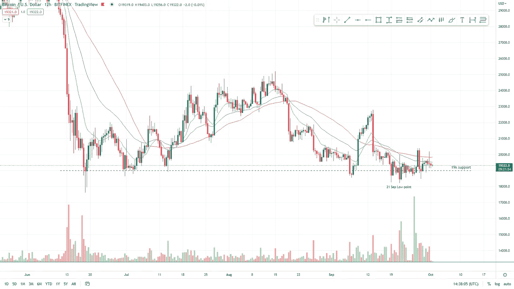
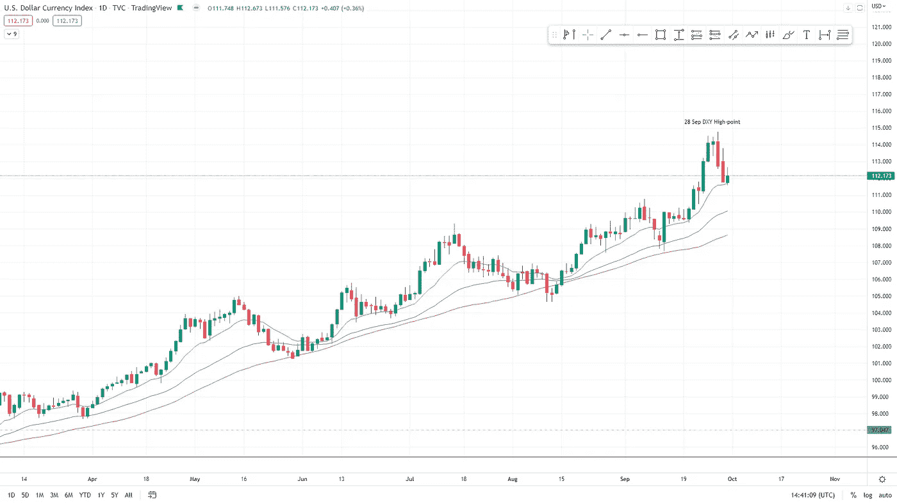
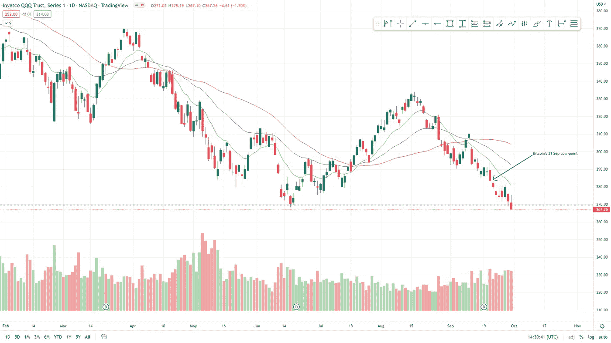
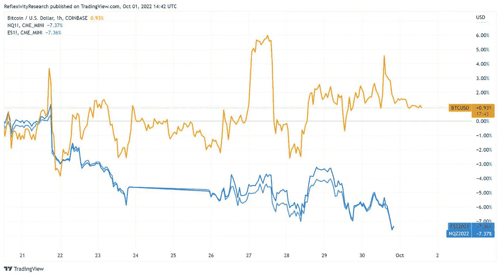

# 政府救助在全球经济压力下开始

> 原文：<https://medium.com/coinmonks/in-this-weeks-report-839e2e15c67d?source=collection_archive---------13----------------------->

**在本周的报道中**

*   英国央行开始购买英国政府债券以抑制波动。救助贝莱德公司。
*   美元相对于其竞争对手货币表现强劲，但其影响可能是严重负面的。
*   XRP(Ripple)x SEC 法庭案件的正面法庭裁决已经公布，这对加密行业来说是个好消息。
*   上周，股市承受了很大的下行压力，但这为什么没有反映在 DXY 和 BTC 股市上呢？
*   比特币仍然疲软，尽管与股市相比相对强劲。
*   股票继续大幅下跌，支撑区没有反应。

‍

This Newsletter was formally released on 30 September at www.boomish.org

# 英国央行对贝莱德的纾困

‍

在全球范围内迅速抛售政府债券后，第一个值得救助的事件出现了，这一次是世界上最大的金融管理公司之一，即贝莱德。

‍

9 月 28 日凌晨，在今年的大幅波动之后，我们看到了第一次央行投降。**英国银行** ( **BOE** )开始购买价值高达 10 亿英镑的英国政府债券。

‍

“你到处都有财务压力。收益率上升，美元升值。它有点像在自我吞噬。我们需要一些东西或人来阻止正在发生的金融压力和金融恐慌。英国央行介入了，”富国银行宏观策略师埃里克·纳尔逊说。

‍

“金融压力的减轻有助于英镑和其他货币对美元的比价回升”(纳尔逊)。

‍

但英镑的缓解可能是暂时的，因为英国仍需应对高通胀等宏观趋势。

‍

但为什么英国央行真的不得不出手保护英国政府债券市场？价格下跌(收益率上升)已经为养老金管理者创造了一个厄运循环。

‍

不是一般的养老金经理，贝莱德。

‍

以下是彭博关于英国央行救助的报告摘要:

‍

怡安投资合伙人 Calum Mackenzie 在英国央行干预后表示:“BOE 的干预是必要的，以防止恶性循环对被迫出售金边证券敞口的养老基金变得更加危险。”。市场迅速而显著的反应突显出已经或可能已经减少负债对冲的养老基金面临的巨大风险。"

‍

受影响的公司包括贝莱德公司、Legal & General Group Plc 和 Schroders Plc。

‍

因此，从本质上来说，央行的介入主要是为了阻止破坏市场的螺旋式下降。这对全球经济来说不是什么好消息。

‍

# 美元走强对全球经济的危险

‍

DXY 是针对所有货币对的贸易加权基准。这代表了它相对于所有其他国家货币的强弱程度(图表见通讯末尾(图 2))。

‍

目前处于 2002 年以来的最高水平。

‍

与此同时，英镑等其他货币处于 37 年低点，接近与美元平价。

‍

欧元兑美元汇率也跌至 97.5 欧元兑 1 美元，低于其平价水平，这是 20 多年来从未出现过的情况。

‍

日本央行干预了日元的疲软，这是自 1998 年以来从未有过的。

‍

人们涌向美元的原因有很多。原因主要可以归结为以下两个原因。

‍

首先是利率。由于美联储一直在大幅提高相对于其他货币的利率，如果投资者将美元借给客户，他们将获得比其他货币贷款更多的利息。

‍

因此，尽管接受贷款的人越来越少，但能够以高利率放贷对投资者/贷款人来说有利于对冲当前的通胀。
‍

第二个原因是美元是世界储备货币。由于当前宏观经济的不确定性，许多人认为美元是他们资金的避风港。

‍

以上是美元走强的原因，但美元走强的风险是什么？
‍

美元是世界上最常用的贸易货币。这意味着，如果美元相对于其他货币升值，所有进口商品都会变得更加昂贵。

‍

例如，石油和能源贸易通常以美元结算，这意味着如果美元走强，石油和能源对非美国国家来说就要贵得多。在当前的能源危机经济中，这当然不是一件好事。

‍

‍

# XRP 第十证券法院案例

‍

在美国证券交易委员会( **SEC** )和美国公司 Ripple 的诉讼案的最新消息中， **Ripple** 获得了美国曼哈顿地区法院法官的积极裁决，该法官驳回了监管机构拒绝向金融科技公司提供文件的尝试。

‍

SEC 起诉 Ripple 的依据是，该公司声称其 XRP 本土代币应被视为一种证券。

‍

Ripple 的论点是，XRP 不能被视为证券，因为没有授予投资者权利的投资合同，而这是被视为证券的要求之一。

‍

在美国证交会公司金融部门前主任威廉·辛曼(William Hinman)的一次演讲中，他表示，以太坊“不是一种证券，因为抛开它的‘筹资’不谈，它已经变得‘足够分散’(证券是集中的实体)。

‍

市场对这一声明反应积极。自 9 月 29 日消息传出后，XRP 的价格在 24 小时内上涨了约 11.21%

‍

这将对加密市场产生更大的积极影响，如果 XRP 可以为不被视为安全奠定基础，这将减轻加密行业的监管压力。

‍

# ‍A 混合分析了 DXY、QQQ 和比特币

‍

相对于股市，比特币表现相对较好。

‍

历史上，第四季度是比特币迄今为止表现最好的一个季度，平均季度回报率为+103.9%。

‍

10 月和 11 月是该公司历史上表现最好的月份，平均回报率分别为 24%和 58%。

‍

比特币社区经常谈论“Pumptober ”,这种季节性在当前市场中真的重要吗？让我们看看。

‍

与此同时，在股票市场，我们看到持续疲软。

‍

比特币在 9 月 21 日触底(图 1)，而 QQQ 自 9 月 21 日下跌以来又下跌了 5.5%(图 3)。

在图 4 中可以看到股票(蓝色线条)和比特币(橙色线条)之间的比较。‍

最可怕的是，股市下跌，而 DXY 下跌。

‍

就背景而言，股市通常与美元指数(DXY)走势相反，但目前对 DXY 的疲软没有反应，这无疑是股市的一个负面信号。

‍

在 9 月 28 日，DXY 看到了暂时的下跌(图 2 ),但是从 QQQ 图表(图 3)可以看出，QQQ 只看到了一个小的反弹，很快就变成了一个大的下跌。

‍

**谨慎**应该是本周的词汇，但一轮反弹肯定是早该出现的，这可以从比特币的尝试中看出。

*图 1 BTC 12H 2022 年 5 月—2022 年 8 月(TradingView)*

*图 2 1D DXY 2022 年 3 月—2022 年 8 月(TradingView)*

*图 3 1D QQQ 2022 年 2 月—2022 年 9 月(交易视图)*

*图 4 BTCUSD/ESZ/NQZ 对比(Tradingview)*

订阅更多类似的新闻简报！

 [## 时事通讯

### boomish.org 提供的每周市场报告仅涵盖每周最相关的市场变动新闻。一小段…

www.boomish.org](https://www.boomish.org/newsletter) 

> 交易新手？尝试[加密交易机器人](/coinmonks/crypto-trading-bot-c2ffce8acb2a)或[复制交易](/coinmonks/top-10-crypto-copy-trading-platforms-for-beginners-d0c37c7d698c)