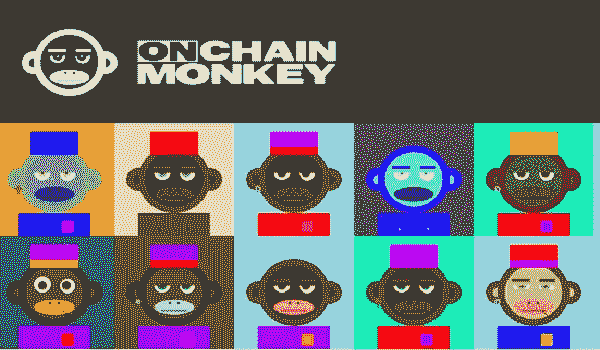

# 受 OnChain Monkey 启发的激励学习

> 原文：<https://medium.com/coinmonks/incentivising-learning-inspired-by-onchain-monkey-eb66690064d6?source=collection_archive---------21----------------------->

他们的激励良好模式是一场社会影响的革命

我昨天买了一只猴子。这是一次幸运的进场，因为在 24 小时内，最低价比我的买入点高出了 70%左右。你不喜欢这种情况吗？然而，我对价格的上涨并不感到不安，因为确实如此！在这里玩起来。

我把我的 NFT 股票分为三类——交易、投资和归属。我所有的交易赌注都是围绕炒作和我对它的看法。我的投资论点很简单——这个空间将在 3 年内成倍增长。因此，我认为这些项目将会在这里，并在那之后获得巨大的成功。

最后，归属感。这是由心而不是由脑做出的决定。如果我觉得一个社区大部分是由真正优秀的人组成的，他们有长远的想法，我在那里会有宾至如归的感觉。这可能包括 Grassverse 这样的摄影收藏，Moonshot 这样的音乐收藏，或者 Onchain Monkey 这样的 10k pfp 收藏。

这个系列的起源是基于为世界做好事的使命。但是创始人并不是生活在理想主义的世界里。他们想通过奖励善来创造一个理想主义的世界。这不是一个我掉以轻心的想法。它可能真的会改变世界。我不知道他们会如何执行，但光是这种雄心就令人钦佩。

他们通过去年的工作证明了他们能够实现这一目标。我想成为其中的一员。我想成为解决‘好’的问题的社区的一员。这是我对这个社区的第一个贡献。这是我今天的一个粗略的想法，也应该被如此对待。

我没有完全描述这个项目及其组成部分是有原因的。我没有谈任务，甜点和因果报应，因为我没有完全理解它们。坦白地说，我昨天看 OCM 维基时睡着了。

和大多数项目一样，了解这个项目并不有趣，也不吸引人。所以，我建议 OCM 的开发者将 OCM 维基游戏化。你可以创建一个有趣的小游戏，以猴子为主角，通过不同的关卡来赚取香蕉。当用户登陆你的网站来了解这个项目时，他会直接进入游戏，通过完成不同的关卡来了解这个项目。完成所有关卡后，用户可以选择“不失去”他通过购买 NFT 获得的所有香蕉。在他买了一个 NFT 后，香蕉也归他所有。

这实现了三个目标:

1.  现在，学习过程既有趣又吸引人，
2.  用户被激励去了解这个项目。
3.  他现在更倾向于从该项目中购买 NFT，因为他现在更加了解它，并且也不想失去他已经赚到的香蕉。

我认为在 OCM 社区有足够多的有能力的开发者可以很容易地建造它。最重要的是，你可以拉一个亚马逊。亚马逊有一个服务器问题，他们通过创建 AWS 将这个问题转化为一个巨大的盈利机会。

你可以为空间中的不同项目创建类似的游戏，只需支付合理的费用。他们会很乐意为此买单，因为你将为他们解决一个大问题。反过来，你将通过激励学习为道创造一个良好的收入来源。

再说一次，这是一个粗略的想法，但我喜欢分享粗略的想法，因为这些想法中会有更好的想法。我希望这件事会有好的结果。

干杯，
NFT 果

> 交易新手？试试[加密交易机器人](/coinmonks/crypto-trading-bot-c2ffce8acb2a)或者[复制交易](/coinmonks/top-10-crypto-copy-trading-platforms-for-beginners-d0c37c7d698c)