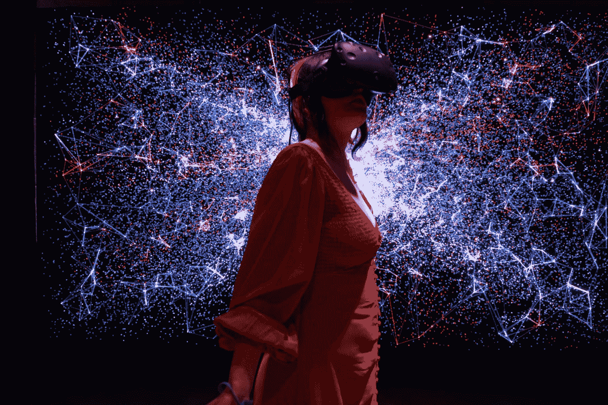
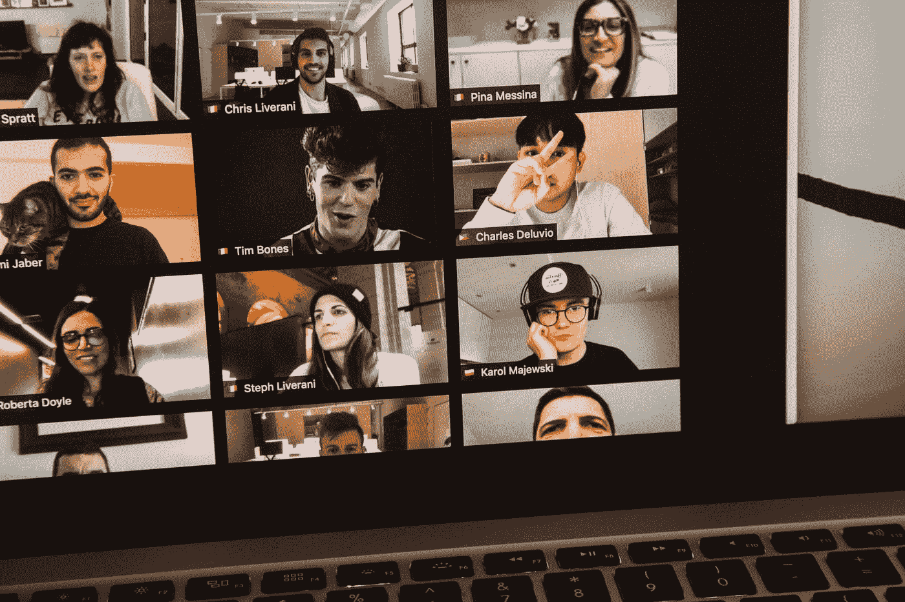

# 冒险进入元宇宙，增加你的在线品牌价值

> 原文：<https://medium.com/coinmonks/increase-your-brand-value-online-by-venturing-into-the-metaverse-2f504521f886?source=collection_archive---------32----------------------->

Photo by [Sara Kurig](https://unsplash.com/@sara_kurig?utm_source=medium&utm_medium=referral) on [Unsplash](https://unsplash.com?utm_source=medium&utm_medium=referral)

对于那些想要从竞争中脱颖而出并拥抱创造力的品牌来说，创新是必不可少的。企业开始看到 NFTs 的效用。将非物质文化遗产整合到其品牌战略中的公司应该考虑与 [NFT](https://prominentcrypto.com/nft/) 的创造者合作，将活动符号化，将实物产品转化为非物质文化遗产，授权，举办 NFT 竞赛和赠品。Zipline 的[调查](https://getzipline.com/blog/when-it-comes-to-retail-does-the-metaverse-matter/)结果显示，84%的 X 一代、70%的千禧一代和 63%的 Z 世代人会对他们喜欢的品牌的 NFT 感兴趣。

NFT 允许品牌为数字产品增加价值；然而，产品必须对消费者有价值。像古驰这样的品牌已经创造了 NFT 服装，耐克提供了可以在元宇宙穿的数字运动鞋。NFT 的新兴使用现在允许品牌融合数字和物理世界；消费者可以购买或赢得一个数字产品，如图像或视频，然后公司可以提供一个实体品牌的产品来结束营销循环。公司可以自己设计 NFT 或者使用专门创建 NFT 和 NFT 平台的公司。[NFT 是品牌与消费者建立联系并提高品牌认知度的可行选择](https://prominentcrypto.com/strengthen-your-brand-with-nft/)。投资使用预建 NFT 平台的品牌更有可能获得市场收益。

# 设计一个互动的虚拟展示

Photo by [Mike Petrucci](https://unsplash.com/@mikepetrucci?utm_source=medium&utm_medium=referral) on [Unsplash](https://unsplash.com?utm_source=medium&utm_medium=referral)

过去，客户会访问一个网站或应用程序来访问公司提供的产品。随着技术的进步，品牌可以为客户创造更多身临其境的体验。顾客可以参观一个虚拟商店，就像耐克创建的那样，而不仅仅是看产品。在元宇宙，顾客可以通过虚拟形象来试穿衣服和其他产品，从而与数码产品进行互动。品牌应该探索将客户体验从简单的网站访问提升到丰富的沉浸式体验的可能性。埃森哲消费者调查显示，64%的受访者进行了虚拟购物，83%的人愿意通过元宇宙购物。

模拟传统店内购物体验的便利和效率的品牌更有可能吸引顾客的注意力。一旦决定在元宇宙开设店铺，商家必须决定使用哪个元宇宙平台。已知的平台是存在的，但品牌应该考虑建立自己的平台，以便进行更多的控制。商店布局可以是独立的应用程序或虚拟空间。多媒体公司可以帮助品牌创建和设计交互层，定义店面的功能以及与第三方工具集成的能力。客户可以使用虚拟眼镜、触觉手套、智能眼镜和 VR 耳机等可穿戴设备获得 3D 体验。构建良好的店面能够实现高水平的互操作性，增加消费者对数字对象的数据访问和操作。

# 创建虚拟事件

Photo by [charlesdeluvio](https://unsplash.com/@charlesdeluvio?utm_source=medium&utm_medium=referral) on [Unsplash](https://unsplash.com?utm_source=medium&utm_medium=referral)

由于 Zoom 的兴起，虚拟会议风靡一时，品牌可以通过举办定制的虚拟活动来利用这一变化。身临其境的虚拟体验可以为寻求超越地理边界扩张的品牌吸引新的商业客户。虚拟活动的类型和结构仅受创意水平的限制，并允许无限的定制。品牌可以与影响者合作，甚至创建自己的虚拟影响者。

企业可以通过移动设备或笔记本电脑举办现场直播或预先录制的活动。虽然需要 VR 眼镜或耳机的 3D 活动是可能的，但现在没有那么受欢迎。

艺术家是利用元宇宙通过现场音乐、喜剧表演和其他社会活动吸引顾客的最大群体之一。虚拟活动参与者可以使用化身出现在虚拟世界中，化身允许他们在听他们最喜欢的艺术家的同时与其他人跳舞。Roblox 利用元宇宙的创新技术，在其虚拟音乐会上有超过 3300 万人参加。包括堡垒之夜在内的游戏市场已经成功地利用虚拟现实游戏在客户互动中推广产品，展示了虚拟品牌的力量。

虚拟参展商可以像传统的会议室活动一样创建真实的互动。公司可以使用品牌展位来展示各种内容，但高质量的制作是关键。品牌可以使用虚拟令牌、徽章、头像更新和数字赠品将粉丝转化为客户。元宇宙为与会者提供了进一步接触的机会。品牌必须做出具体决定，以确保潜在客户是活动的一部分，而不仅仅是观众。

# 开始你自己的元宇宙

Photo by [Roméo A.](https://unsplash.com/@gronemo?utm_source=medium&utm_medium=referral) on [Unsplash](https://unsplash.com?utm_source=medium&utm_medium=referral)

在虚拟平台上存在是好的，但拥有自己的平台更好。品牌应该考虑创建自己的虚拟平台。虽然最初看起来财务上有风险，但提供有针对性和品牌化的客户互动的能力只会增强消费者体验。想要在元宇宙成功上市的公司必须准备一份市场分析，以确保该项目满足客户的需求，并在竞争中脱颖而出。一些公司甚至提供创建你自己的安全智能合同、NFT 市场等等的能力。

> 交易新手？试试[加密交易机器人](/coinmonks/crypto-trading-bot-c2ffce8acb2a)或者[复制交易](/coinmonks/top-10-crypto-copy-trading-platforms-for-beginners-d0c37c7d698c)