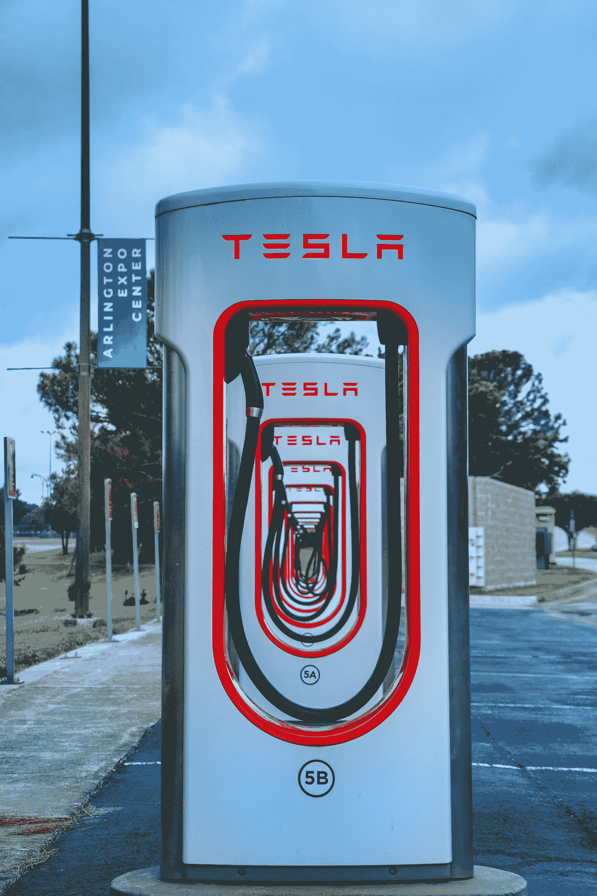

# 围绕电动汽车的产业政策

> 原文：<https://medium.com/coinmonks/industrial-policies-around-electric-vehicles-evs-877aa7f20766?source=collection_archive---------35----------------------->

Photo by [Trac Vu](https://unsplash.com/@tracminhvu?utm_source=medium&utm_medium=referral) on [Unsplash](https://unsplash.com?utm_source=medium&utm_medium=referral)

我的目标是分享一些关于产业政策未来方向的想法，以及地缘政治趋势将如何影响电动汽车(E-mobility)。

我在下面的文章中提供了三个突破:

1.)电动汽车充电网络*重新定义*在全球范围内，交通和移动被视为一种交通方式；

2.)由于监管环境仍不确定，原材料在电动汽车生产中占据了更新、更有*先见之明的*位置；

3.)电池正在演变成一个大规模的产业，在这个产业中，生产商努力确保世界上一些最脆弱地区的供应安全(T4)

要继续阅读这篇故事，请点击下面的 [**链接**](/@44jmonroe91/industrial-policies-around-electric-vehicles-evs-promote-new-ideals-on-e-mobility-d3466fdd274d) 。

 [## 围绕电动汽车(ev)的产业政策促进了电动汽车的新理想

### 这篇文章旨在促进我的许多同行媒体作家，他们已经揭示了最…

medium.com](/areas-producers/industrial-policies-around-electric-vehicles-evs-promote-new-ideals-on-e-mobility-d3466fdd274d) 

完整的故事发表在 [**地区&制片人**](https://medium.com/areas-producers) 。

 [## 地区和生产商

### 这份出版物通过分析商业新闻、法律案件和与…有关的国际事务，探索了一种范式的转变

medium.com](https://medium.com/areas-producers) 

> 交易新手？尝试[加密交易机器人](/coinmonks/crypto-trading-bot-c2ffce8acb2a)或[复制交易](/coinmonks/top-10-crypto-copy-trading-platforms-for-beginners-d0c37c7d698c)