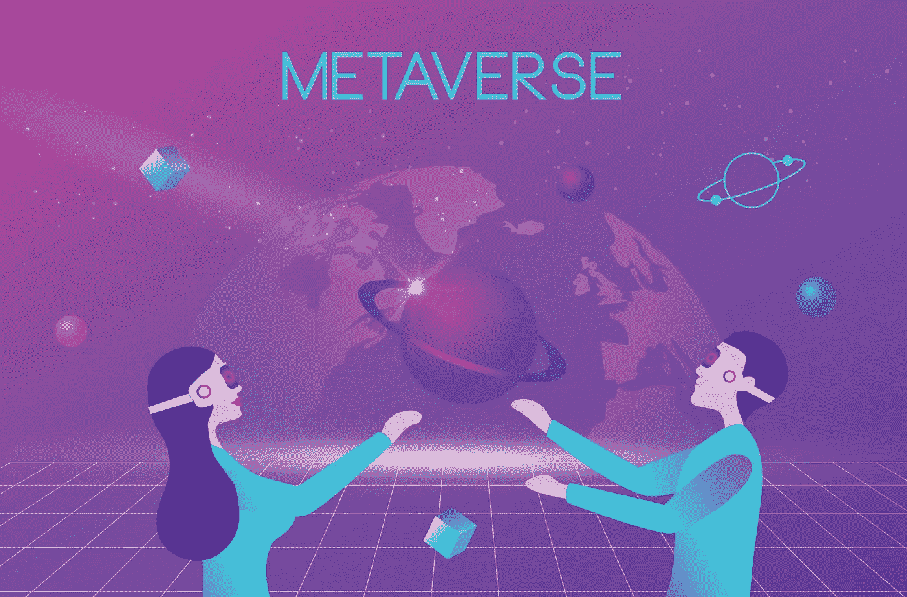

# 被元宇宙打乱的产业

> 原文：<https://medium.com/coinmonks/industries-disrupted-by-metaverse-c7dfb131ccd7?source=collection_archive---------29----------------------->

元宇宙可能是一个营销噱头，可能会也可能不会飞，我不知道，但它已经开始扰乱我们今天的工作方式。

大型企业和行业正在试验元宇宙，在这篇文章中，我将讨论元宇宙可能会破坏的行业。

元宇宙将为在这些行业工作的人带来新的机会，所以让我们一起来看看吧。我将讨论在不久的将来可能被打乱的四个行业。

**社交媒体**

脸书公司更名为 Meta，他们已将名称改为 Meta，并计划转移到这些世界。Meta 的目标是创造下一个版本的互联网，在这个版本中，人们将不再局限于被动的消费和反应。它将带领我们踏上一段旅程，改变我们社交、工作、购物、娱乐以及与周围世界互动的方式。

**Snapchat** 也进入了元宇宙的世界。他们最近推出了阿凡达镜头 ar，让用户看起来像模拟人生中的角色。 **Tik Tok** 也在尝试或准备开始做非功能性博客，内容创作者可以用他们在 Tik Tok 的帖子做一个 NFT。元宇宙可能不会改变社交媒体的一切，但肯定会释放出新的社会福利，这与我们之前看到的任何事情都不一样。

**游戏**

游戏市场很大，全球有超过 250 万游戏玩家，千禧一代花大量时间玩游戏。元宇宙颠覆游戏产业的主要原因是，在元宇宙，人们可以利用 3D 技术在虚拟环境中创造真实的现实世界。因此，无论你现在能想象在现实世界中发生什么，都可以在虚拟世界中重现。

游戏公司正在将 NFTs 和区块链结合起来，开发真正属于玩家的游戏。更多的游戏玩家正沉浸在虚拟世界中，在那里他们可以玩元宇宙游戏，也就是[Axie infinity](https://axieinfinity.com/)；[沙盒](https://www.sandbox.game/en/)和 [Pegaxy](https://pegaxy.io/) 不一而足。

**时尚**

在学习了 2020 年的疫情之后，服装品牌和零售商迅速采用虚拟销售渠道，为他们的顾客提供有价值的产品。实现这一目标的一种方式是通过引入 AR/VR 驱动的数字展厅，让客户能够在购买之前看到特定服装产品在他们身上的样子。消费者现在可以虚拟地与任何一件衣服互动，而不是用他们的想象力去想象一件衣服是什么样子——更重要的是，他们穿起来会是什么样子。他们可以对产品进行 360 度全方位的观察。他们可以放大甚至最小的细节，而不是依赖品牌上传到网站的几张照片。现在，消费者甚至可以通过将一件或多件商品拖到自己的照片上来进行虚拟试穿。

另一个有趣的用例是 [**Dressx**](https://nft.dressx.com/) ，在这里你可以为你所有的 web3 体验创建你的元衣橱你的数字衣服衣柜。这是你在虚拟世界、社交媒体、照片、视频、视频通话(即将推出)和元宇宙中打扮自己的首选目的地。

> 交易新手？试试[密码交易机器人](/coinmonks/crypto-trading-bot-c2ffce8acb2a)或[复制交易](/coinmonks/top-10-crypto-copy-trading-platforms-for-beginners-d0c37c7d698c)

**金融**

元宇宙的金融将变得非常重要，就像现实世界一样。银行和信用合作社开始测试在未来提供元宇宙客户体验。例如，汇丰银行购买了沙盒中的虚拟土地，与体育、电子竞技和游戏爱好者接触[1]。

Sokin 是一家总部位于伦敦的金融科技公司，正在建设处理元宇宙支付、交易和投资的基础设施。包括北美科技公司 TerraZero 在内的几家公司正在为元宇宙的虚拟房地产融资提供后台支持。不乏金融服务公司在探索元宇宙最新发展的效用。

一个有趣的用例是，你可以在元宇宙世界像在真实世界一样贷款给分散的土地、NFTs 等。这些平台，即 [Pawnfi](https://pawnfi.com/) ，你可以用你的 NFT 作为抵押来获得贷款。假设你有 NFT，即加密猫或无聊猿，你可以用它们作为抵押品，并以法定货币支付你的账单等。

如果你想持有你的 NFTs，你不想出售它获得现金，所以你可以把它锁定在一个智能合同中，在这个平台上获得法定货币贷款，即美元，欧元或卢比等。

参考

1.  [https://gadgets 360 . com/cryptocurrency/news/HSBC-the-sandbox-jp-mor gan-元宇宙-2828469](https://gadgets360.com/cryptocurrency/news/hsbc-the-sandbox-jp-morgan-metaverse-2828469)[https://www . pym nts . com/元宇宙/2022/sokin-launching-ecommerce-元宇宙-world/](https://www.pymnts.com/metaverse/2022/sokin-launching-ecommerce-metaverse-world/)
2.  [https://TechCrunch . com/2021/12/23/snapchat-know-you-want-to-see-youd-look-like-in-the-元宇宙/](https://techcrunch.com/2021/12/23/snapchat-knows-you-want-to-see-what-youd-look-like-in-the-metaverse/)
3.  [https://www.tiktok.com/tag/metaverse?lang=en](https://www.tiktok.com/tag/metaverse?lang=en)
4.  [https://www . CNET . com/tech/computing/how-the-game-industry-is-charging-in-the-元宇宙/](https://www.cnet.com/tech/computing/how-the-game-industry-is-charging-into-the-metaverse/)
5.  [https://www . McKinsey . com/industries/retail/our-insights/how-the-fashion-industry-can-get-into-a-元宇宙思维模式](https://www.mckinsey.com/industries/retail/our-insights/how-the-fashion-industry-can-get-into-a-metaverse-mindset)
6.  [https://www.wired.com/story/extreme-fashion-metaverse/](https://www.wired.com/story/extreme-fashion-metaverse/)

> 加入 Coinmonks [电报频道](https://t.me/coincodecap)和 [Youtube 频道](https://www.youtube.com/c/coinmonks/videos)了解加密交易和投资

# 另外，阅读

*   [火币加密交易信号](https://coincodecap.com/huobi-crypto-trading-signals) | [HitBTC 审查](/coinmonks/hitbtc-review-c5143c5d53c2)
*   [TraderWagon 回顾](https://coincodecap.com/traderwagon-review) | [北海巨妖 vs 双子座 vs BitYard](https://coincodecap.com/kraken-vs-gemini-vs-bityard)
*   [如何在 FTX 交易所交易期货](https://coincodecap.com/ftx-futures-trading)
*   [OKEx vs KuCoin](https://coincodecap.com/okex-kucoin) | [摄氏替代度](https://coincodecap.com/celsius-alternatives) | [如何购买 VeChain](https://coincodecap.com/buy-vechain)
*   [ProfitFarmers 回顾](https://coincodecap.com/profitfarmers-review) | [如何使用 Cornix 交易机器人](https://coincodecap.com/cornix-trading-bot)
*   [如何匿名购买比特币](https://coincodecap.com/buy-bitcoin-anonymously) | [比特币现金钱包](https://coincodecap.com/bitcoin-cash-wallets)