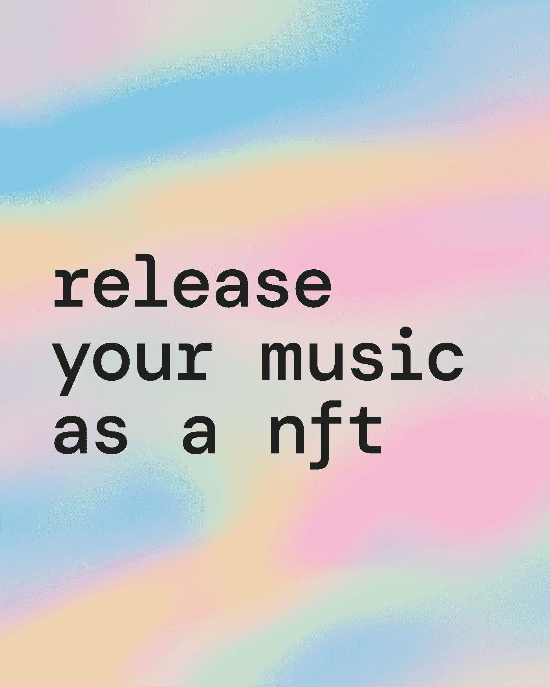

# 本月在音乐 NFTs

> 原文：<https://medium.com/coinmonks/industry-radar-this-month-in-music-nfts-f68863cb1828?source=collection_archive---------34----------------------->

从卡迪小子到华纳音乐集团，10 月份已经有一些知名公司被吸引到 NFT 领域。以下是《音乐与网络 3 》( all things music & web 3)的过去和未来:

安妮卡·罗斯是 NFT 舞台上的新人，本月早些时候她在 T2 首次亮相。这位 20 岁的歌曲作者与艺术家代言人 [Nvak Collective](https://nvakcollective.xyz/) 合作，发布了她最新歌曲《瘀伤》的 25 首新专辑。随着越来越多的后起之秀选择 web3 路线，人们应该会大开眼界，看到区块链技术对那些利用它的人来说是多么有利可图和有回报。

在 EDM 方面，荷兰制作人兼 DJ [**圣赫萝**](https://sanholo.com/) 宣布他即将于 10 月 15 日在 NFT 落下帷幕。这个名为“漂浮的碎片”的项目将包含被设定为生成视觉艺术的音乐片段——一种融合了 EDM 的寻宝游戏。每次购买“漂浮碎片”都会附带可兑换的实物收藏品。NFT 持有者也可以将这些片段拼凑成一个完整的曲目，这将使他们有机会赢得艺术家本人的限量版黑胶唱片！

嘻哈奇才**卡迪小子**用三管齐下的方法来发行他的最新专辑 [Entergalactic](https://pitchfork.com/reviews/albums/kid-cudi-entergalactic/) 。数字发行，网飞系列和现在的 NFT 合作都是 Cudi 进入数字领域的最新尝试的一部分。他已经与 web3 音乐公司[秘密花园](https://www.waverlylab.com/project/secret-garden)合作，为 Entergalactic 的 15 首歌曲中的每一首制作独特的人工智能生成的可视化效果。我们期待看到迷幻的视觉效果与卡迪小子众所周知的流畅的嘻哈民谣的结合。

十月秘密花园也没有结束。他们还与林肯公园的麦克·信田合作发行了“风铃”。这个庞大的项目包括 2000 幅独立的艺术作品，这些作品(在麦克·信田的帮助下)被制作成了交互式音乐播放器。这是一个真正新颖的概念，Shinoda 的粉丝——以及一般的音乐互动——可以在 [OpenSea](https://opensea.io/collection/windchime) 上利用这个独一无二的 NFT。秘密花园的联合创始人 Eric Gao 甚至和 Shinoda 一起去讨论发行事宜以及 web3、和 NFTs。

尽管 NFT 空间一直直言不讳地支持业余艺术家(并帮助他们绕过通过标签获得成功的乏味途径)，但我们特别感兴趣地注意到华纳音乐集团(Warner Music Group)的到来。本月早些时候，WMG 宣布与 OpenSea 合作，名称为[“可能是一个标签”](https://opensea.io/collection/probablyalabel)，旨在通过将华纳艺术家引入 web3 的世界来支持他们。该项目以标签搜索令牌的形式出现，基本上是允许购买者访问 PAL 音乐生态系统的 NFT。根据 WMG 的说法，“可能是一个标签”将有助于艺人与粉丝建立更深的联系，以及更强的归属感和收益感。

最后，我们 10 月份的 NFT 亮点是艺术和音乐世界令人兴奋的融合:[slab heads——音乐收藏](https://opensea.io/assets/ethereum/0x495f947276749ce646f68ac8c248420045cb7b5e/114017766385484385813850730723286994341039448233103194518198998629728525484133)！这是由[**KMC**](https://opensea.io/KMCnftartist?fbclid=IwAR2cR_TlLsXUU_ytwGNul4URpForN92ZanA4WxTSoe6tjmtNeAhH9aqokBs)**创作的真正独一无二的数字艺术品收藏，展示了这位艺术家漫画不同音乐流派偶像的能力，从蓝尼·克罗维兹到鲍勃·马利。web3 最有前途的方面之一是艺术家能够结合不同的媒介来创造感官扩展的体验。这些合作以公平所有权和分配的价值观为基础，可能会吸引越来越多有才华的音乐家和艺术家进入不断增长的 NFT 空间。**

****

**你是一个崭露头角的艺术家，想要为自己建立一个名字吗？寻找一份能让你获得应得版税的合同？Publicator 致力于为艺术家、粉丝和 NFT 爱好者创建一个平台，完全拥抱音乐产业的去中心化未来。传统上，从艺术家的辛勤工作中赚取版税并不一定是一件确定的事情——主要唱片公司[所有权](https://indepreneur.io/articles/5-reasons-never-sign-record-deal/)的不完整历史已经足够清楚地表明了这一点。为了将平衡转移到音乐家和粉丝身上，我们创建了一个平台，这将是你在获得被动收入之前看到的最后一样东西。我们袖手旁观创意，原创和艺术家所有权的潜在价值。请访问我们在[https://the-publicator.com/](https://the-publicator.com/)的网站，申请成为 beta 测试者，开始行动吧！**

> **交易新手？尝试[加密交易机器人](/coinmonks/crypto-trading-bot-c2ffce8acb2a)或[复制交易](/coinmonks/top-10-crypto-copy-trading-platforms-for-beginners-d0c37c7d698c)**