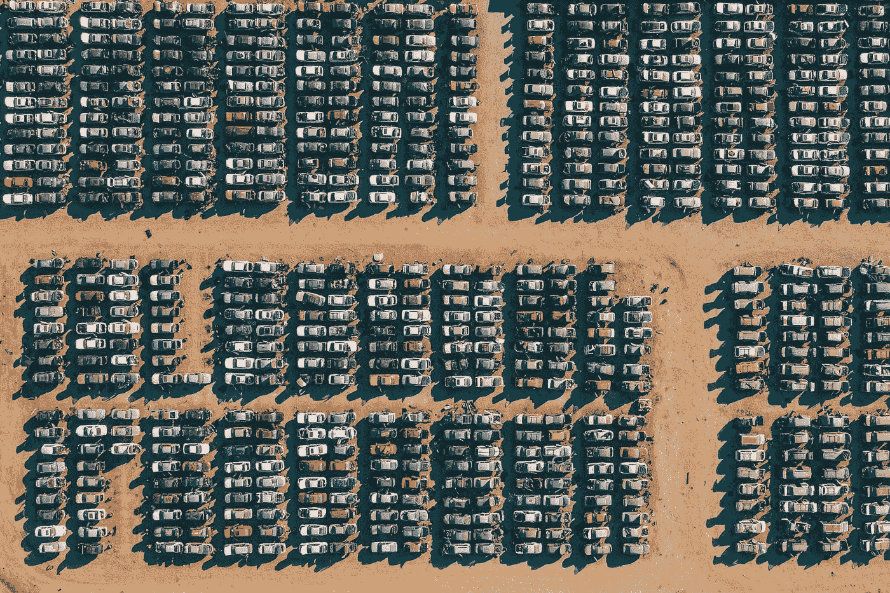

# 通货膨胀=气候变化

> 原文：<https://medium.com/coinmonks/inflation-climate-change-645ae6fe84b3?source=collection_archive---------26----------------------->

Photo by [Meriç Dağlı](https://unsplash.com/@meric?utm_source=medium&utm_medium=referral) on [Unsplash](https://unsplash.com?utm_source=medium&utm_medium=referral)

那些告诉你比特币对环境有害的环保主义者不知道他们在说什么。这是一个你可以在任何时候争论的事实:超过 60%的比特币开采是基于可再生能源，这使得它成为世界上最“绿色”的行业。这只是给你一个开始，因为事情远不止如此。所以让我们直接跳进深水区，好吗？答案是:我们当前的金融和政治体系是如何导致气候变化的，以及比特币如何解决这个问题。

但首先，通货膨胀是一个热门话题，但我会尽量让它简单易懂。通货膨胀是政府和银行创造货币时货币贬值的过程，今天是通过基于债务和信贷的系统实现的。其中一个影响或现象是，它会导致商品和服务的价格随着时间的推移而上涨。你可能已经注意到，也可能没有注意到，在过去的几个月里，物价一直在上涨，而这一切都是由我们运行世界经济的基于通货膨胀的金融和货币体系造成的，也就是所谓的法定货币。

通货膨胀也助长了我们高度消费主义的社会，扭曲了我们的时间偏好，使我们难以为未来储蓄，从而使我们更喜欢现在消费和购买东西。简而言之:是我们的钱的运作方式迫使我们创造和购买我们原本不需要的东西。消费本身并不是坏事，而是我们想要避免的浪费和不必要的消费和生产。

说到我们本不需要做的事情，通货膨胀也会导致适得其反的政府支出。正如我们之前讨论过的，是通货膨胀而不是税收为政府及其项目提供资金。这些项目用光并扔掉资源，否则如果没有这个欺骗性的通货膨胀系统，这些资源就不会得到资助。这也是一个自我发展的系统，因为人们投票给他们认为以更少的钱给他们更多的权力的政客。他们说:不要介意挖一个洞然后再把它铲回去的浪费，如果这意味着给人们提供工作，我可以得到我的选票。

但是这和气候变化有什么关系呢？我引用了作者兼比特币思想家杰夫·布斯(Jeff Booth)的一句话，他说“在一个有限的世界里，通胀性的货币政策保证了这个世界会燃烧起来。”这意味着，在一个以债务为基础的体系中，必须创造越来越多的东西来填补不断增长的空白，我们将肯定会耗尽资源。“气候变化”的争论最终是一个资源管理的问题，如果从我们的债务和基于消费的通胀货币体系的角度来看，它无法提供解决方案。

所以，作为环保主义者，我们的目标应该是少花钱多办事。这实际上是技术让我们能够做到的。在这个技术飞速发展的时代，我们正以越来越快的速度用更少的钱获得更多。可能看起来不像，但那只是因为钱断了。如果没有货币的这种扭曲，我们应该会看到东西的价格下降，因为它们变得更便宜、更丰富。这是通缩世界中发生的事情，也是比特币将迎来的世界。

相对于比特币，价格将会下跌，因为它是一种有限供应的财产，这使它成为一个通货紧缩的货币体系。在比特币标准下，人们将有办法储存他们的购买力，而不必浪费资源制造和开发财产和资产。我们将拥有鼓励我们为未来储蓄的钱，而不是让我们自己背负债务去购买和消费今天的东西。正如杰夫·布斯所说，“金钱的充裕造成了一切事物的匮乏，但金钱的匮乏又造成了一切事物的富足。”解决资金问题是我们拯救地球的方法。

—

如果你喜欢这种讨论，来加入我的比特币社区吧！这是一个智力空间，让东南亚人探索比特币迫使我们审视的想法和问题，并将其融入语境。我每两周主持一次有主持的讨论会，我们讨论比特币思想者的播客，任何人都可以加入。这是一种令人心寒的氛围，你可以听进去，即使只是在聊天中做出反应也很有趣。我们今晚 9 点(GMT+8)有一个关于杰夫·布斯的节目，我们肯定会涵盖上面的一些想法，所以我希望在那里见到你！加入我们:[https://discord.gg/XvxYuS2WF6](https://discord.gg/XvxYuS2WF6)