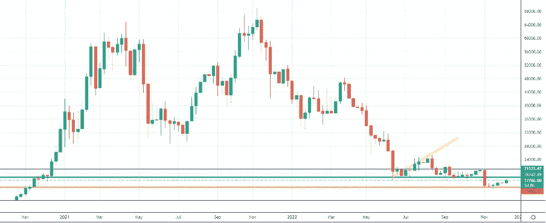
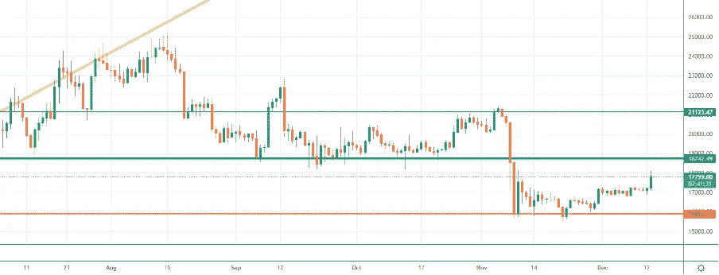
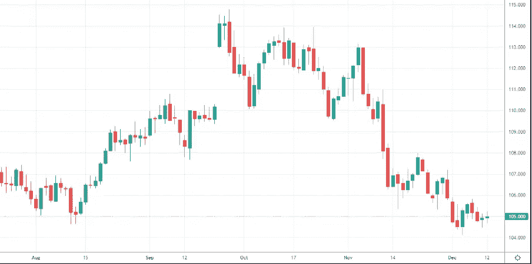
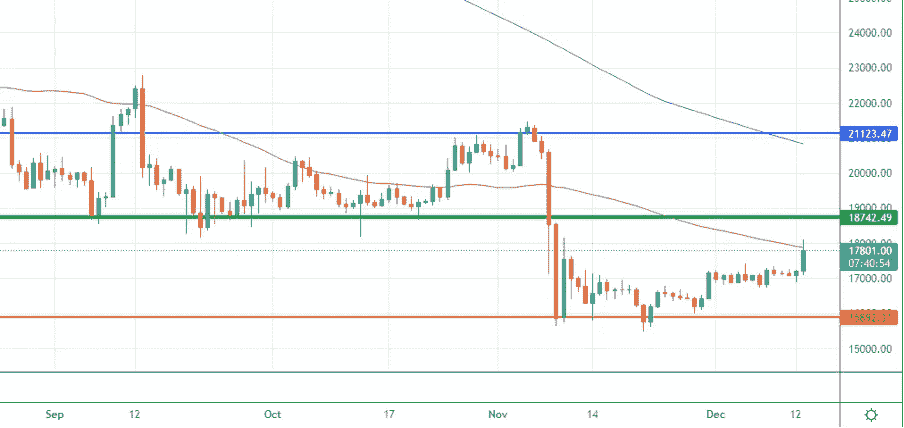
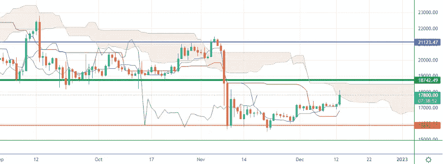

# 通胀数据给比特币市场带来一些信心

> 原文：<https://medium.com/coinmonks/inflation-data-bring-some-confidence-to-bitcoin-market-bb9411213d19?source=collection_archive---------20----------------------->

我们将进入什么样的市场阶段一直是我们上次约会的开场白问题。我们要听牛市还是熊市？我们会看到牛市还是熊市？
欢迎来到“市场冲浪”,我们已经进行了第 31 次约会，我希望这些简单的技术分析能在某种程度上帮助你，甚至只是评估不同的市场观点。
分析师预计通货膨胀率为 7.3%，而官方公布的数据为 7.1%。美国通胀率低于预期，给市场带来一些信心。

# 让我们从我们通常的每周视角开始

Weekly Chart — Source: Tradingview

*“在这个“后 FTX 时代”，我们正在 16500 美元区域的新价格水平上盘整，波动性下降。投资者现在买卖都很谨慎。目前的价格仍有机会朝着绿线上涨一点点，但我们必须看看其他交易所是否会很快违约。Crypto.com 和 Gate.io 都在谈论潜在的疲软。你可以在这里阅读我关于这个主题的最后一篇内容"*
这是我在三版冲浪市场分析中写的，正如你所见，该地区的价格仍然稳定，波动性仍然很低，交易量也不高。
我将继续引用我自己的话:
*“如前所述，在我个人看来，如果出现重大坏消息，如巨大的电力危机、移动网络危机或俄罗斯的天然气限制，比特币价格只能跌至 15000 美元。”*
*好吧，在这种情况下，发生了重大事件但我没有考虑一级交易所的违约。更多的第一层现在在聚光灯下！*

# 从日常角度来看，我期望什么？

Daily Chart — Source: Tradingview

橙色支撑目前正在抵抗，即使我不排除在即将到来的周末会出现一些假突破，此时交易量减少，市场可能更容易定向。 **没有假突破，但价格上涨不错！这是我上两周写的。我们现在相当稳定地在 17000 美元上方交易。**

Source: Screenshot Dollar Stregth Index

美元强势指数在 104 点区域找到了强有力的支撑。DXY 的稳定通常是一个潜在的看涨信号，因为它代表了市场的巩固，给买家和交易者带来了更多的信心。

50MA 和 200MA 现在更接近了。50MA 可以作为电阻。无论如何，现在的想法是观察每日收盘，如果它高于 17300 美元水平，我们可能会看到进一步的上涨。

Daily Chart — Source: Tradingview

市云被价格打破了。如果云将被完全侵入，云可能开始充当支撑，启动下一个运动。

Daily Chart — Source: Tradingview

# 有什么特别要观察的？

我悄悄看涨，由于通货膨胀数据，我得到了一些结果。市场不可能永远看跌，因此我预计未来几个月可能会出现进一步的真正看涨走势。让我知道你对这个新的每周约会的想法，以及你希望更多地考虑(甚至解释)哪些指标。
敬请关注，我的内容出来的时候一定要关注。

# 促销建议

还有一点:如果你真的不关心技术分析，或者你不喜欢花时间在市场上，一定要去看看 [Zignaly](https://zignaly.com/app/signup/?invite=mikezillo) 平台，这是一家币安官方经纪合作伙伴，管理着大量的交易量。他们提供很好的利润分享交易服务，你可以模仿其他专业交易者，与他们分享利润！一定要给个眼神！
如果您有兴趣提前获得我们合作伙伴指标发布的通知，请在此留下评论，以便我们了解您是否有兴趣！

> **我写的任何内容都不能代表任何形式的财务建议。所以，在采取任何行动之前，先做好自己的研究。**

> 交易新手？尝试[加密交易机器人](/coinmonks/crypto-trading-bot-c2ffce8acb2a)或[复制交易](/coinmonks/top-10-crypto-copy-trading-platforms-for-beginners-d0c37c7d698c)