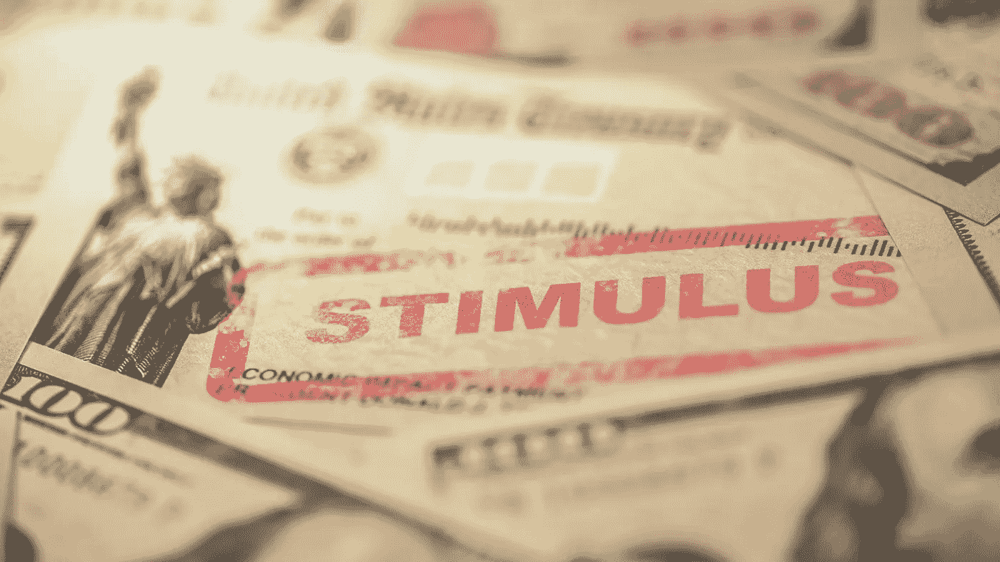
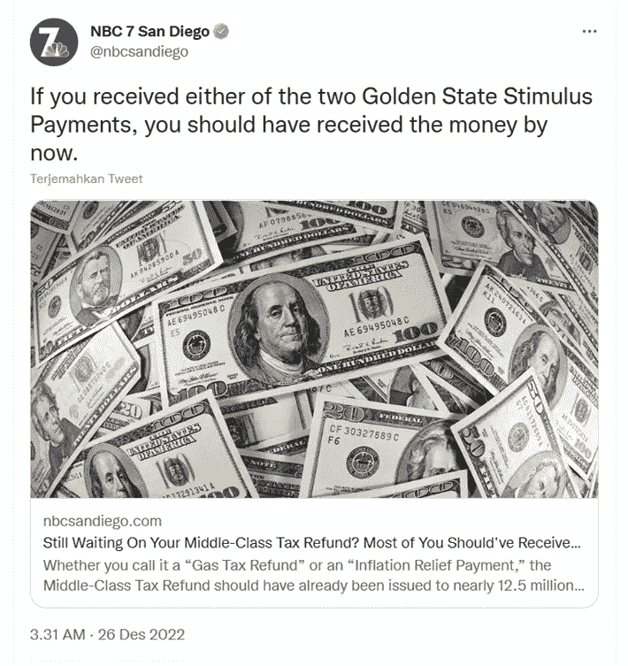
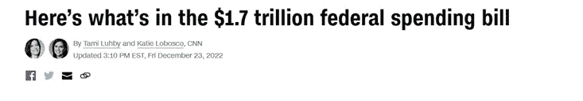

# 缓解通货膨胀只是短期的解决办法？？

> 原文：<https://medium.com/coinmonks/inflation-relief-is-only-a-short-term-solution-bb1a53c289ca?source=collection_archive---------64----------------------->

通货膨胀刺激计划是为了帮助人们应对由于通货膨胀而导致的食品、燃料和几乎所有东西的高成本而设立的拨款。

> 不知道什么时候买卖 cryp，试试[复制交易](http://coincodecap.com/go/bityard)。

提供的通货膨胀援助可以是个人支票、税收援助等形式。实施通胀援助的几个国家包括(我只列出了几个国家):

# 加利福尼亚

[https://twitter.com/nbcsandiego/status/1607111705414205440?s=20&t=SUsSRgDml-IE9pN0PHECkg](https://twitter.com/nbcsandiego/status/1607111705414205440?s=20&t=SUsSRgDml-IE9pN0PHECkg)

高达 1050 美元的中档退税将从 12 月份持续到 2023 年。付款从 10 月份开始，但会持续到明年 1 月份。退款将通过借记卡发送

# 西班牙

西班牙政府通过了一项新计划，旨在将乌克兰战争的经济后果减少高达 106 亿美元。除其他外，西班牙政府的援助形式

1.  年收入低于 27000 欧元(28674 美元)的 420 万个家庭将获得一次性支付的 200 欧元食品支票。
2.  到 2023 年底，当地和地区交通工具可免费乘坐火车
3.  养老基金的增加

# 意大利

今年 8 月，意大利批准了一项价值约 174 亿美元的新援助计划，以帮助保护企业和家庭免受飙升的能源成本和飙升的消费价格的影响。

# 美利坚合众国

[Here’s what’s in the $1.7 trillion federal omnibus spending bill | CNN Politics](https://edition.cnn.com/2022/12/20/politics/spending-bill-congress-omnibus/index.html)

1.  450 亿美元的援助，以帮助乌克兰抵御俄罗斯的攻击。
2.  380 亿美元的紧急救援基金，用于帮助西部和东南部受近期自然灾害影响的美国人，包括龙卷风、飓风、洪水和野火
3.  保护怀孕女工
4.  医疗补助和其他医疗保健计划
5.  增加对军人和退伍军人(养老金领取者)的工资支持
6.  加强对儿童的营养援助
7.  对预防无家可归和经济适用房的投资 36 亿澳元

## 通货膨胀再膨胀之我见

当消费材料、能源、服装的价格上涨时，政府通过向社区提供补贴/给钱来提供解决方案。**当一个国家大规模印刷时，通货膨胀本身就会发生。**

通货膨胀的其他影响包括更多的失业，商品出口减少，更多的进口商品，商品价格上涨，能源燃料价格上涨，导致税收无法达到目标。

政府以金钱、纳税申报单、支票等形式提供帮助。同时，给的钱是通过印钱，给越来越多的债务负担得来的。

> 加入 Coinmonks [电报频道](https://t.me/coincodecap)和 [Youtube 频道](https://www.youtube.com/c/coinmonks/videos)了解加密交易和投资

# 另外，阅读

*   [3 商业评论](/coinmonks/3commas-review-an-excellent-crypto-trading-bot-2020-1313a58bec92) | [Pionex 评论](https://coincodecap.com/pionex-review-exchange-with-crypto-trading-bot) | [Coinrule 评论](/coinmonks/coinrule-review-2021-a-beginner-friendly-crypto-trading-bot-daf0504848ba)
*   [莱杰 vs n rave](/coinmonks/ledger-vs-ngrave-zero-7e40f0c1d694)|[莱杰 nano s vs x](/coinmonks/ledger-nano-s-vs-x-battery-hardware-price-storage-59a6663fe3b0) | [币安评论](/coinmonks/binance-review-ee10d3bf3b6e)
*   [加密交易机器人](/coinmonks/crypto-trading-bot-c2ffce8acb2a) | [Bingbon 评论](https://coincodecap.com/bingbon-review)
*   [Bybit Exchange 审查](/coinmonks/bybit-exchange-review-dbd570019b71) | [Bityard 审查](https://coincodecap.com/bityard-reivew) | [Jet-Bot 审查](https://coincodecap.com/jet-bot-review)