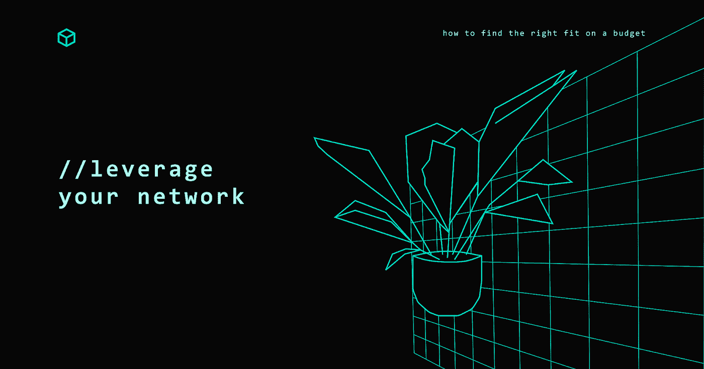
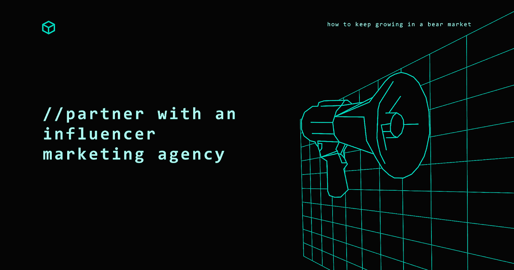

# Web3 中的影响者营销:如何根据预算找到合适的产品？

> 原文：<https://medium.com/coinmonks/influencer-marketing-in-web3-how-to-find-the-right-fit-on-a-budget-c6be09c16e04?source=collection_archive---------14----------------------->

Influencer Marketing in Web3

## 传统的影响者营销在 Web3 中已死。你必须做的不仅仅是给一个拥有数百万追随者的有影响力的人一些钱，并期待结果。这是因为 Web3 的用户比以往任何时候都更加清楚。他们参与他们关心的话题，并意识到虚假代言。

要在 Web3 的影响者营销中取得成功，忘记传统的 Web2 策略是至关重要的。你如何通过与合适的人合作来获得像罗根·保罗这样的人，他在 2021 年卖出了价值 500 万美元的 NFT？

较小的品牌几乎不可能获得大的影响者，但是你可以混合使用微观影响者和宏观影响者来传达你的信息。

本文将深入探讨如何在预算范围内进行影响者营销。

Think Big, Start Small

# 1.从大处着眼，从小处着手

更大。好多了。更强。这种策略对有预算的小品牌不起作用。

你应该从寻找合适的微观影响者开始。与他们的大同行相比，这些有影响力的人拥有更少、更投入的观众。你可以向他们提供免费的产品、金钱或任何对影响者和你的品牌有意义的东西。这将有助于你判断你的产品或品牌是否能引起影响者的观众的共鸣。

考虑雇佣一名全职的有影响力的营销专家。这个人应该能够识别正确的影响者，并与他们谈判有利的交易。这里有一个[很好的例子](https://cryptocurrencyjobs.co/marketing/seedify-influencer-marketing-specialist/)，一个有影响力的营销人员的职位，你可以为你的品牌复制。

> 交易新手？在[最佳加密交易](/coinmonks/crypto-exchange-dd2f9d6f3769)上尝试[加密交易机器人](/coinmonks/crypto-trading-bot-c2ffce8acb2a)或[复制交易](/coinmonks/top-10-crypto-copy-trading-platforms-for-beginners-d0c37c7d698c)

此外，追随者指标并不代表一切:

Leverage Your Network

# 2.利用你的网络

如果你没有预算来雇佣一个专门的有影响力的营销人员，还有其他选择。利用你现有的关系网，或者尝试建立一些战略伙伴关系。尝试与同行业或有类似产品的有影响力的人达成交易。

例如，如果你在 NFT 时装业，有一个服装系列，你可以与同一领域的其他有影响力的人合作。这将帮助你为你的品牌建立更多的可信度，并获得更多的曝光率。

网络很重要，这也是顶级加密营销机构之一 Coinbound 的首席执行官在他的苹果播客中谈到的。

# 3.制造赠品

微小影响者的伟大之处在于他们渴望更多的工作。你看，微小影响者把巨大影响者视为他们的长期目标，因为他们可以从一条推文中获得数千美元！

这些较小的影响者可能无法在他们的行业中与鲸鱼竞争，但他们会喜欢较小的块，也称为加密空间中的赠品。

制造赠品是增加品牌参与度的有效方式。你可以利用有影响力的人来推广你的赠品。这将帮助你建立一个更广泛的潜在客户群，并提高你的品牌的知名度。这里有一篇关于如何[为你的品牌创造](/@shaggy_ks/how-to-run-a-successful-crypto-giveaway-campaign-on-your-first-day-on-twitter-2350e4461603)有效赠品的精彩文章。

Love Thy Influencer

# 4.爱你的影响者

关于影响者营销，与你雇佣的影响者保持关系至关重要。你应该送他们小礼物(NFTs？)，为他们提供一个测试新产品的机会，向他们推销产品并发展关系。

这很重要，因为有影响力的人需要保护他们的追随者。如果他们认可的产品不符合他们的标准，这可能会影响他们的形象。因此，重要的是要确保你的产品是好的，并且你与有影响力的人保持关系，这样他们会觉得推广它是安全的。

对你的微影响者网络表现出忠诚和热爱也将为你的品牌在大影响者空间创造良好的声誉，这可以帮助你在未来接触到更多杰出的影响者。

瞄准合适的影响者；据这位联盟营销专家称，接触是次要的。

Partner With an Influencer Marketing Agency

# 5.与有影响力的营销机构合作

在 Twitter 上找到合适的影响者就像大海捞针。这就是为什么与有影响力的营销机构合作是有益的。

这些[机构](https://www.singlegrain.com/web3/web3-influencer-agency/)已经有了一个与他们合作的影响者网络，他们可以帮助你快速进入一个更大的影响者网络。他们还将能够为您协商更好的交易，并帮助您创建一个有效的影响者营销计划。

简而言之，这些机构可以让你的品牌看起来像是原创的。

# 影响者营销是命中或错过

影响者营销会一直持续下去。如果做得正确，它可以非常有效地推广你的品牌，但它也有一些陷阱。

影响者是不可预测的。你应该始终与你信任的有影响力的人合作，并在签署任何交易之前与他们建立融洽的关系。

最后，对你的活动要有现实的期望。重要的是要记住，影响者营销是一个碰运气的游戏。不管你的影响者有多好，他们的活动可能不会总是按计划进行。

成功的关键是坚持和愿意从错误中学习。你可以很容易地在预算范围内进行影响者营销，并通过正确的战略和战术取得巨大的成果。