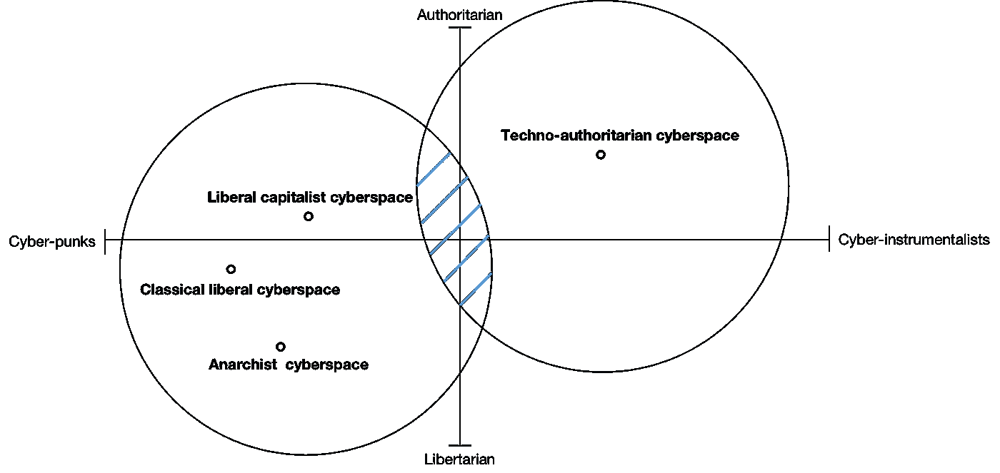

# 围绕数字资产的创新是下一次 Web3 革命的核心驱动力

> 原文：<https://medium.com/coinmonks/innovation-around-digital-assets-is-the-core-driver-of-the-next-web3-revolution-783e9d6ed8b3?source=collection_archive---------30----------------------->

Innovation around digital assets

“我们所有思想区别的根源，不管多么细微，都是一个明显的事实，那就是没有一个区别是如此的细微，以至于除了实践的可能差异之外，不存在任何东西。为了在我们对一个对象的想法中获得完全的清晰，那么，我们只需要考虑该对象可能涉及的实际类型的可想象的效果——我们将从它那里期待什么感觉，以及我们必须准备什么反应。”

*— —威廉·詹姆士*

在上文中，我们已经揭示了网络空间意识形态战争的开始，并在文章的后半部分，简要谈论了后斯诺登版本的 Web3 和超金融化的 Web3 所代表的不同意识形态，在本文中，我希望阐述两者之间的差异，并从务实的角度探索 Web3 下一波快速发展的核心驱动力。

# 后斯诺登时代的无政府主义者

很多朋友都对比特币的出现感到惊讶，就像古希腊的黄金时代一样。似乎是一个标新立异，莫名其妙的天才产品。但是，我不同意这种观点。我觉得比特币的发明一点都不偶然。是当时网络环境下的必然结果。

[在上面的介绍](/coinmonks/web3s-core-values-and-cyberspace-s-ideological-war-e866a7b4fd27)中，我们回顾了 Web 的发展历史。在古典自由网络时代，逐渐形成了开放性、包容性、全球化和中立性的设计原则。然而，随着大量 web 应用的出现，web 用户的构成发生了很大的变化。从之前的用户亚文化群体(其实通常是编码者)，到覆盖各类人群的全民主流文化群体。优先考虑高效率和低成本的实用主义盛行。

但这并不意味着开放协议的原则已经完全消失。与政治革命不同，技术进化是非暴力的，因此相应的思想进化是一个温和融合的过程。事实上，一些开发者，我们可以称之为古典自由主义的遗产，一直秉承开放协议的原则开展技术研发和相关概念推广工作，我们很容易就能找到他们，比如**自由软件基金会、电子前沿基金协会、维基媒体基金会**等组织，他们先后资助并推广了许多有趣的技术解决方案，比如 **Tor、VPN、SSH** 等。，而且他们也是第一批比特币用户，使用比特币来筹集资金，所以有理由相信比特币的设计一定是来自这部分人群。[最初的目的是为这些组织开发一个不受监管的匿名电子现金支付系统](https://en.wikipedia.org/wiki/Bitcoin)。

随着比特币的巨大成功引起了一些计算机专家的兴趣，我相信 Vitalik 和 Gavin Wood 就属于这一批人，借助比特币最重要的原创技术:工作证明(POW)共识算法，构建一个去中心化和匿名的计算机系统，从而彻底改变经典的 C/S Web 开发范式已经成为可能。

随着轰动一时的“棱镜事件”的爆发，技术和政治权威的可信度大打折扣，这为新概念的推广提供了绝佳的机会，于是我们看到了具有最新语义的 Web3 的出现，它是由加文·伍德(Gavin Wood)提出的，在这里我认为有必要再次引用这段经典的描述:

> Web 3.0，或者可以被称为“后斯诺登”网络，是对我们已经使用网络的各种事物的重新想象，但具有一种根本不同的各方互动模式。我们认为是公开的信息，我们会公布。我们认为是一致同意的信息，我们放在一致同意的分类账上。我们认为是私人的信息，我们保守秘密，从不泄露。通信总是在加密信道上进行，并且仅使用假名身份作为端点；从不带有任何可追踪的东西(比如 IP 地址)。

这个版本的 Web3 的核心愿景是建立一个去权威化、无审查的网络世界，充分保护个人隐私。这可以看作是对网络空间无政府主义的经典诠释，所以我愿意称之为**无政府主义 Web3** 。值得注意的是，做出如此明确区分的意义在于，我们需要弄清楚用什么原则来指导我们的应用设计，才能实现最终的愿景，从而完成最符合我们诉求的网络的构建。

> 交易新手？试试[密码交易机器人](/coinmonks/crypto-trading-bot-c2ffce8acb2a)或者[复制交易](/coinmonks/top-10-crypto-copy-trading-platforms-for-beginners-d0c37c7d698c)

在这样的思想指导下，对去中心化和私密性的终极追求催生了一系列有趣的 Web3 项目。此类项目的成功案例通常基于底层基础设施。回想一下那些高超的密码学和共识算法，我就不举具体的例子了，因为你可以找到很多著名的项目，但是涉及到应用层和协议层的并不多。或许 ENS 是个例外。

# 超级金融自由资本主义网站 3

自 2013 年 MasterCoin 设计了第一个初始硬币发行(ICO)以来，以加密货币为载体的众筹模式逐渐流行，随着 ERC-20 等协议层的完善，发行和参与的门槛大大降低。2017 年，ico 的发展达到顶峰。

让我们回顾一下这段历史。作为标的物的硬币(或称代币)也演变成不同的类型，最具代表性的是效用凭证和所有权凭证。前者类似于一张入场券。有了这个证书，你才有权利使用目标项目。其实在 ICO 发展初期，项目发行的代币大部分都属于这一类型，包括 Mastercoin、NextCoin，甚至以太坊(早期以太坊设计中并没有包含 POS)。

权属证书的产生和快速发展离不开两个契机。第一个是一个叫 Sunny King 的极客在 2012 年提出了 Stake 的证明(POS)并开发了 Peercoin。我觉得这个概念最大的贡献在于，它第一次提出了用 token 来承载一个独占的网络所有权的范式设计(虽然在这里，Token 承载的更多的是一个分红权)，然后围绕网络所有权的范式设计就变成了 2018 年，EOS 的 ICO 迎来了发展的巅峰。但是过度的开发泡沫和没有实现的应用爆炸，使得开发停滞不前。

所有权凭证的第二次发展机会，我认为可以追溯到 Comp token by Compound 的发行，这也彻底开启了超金融**自由资本主义 Web3 时代**。在此之前的很长一段时间里，所有权证书的开发都集中在底层网络的所有权分配上，应用层似乎并没有做出反应。其实一些知名的 Dapp 项目诞生的很早。“业主治理”+“付费制”基本是主流模式。

直到 Comp 的出现，围绕 Dapp 关键用途的**【社区治理】+【挖矿激励】**的 Dapp 开发模式，通过 Tokens 所承载的应用的所有权，逐渐得到了广泛的普及。得到认可并迅速发展。由于丰厚的财务回报、顺畅的退出机制和自由的市场环境，许多投资者带着大量资金进入了 Web3。与古典自由主义时代的变化类似，随着主要用户构成的变化，行业再次迎来变化，Web3 的意义也发生了很大的变化。让我们回忆一下克里斯·狄克逊给出的定义:

> Web3 是由建设者和用户拥有的互联网，用令牌编排。在 web3 中，所有权和控制权是分散的。用户和构建者可以通过拥有不可替代(NFTs)和可替代的令牌来拥有互联网服务。

到目前为止，差别非常明显。Web3 逐渐从原来的追求去权威和个人隐私，转变为通过数字资产承载网络所有权，从而实现网络资源的再分配。在这样的愿景下，数字资产的私人所有和绝对自由的市场才是最终目标，去权威化和个人隐私已经退化为保证上述两个目标的手段。这是一个重要的变化，基本等同于自由资本主义的政治追求(其实在政治哲学中，自由资本主义基本等同于一种特定的、具体的无政府主义形式)。

在这种思想的指导下，数字资产所承载的价值类型和所有权分配方式的创新成为主要的演进方向。基本上，在最近激烈的去杠杆浪潮到来之前，Web3 行业的主要创新都集中在这里。。我们需要非常清楚两者之间的区别，因为这将导致两种完全不同的评价标准，一些 Web3 项目在无政府主义者 Web3 支持者看来非常好，但在自由资本主义者 Web3 支持者看来则不然。没关系，当然也有完全相反的情况。归根结底是因为意识形态的差异。

# 围绕数字资产的创新将继续成为 Web3 的核心驱动力

在了解了这两个命题之间的区别之后，我希望探讨一下可能是下一波 Web3 快速发展的核心驱动力。我个人更赞同实用主义，这也是为什么我选择在开头用威廉·詹姆斯的名言:在我看来，判断一个观念或一个事物概念的意义在于这个观念对人类行为的作用。以上是什么效果，产生什么样的价值，依靠玄学的自上而下的思维方式通常不利于社会的发展。从这个角度来说，我也认同社会主义。

在这种理念的指导下，我认为网络空间的发展很可能会沿着一条妥协和低摩擦的道路发展。还记得我们在[上一篇文章](/coinmonks/web3s-core-values-and-cyberspace-s-ideological-war-e866a7b4fd27)中提到的网络意识形态光谱吗，一般来说，我们可以把传统的自由主义网络、无政府主义网络 3 和自由资本主义网络 3 放在同一个区域，这是技术独裁网络的相反部分，而**未来网络空间的意识形态将在蓝色阴影区域爆发出更大的能量。**推动这种发展的核心是是否会有创新的、普遍的价值主张被发现。从现有的一些结果来看，我认为数字资产基本上具有这样的能力，或者说数字资产在资产方面的创新将继续成为 Web3 的核心驱动力。

Key areas for Web3 development

首先，我需要声明，我并不反对与去中心化和隐私保护相关的工作价值。相反，我认为相关的成果通常是有启发性的，但是根据目前的实际情况来看，这两个目标通常是基于密码学技术的演进，受制于相关技术的发展，这种理念所支撑的一些产品在性能上大多不尽如人意，或者说与一些成熟的计算机网络技术相比，这些产品还有很大的提升空间，而且由于密码学作为一门基础学科， 具有投资大、产出周期长的特点，与 Web3 企业目前的发展现状不匹配，而且我认为这种情况短期内不会改变。

但是，对于数字资产的讨论，情况会有所不同。到目前为止，我仍然对 Web3 世界中数字资产所有权(或加密资产)的巧妙设计印象深刻。最直接的影响包括三个方面:

***一种仅依靠技术保证的所有权确认方法；**

***确保所有者对实物形式的数字资产的排他性控制的实现方法；**

***一种依靠网络的数字资产转移方法；**

毫不夸张地说，以往任何技术方案和具体产品对于数字资产的变现都不如 Web3 方案完美，而这也为 Web3 中的数字资产带来了更多的实用价值，即**的高流动性和低成本的信任助推**为网络空间的发展注入了新的活力。因此，我认为下一波 Web3 快速发展的核心驱动力将继续是围绕数字资产的创新，简单来说，创新可能从以下几个方面进行:

***范式创新:**与可替代令牌(FT)和不可替代令牌(NFT)类似，数字资产的每一个新范式的提出都为 Web3 注入了前所未有的发展动力，因为新范式的提出给了人们创新的具体边界，具有指导意义。可替代与不可替代，对立的范畴似乎足以涵盖所有类型，但我想表达的是，这是不对的，想象一下性别，我们很久以来就想当然地认为性别二元，看看我们目前所取得的成就。其实我觉得提出一些**在一定条件下各具特色的新 token 范式很有意思，可替换只是其中一个维度，还会发现更多的维度。**当然，创新的前提是提出范式对应的具体应用场景才有价值。就在最近，[由](https://papers.ssrn.com/sol3/papers.cfm?abstract_id=4105763)[e . Glen Weyl](https://papers.ssrn.com/sol3/cf_dev/AbsByAuth.cfm?per_id=1186331)[Puja ohl haver](https://papers.ssrn.com/sol3/cf_dev/AbsByAuth.cfm?per_id=5235379)[Vitalik buter in](https://papers.ssrn.com/sol3/cf_dev/AbsByAuth.cfm?per_id=3112539)提出的灵魂束缚令牌(SBT)。我认为这是一个非常好的开始；

***价值创新:**通过一定的经济模型或者一定的应用设计，结合现有的 FT 和 NFT 范式，承载一种新型的价值，这也是非常有意义的创新方向。以 FT 为例，我认为 FT 所承载的当前价值大致可以抽象为以下几种:**实用价值、成长价值、分红权价值、治理价值**。在下一篇文章中，我将详细分析这一点。四种值类型之间的差异。结合目前行业的发展，我认为**信用值**很可能作为第五维度来补充这个。

***业务创新:**这种类型的创新通常以某项具体业务为突破口，试图用新的方法解决老问题，以达到更好的效果，这里我认为会有两种潜在的创新路径，第一种是传统 Web 业务的转型，利用数字资产的一些特性对现有的业务模式进行部分优化或改造，形成新的竞争力， 第二种是结合数字资产对现有使用模式的优化和改造，或者也可以称为 token 模式创新，往往可以充当行业发展的催化剂，类似于**产量耕作、X 赚**等。 都属于这一类；

在后面的文章中，我会详细介绍三者的区别，目前的发展现状以及我的一些想法。未来的 Web3 会是什么样子，让我们拭目以待。