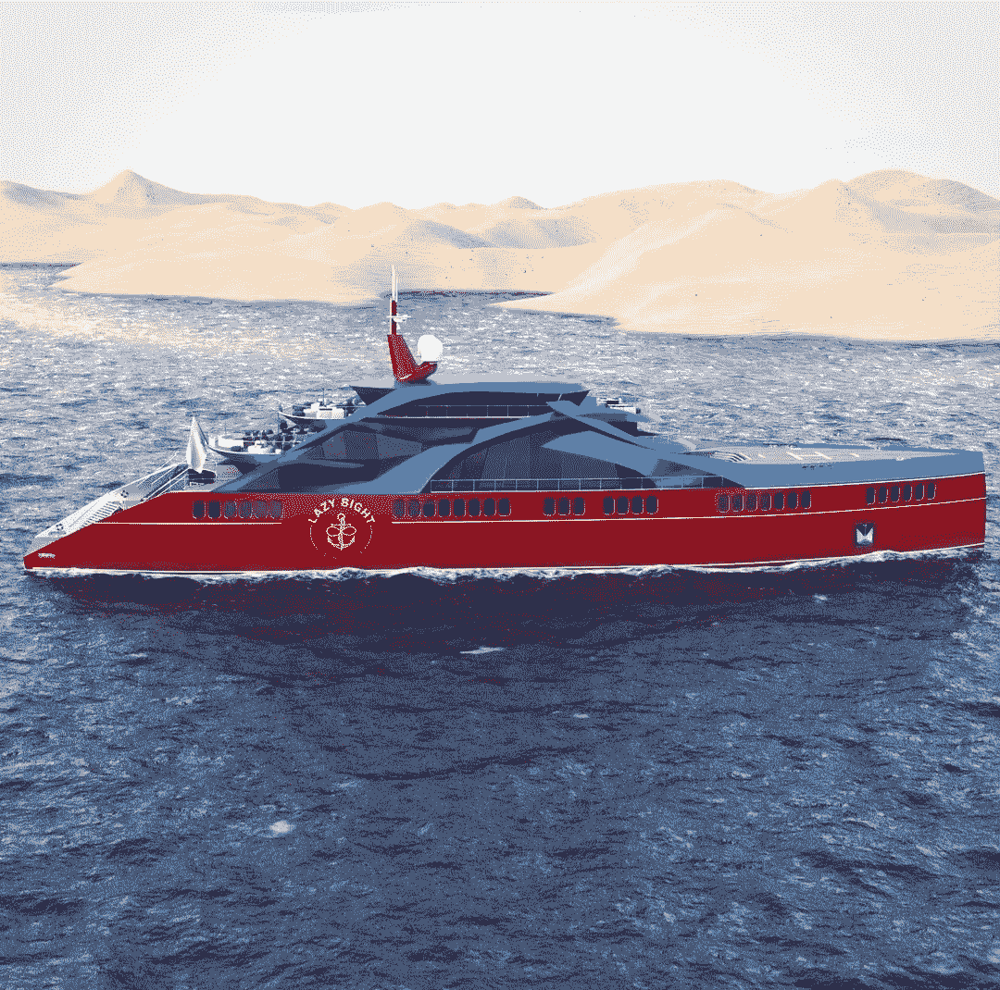

# 创新的豪华旅行，甲板下的冒险，一个 1000 万美元的错误

> 原文：<https://medium.com/coinmonks/innovative-luxury-travel-below-deck-adventures-a-10-million-mistake-691bfae86ed0?source=collection_archive---------28----------------------->

[来自《懒惰的 YC》的瓶装时事通讯](https://medium.com/u/6dcb932fb22b?source=post_page-----691bfae86ed0--------------------------------)

By [Dr. Holly Eimer](https://medium.com/u/e25f399c6d84?source=post_page-----691bfae86ed0--------------------------------) for [Message in a Bottle Newsletter by Lazy 8ight YC](https://medium.com/u/6dcb932fb22b?source=post_page-----691bfae86ed0--------------------------------)

***当前市场***

截至周四下午 4 点 30 分，比特币在过去 24 小时内上涨了 2.1%，达到 19192 美元。根据 CoinMarketCap 的信息，比特币在香港上涨，延续了当天早些时候的涨幅，而以太上涨 6.3%，至 1613 美元。在 Terra 宣布向其持有人免费空投 Luna 之后，Terra Classic，第一个 Terra 区块链的本地令牌，在过去的 24 小时内上涨了 51.6%，达到 0.00053 美元。Terra Classic 目前的七日涨幅为 117.8%。新加坡数字资产管理公司 Metalpha 的业务发展主管杨培安在给 Forkast 的一封电子邮件中表示，投资者对以太坊网络即将合并感到乐观，但收益可能会很快消失。“超跌反弹和积极的 ETH 合并公告是这一(涨幅)的关键驱动因素，”杨表示。“真正的复苏可能要等到美联储在本周期内完成加息。”

在周四的一次演讲中，美国证券交易委员会(Securities and Exchange Commission)主席加里·詹斯勒(Gary Gensler)将目标对准了加密货币行业，警告律师听众说，近 1 万个现有加密令牌中的“绝大多数”都是证券，正在向公众分发，违反了联邦法规。根据事先准备的发言，Gensler 表示，“投资公众正在购买或出售加密安全令牌，因为他们期望从共同企业中的其他人的努力中获得利润，”解释了美国法院裁决中的“安全”概念。

Gensler 批评了该行业的许多人，他们认为当前的证券法不适用于加密货币，并呼吁制定专门针对该行业的新法规。他表示，美国证券交易委员会已经通过公告和数十项执法行动，非常清楚地表明了现行法律如何适用于该行业，而且目前还没有这样的规定。“不喜欢这条信息并不等于没有收到它，”Gensler 说。“这些不是自助洗衣店的代币。据推广这些代币的人说，投资大众购买了大部分代币，兜售或预期基于他人努力的回报。根据 Gensler 的说法，投资者需要信息披露来帮助他们区分他们认为会成功或失败的投资。

“投资者应该免受欺骗和操纵。这些安全措施是法律规定的，”他说。美国证券交易委员会在 5 月份宣布，它将在新命名的加密资产和网络部门增加 20 个新职位，几乎将该部门的规模扩大了一倍。这个执法人员负责保护加密货币市场的投资者。在他的讲话中，Gensler 特别提到了加密货币交易所和其他中间商，声称他们应该在 SEC 注册为经纪交易商和证券交易所。

在无意中退还一名澳大利亚妇女一笔远远超过她预期的金额后，Crypto.com 交易网站正遭受一个代价高昂的错误。据《每日邮报》报道，这位住在墨尔本的女子去年 5 月要求交易所退还 100 美元，但却收到了 1000 万美元。据消息人士称，七个月后，在一次年终审计中，Crypto.com 发现了这个错误。根据这篇文章，发生错误是因为在支付区输入了一个账号，而不是最初想要的金额。总部设在新加坡的交易所随后依法要求用户收回资金。

然而，当 Crypto.com 意识到发生了什么时，这 1000 万美元已经花在了墨尔本郊区克雷吉伯恩的一座价值数百万美元的豪宅上，并配有家庭影院和健身房。这位妇女和她的妹妹很难逃脱他们的行为。根据最近的报道，一名法官下令出售他们的财产，并归还交易所得。根据资产令牌化平台 VNX 的首席执行官亚历山大·特卡琴科的说法，尽管 Crypto.com 是一家知名公司，并且可能会在法庭上获胜，但这对其他企业来说将是一个教训。

随着新的参与者被召集到案件中，美国 Dogecoin 投资者对特斯拉首席执行官埃隆·马斯克提起的 2580 亿美元的诉讼正在升温，指控他运营 Dogecoin 加密货币金字塔计划。这起诉讼最初是由新英格兰电工凯西·强生公司在 6 月份提起的，现在已经包括了 6 名新被告和 7 名新原告，他们都在 Dogecoin 的投资中亏损。马斯克和其他被告周三收到了民事诉讼的传票。

马斯克的隧道建筑公司 Boring Co .和 Dogecoin 基金会是新的被告，该基金会自称是一个监督和支持 Dogecoin 的非营利组织。各种 Dogecoin 开发者、推动数字货币的互联网影响者，以及建立 Dogecoin 的软件开发人员比利·马库斯和杰克逊·帕尔默，最初把这个项目称为一个笑话，也是本案的被告。该诉讼称，被告在两年的时间里将 Dogecoin 的价格提高了 36，000%以上，让它崩溃，然后以其他利益相关者为代价带走了数百亿美元。

***豪华酒店业***

Wyndham Hotels & Resorts 以 4400 万美元的价格收购了 Vienna House 品牌，扩大了其高档和中档产品组合，包括约 40 家酒店和 6000 多间客房。温德姆酒店及度假村集团是全球最大的酒店特许经营公司，在超过 95 个国家拥有约 9，000 家酒店。关闭后，维也纳之家品牌将更名为温德姆维也纳之家，并加入温德姆的公认品牌稳定。拥有 120 家特许经营酒店和超过 19，000 间客房，仅在德国就新增了 28 家酒店，这巩固了温德姆在其最大的欧洲市场之一的地位，以及其向邻国的扩张。超过 30 个国家的 400 多家酒店的组合将为该地区的商务和休闲旅客提供比温德姆酒店在欧洲提供的更多品牌酒店选择。

屡获殊荣的酒店 Waldorf Astoria Beverly Hills 位于著名的加州市中心，推出了一种全新的个性化餐饮体验，这种体验以游客自己的房间为中心，并在房间内进行。入住贝弗利山庄套房、别墅套房或总统顶层套房时，可享受晚餐套餐，包括私人厨师、私人调酒师和独特的音乐表演。作为套餐的一部分，还包括在上述套房中住宿一晚，客人可以选择各种不同的美食，包括地中海、法国、亚洲、摩洛哥、中东、墨西哥、意大利甚至美国菜肴。

拥有一个私人调酒师是非常有趣的；一个专门的管家将加入调酒师和厨师的行列，还有一个高级的开放式酒吧，可以选择在六道或八道菜的晚餐上添加六道菜的葡萄酒或鸡尾酒。此外，该套餐扩展了奢侈的含义，除了美食和高端饮料之外，还包括娱乐。与露台上的三小时私人音乐会类似，华尔道夫酒店专门的礼宾团队可应要求提供爵士二重奏和独奏音乐家。该酒店一直获得福布斯五星奖，并在 2019 年至 2022 年的旅游与休闲“世界最佳”奖中获得一席之地。世界报道和新闻。定价从 4000 美元起。

***游艇业***

在艾美奖提名系列的最近一部中，Bravo 带着观众离开甲板和船，作为客人滑翔伞，探索洞穴，并沿着挪威峡湾进行大胆的直升机旅行。这一季的《甲板下的冒险》跟随机动游艇“水星号”的船员，在拥有数十年全球海洋专业知识的专业船长 Kerry Titheradge 船长的指导下，穿越小得令人难以置信却又美丽的峡湾。在挪威变幻莫测的寒冷海域，他分配给他的船员为游客创造一生难忘的体验的任务，包括在安达尔斯尼斯滑翔伞和探索瓦尔达尔洞穴的短途旅行。

主厨杰斯·康迪是一个热爱旅行的完美主义者，首席厨师斯图·法耶·克拉克辞去了她在商界的高薪工作，转而追求游艇运动，空姐奥丽亚娜·施内普斯和卡西·法达赫，两人曾有过不愉快的同事经历，都在争夺第二名空姐的职位。当不符合标准和通信故障升级时，在试图给游客留下深刻印象的同时，该船的船长刘易斯·勒普顿和水手内森·莫雷、迈克尔·吉尔曼和凯尔·迪卡德在这冰冷的海洋环境中合作。游艇船员遇到了相当数量的波涛汹涌的海浪，他们团结在一起，为租船的客人提供了一次难忘的经历。

NFT 豪华酒店公司 Lazy 8ight Yacht Club (L8YC)的首席营销官(CMO)和联合创始人奥瑞娜·施内普斯(Oriana Schneps)一直对海洋着迷。她甚至在新英格兰水族馆度过了她的高中暑假。当她还是一名大学生时，她参加了巴哈马群岛的一个潜水研究任务，并且再也没有回头，因为她开始了职业帆船运动。Oriana 是一个顽强的工人，以前有过当厨师的经历，渴望在内部团队中立足。然而，为了完成手头的任务，她必须证明自己有能力克服部门内的争议。

Schnepp 的 Lazy 8ight 游艇俱乐部(L8YC)正在将 Web0(真实世界)实用程序集成到 Web3 空间中。除了 Web0 中的私人豪华活动和独一无二的可穿越大型游艇 NFTs，L8YC 还通过其独家酒店合作伙伴关系提供前所未有的游艇服务和独特体验。L8YC 经验丰富的内部销售团队协助满足游艇销售需求，无论是购买第一艘游艇，还是更新换代。L8YC 专家指导客户的每一步，Lazy 8ight 经验丰富的船长还提供一对一的定制咨询，包括虚拟和面对面咨询。NFT 和豪华酒店公司为船主提供各种各样的帮助，如机舱 101、导航、船坞咨询和海上安全。L8YC 会员可以在 L8YC 的一艘游艇上享受一日游，起价仅为 300 美元。拥有全天和半天两种选择，持有者可以享受 500 多艘全天包租的游艇，无论是在美国还是在国际上。L8YC 的内部包机经纪人团队帮助规划完美的包机，无论是在米克诺斯岛过夜游览，还是去阿拉斯加旅行一周。Lazy 8ight 设计一切，从路线和活动，下至船只本身，同时协商最佳价格。

此外，Lazy 8ight 还提供私人厨师服务。他们的餐饮合作伙伴，草药厨师，策划了令人难忘的高端之夜，选择 CBD & THC 注入，以改善多菜餐。Chris Sayegh 和他的团队为活动提供豪华餐饮，提供鱼子酱站、生海鲜吧、豪华自助餐、顶级牛肉切肉站、国王三文鱼片等选项。L8YC 现在也很高兴通过他们的合作伙伴 Security & Consulting 以及他们由经验丰富的军事特种作战人员、前执法人员和情报界退休人员组成的团队来提供活动安保。Lazy 8ight 的安全合作伙伴利用广泛的培训来确保活动的安全，同时为全球的知名客户、贵宾、精选企业和组织提供最高质量的近身保护、监控和应对措施计划。

请务必访问位于[http://L8yachtclub.com](http://L8yachtclub.com)的 Lazy 8ight 游艇俱乐部网站，咨询铸造和豪华酒店服务，或者访问社交媒体上的 Discord、Twitter、Medium 和 Instagram 页面，了解最新的 L8YC 新闻。

> 交易新手？试试[密码交易机器人](/coinmonks/crypto-trading-bot-c2ffce8acb2a)或者[复制交易](/coinmonks/top-10-crypto-copy-trading-platforms-for-beginners-d0c37c7d698c)