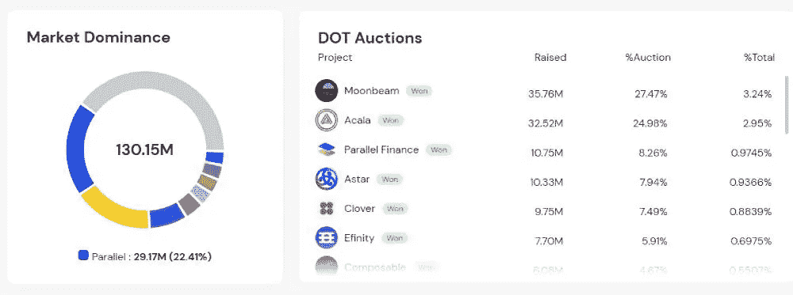

# 新时代的创新 Web3 金融解决方案 DEFI Super App —并行金融

> 原文：<https://medium.com/coinmonks/innovative-web3-financial-solutions-of-new-age-defi-super-app-parallel-finance-650638fe5bc3?source=collection_archive---------18----------------------->

密码投资者被动持有他们的密码而不赚取任何回报的日子已经一去不复返了。在当今的加密时代，我们有 DEFI 应用程序，为加密投资者提供收益和回报，因为他们将自己的加密存入 DEFI 协议，为互换对提供流动性，或借出他们的加密和盈利利息。

这种 DEFI age 在 2020 年开始流行，早期的 DEFI 协议包括 Compound、Uniswap 和 Aave，现在我们当然知道区块链有数百种 DEFI 协议。并行金融就是这样一个新时代 DEFI 超级应用，它现在是 Polkadot 区块链中活跃的副链。

[Parallel Analytics](https://analytics.parallel.fi/overview). Active Web3 financial services in Parallel Finance for DEFI users…

# Parallel Finance 通过其众筹贷款服务对#Dotsuma 生态系统做出了巨大贡献

平行金融自推出以来一直很热门，DOT 用户使用该平台的众筹贷款托盘将他们的 DOT 贡献给 Polkadot 的 Parachain 众筹贷款。Parallel Finance 是在赢得 Polkadot 的一次 parachain 拍卖后，在 Polkadot 获得 Parachain 席位后推出的。

你可以在平行金融超级 DEFI 应用上查看他们的[分析页面](https://analytics.parallel.fi/overview) > >看看 DEFI 活动

[Parallel Analytics >>](https://analytics.parallel.fi/overview) Various active DEFI operations in Parallel Finance have attracted over 550 million Total Value locked in this Super DEFI app!!

***Parallel Finance 已经为#Dotsuma 生态系统做出了贡献，其*** [***众筹贷款托盘功能***](https://analytics.parallel.fi/polkadot/crowdloan) ***已经锁定了价值超过 1.3 亿美元的 DOT 众筹贷款贡献。***

[Parallel Analytics>>](https://analytics.parallel.fi/polkadot/crowdloan) DOT Crowdloan contributions from Parallel Finance’s Crowdloan Pallet forms 22.41% of the overall Crowdloan DOT contributions in the entire #Dotsuma Ecosystem.

因此，在开发其他功能之前，Parallel Finance 最初是一个为 DOT 用户提供有价值服务的 DEFI 应用程序。

## 创新的流动性点衍生解决方案 cDOT，用于释放锁定的众筹贷款点的流动性

作为一个新时代的应用程序，平行金融提供了[流动性众筹贷款网络衍生品；cDOT](/@kikctikcy/more-rewards-for-lp-providers-with-the-yield-money-market-functions-of-parallel-finance-452834f737a3) ，这样众筹贷款的流动性就可以在 DEFI 中得到利用。

你可以查看 Parallel Finance 的分析，发现 cDOT 持有者作为流动性提供者正在获利。

[Parallel Analytics >>](https://analytics.parallel.fi/amm) cDOT holders earn yields in Parallel Finance.

[Parallel Analytics >>](https://analytics.parallel.fi/yield) Amount of cDOT assets locked in Parallel Finance, these assets can be employed in Parallel Finance to earn yields.

## cDOT 持有者作为 LP 提供者和贷款者在平行融资中的收益

向 DOT-cDOT 对提供流动性的 cDOT 持有人有好处，因为他们可以在 DOT 或相应的 cDOT 衍生品中获得稳定的 LP 回报(没有非永久性损失的危险)，此外，他们可以在货币市场上借出这些 [LP 回报](/@kikctikcy/more-rewards-for-lp-providers-with-the-yield-money-market-functions-of-parallel-finance-452834f737a3)，并根据这些 LP 回报 ***借入 DOT。***

***注意，以 LP-DOT/cDOT 资产为抵押的贷款，可获得*** [***无清算风险的 DOT 贷款***](/@kikctikcy/liquidation-risk-free-dot-loans-using-your-cdot-assets-as-collateral-in-parallel-finance-8aed8cb6f46f) ***。***

因此，使用 [Parallel Finance 的众筹贷款托盘](/@kikctikcy/parallel-finance-expands-its-utility-with-defi-functions-having-initiated-in-the-platform-9f4f5ee14897)向 Parachains 贡献了 DOT 的 DOT 持有者将会很高兴，他们的 DOT 贡献以 cDOT 的形式重新用于 DEFI，甚至有可能用他们的 cDOT 获得 DOT，因为 DOT-cDOT 对的 LP 奖励可以用于借入 DOT，而没有清算风险！！

*因此，Parallel Finance 不仅仅是一个具有一般 DEFI 功能的 DEFI 应用程序，它是一个超级 DEFI 应用程序，目标是提供资本高效的 DEFI，用户可以从他们的存款资产中获得最大价值，并在 Parallel Finance 中获得供应。*

## 新时代 Super DEFI 应用的创新液体定位点(sDOT)解决方案

作为一个新时代的 DEFI 超级应用程序，Parallel Finance 提供 [DOT liquid staking 服务和 staked DOT 衍生品，sDOT](/coinmonks/liquid-staked-sdot-accrues-staking-rewards-which-can-be-used-in-parallel-finances-defi-ecosystem-f823b14967cb) 也可用于 DEFI。因此，在 sDOT 持有者不断积累赌注回报的同时，他们可以通过在货币市场上出借资产并在 Parallel Finance 的流动性模块中为 DOT-sDOT 对提供流动性来使用 sDOT

# 面向点持有者的一站式 DEFI 中心—并行金融

因此，对于 dot 用户来说，Parallel Finance 确实是一个有价值的一站式应用程序，为他们提供了许多服务，他们可以轻松地向 Polkadot 的众筹贷款捐款，流动持有他们的 DOT，甚至在一段时间内使用 DOT 向某个地址定期支付款项，利用 Parallel Finance 的 Dao Fi 服务提供流支付模块。

# 使用流协议安排自动定期付款

我已经在之前的文章中解释了并行金融的现金流支付功能。这是一个用于工资单和令牌分发的 Web3 支付解决方案。

您可以查看 Parallel [Finance 的分析](https://analytics.parallel.fi/stream)并发现 Stream 是一个利用良好的产品，其中 Para、HKO、DOT 和 Kusama 资产可以定期发送和接收。

[Parallel Analytics >>](https://analytics.parallel.fi/stream)

# **了解平行金融-**

Parallel Finance Super DEFI App 为 Dotsuma 社区和其他加密投资者提供了一系列有价值的 web3 金融服务。平行金融致力于成为一个安全的 DEFI 中心，提供有价值的 DEFI 服务，在不久的将来将吸引至少 10 亿用户。Parallel Finance 中的 DEFI 服务旨在提高资本效率，用户可以从他们在 DEFI 应用程序中存放和提供的资产中获得最大收益。

【https://parallel.fi/index.html】网站 — [网站](https://parallel.fi/index.html)

推特—https://twitter.com/ParallelFi

**不一致**——[https://discord.gg/DeyEntFT](https://discord.gg/DeyEntFT)

白皮书—[https://parallel fi . git book . io/parallel-finance/polkadot-network/白皮书](https://parallelfi.gitbook.io/parallel-finance/polkadot-network/white-paper)

***这位作者的文章也可以在这些平台上阅读—***

[https://peakd.com/@mintymile/posts](https://peakd.com/@mintymile/posts)

[https://steemit.com/@mintymile/posts](https://steemit.com/@mintymile/posts)

[https://www.publish0x.com/@greenchic](https://www.publish0x.com/@greenchic)

> 交易新手？尝试[加密交易机器人](/coinmonks/crypto-trading-bot-c2ffce8acb2a)或[复制交易](/coinmonks/top-10-crypto-copy-trading-platforms-for-beginners-d0c37c7d698c)