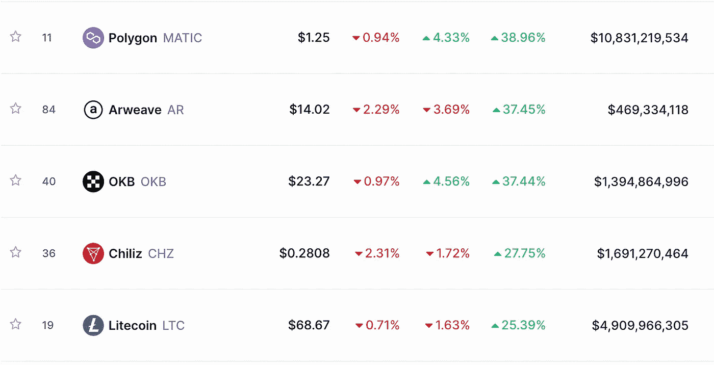

# Instagram Joins de NFT 太空公司。

> 原文：<https://medium.com/coinmonks/instagram-joins-de-nft-space-6a273a8b53e2?source=collection_archive---------49----------------------->

*   🖼️ Instagram 加入了 de NFT 空间
*   💸新加坡的 DeFi 实验
*   ⛓️是顶级 L2 链的仲裁人
*   🦹‍♂️ OpenSea [功能检测](https://decrypt.co/113332/opensea-now-auto-detects-blocks-stolen-nfts-disables-scam-links)被盗的 NFT 和诈骗
*   💰本周硬币
*   📰顶级阅读
*   🙏🏻感谢…

# 🖼️ Instagram 加入了 de NFT 空间

Instagram 表示，从本月开始，它将允许一批精选的数字创作者直接从社交媒体平台铸造和销售不可替代的代币( [NFT)](https://en.wikipedia.org/wiki/Non-fungible_token) 。

专注于图像的应用程序[最近在 100 个国家推出了其数字收藏品功能](https://www.coindesk.com/business/2022/09/29/meta-opens-nft-sharing-on-instagram-and-facebook-to-all-users/)，允许用户连接到他们的数字钱包并展示他们创建或购买的 NFT。连接的 NFT 可以显示在您的 feed 中，并包含闪烁效果以指示真实性。**多边形链中会出现薄荷糖。**

> ***为什么这很重要:******insta gram 的母公司在 2022 年为了建设元宇宙和垄断 web3 tech 已经亏损了 94 亿美元。毫不奇怪，他们正在为超过 20 亿的用户群提供 NFT 造币和产品。但是人们很快就赶上了梅塔的垄断目标，并且知道有真正的网络 3 替代方案来将他们的艺术货币化，并创造一个他们可以拥有并随身携带的追随者。***
> 
> ***尽管如此，* ***IG 的用户友好性以及平台上共享的大量用户群和艺术，使得用户至少尝试一下新功能*** *非常有吸引力，即使这比他们 30%的收益花费更多* [*更多。*](https://www.engadget.com/meta-creators-can-sell-nfts-directly-on-instagram-220049106.html)**

# **💸新加坡的 DeFi 实验**

**根据 [Aave](http://aave.com/) 创始人 Stani Kulechov 的说法，新加坡金融管理局(MAS)的分散融资试点项目刚刚执行了“机构级 DeFi 协议的第一个现实世界用例”。**

**摩根大通(J.P. Morgan)、星展银行(DBS Bank)和 SBI 数字资产控股有限公司(Bernstein Digital Asset Holdings)昨日在 Polygon 上使用 Aave 协议——一种二层扩展解决方案——来完成以太坊网络上的外汇和政府债券交易。银行将新加坡政府债券的象征性版本换成日本政府债券，并将日元换成新加坡元作为测试。**

**“我们期待着欢迎更多的创新，利用可组合的 DeFi 协议来提供进入许多服务不足的市场的机会，并实现一个更具包容性的系统，”Kulechov 通过电报告诉*。***

***Yaro on Tech、Blockchain 和 Web3 是一份读者支持的出版物。为了接收新帖子和支持我的工作，考虑成为一个免费或付费用户。***

> ******为什么这很重要:*** *随着越来越多的政府和机构加入 DeFi 空间，越来越多的资金在链上流动。更多的采用将使区块链数字交易成为新常态。这带来了对网络安全(尤其是当* [*过渡资金*](https://cointelegraph.com/news/report-half-of-all-defi-exploits-are-cross-bridge-hacks) *)的更多强调，用户友好的 DeFi 平台，以及链之间的可组合性。****
> 
> ****另请注意，* [*为 Vitalik shared，*](https://thedefiant.io/vitalik-urges-defi-to-slow-down-integration-with-traditional-finance) *机构与政府资本的整合可能带来繁重的监管。****

# ***⛓️是第二层链条的顶端***

***以太坊第二层扩展解决方案 [Arbitrum](https://offchainlabs.com/) 自 8 月份的 Nitro 更新以来，其交易量激增，大约是以太坊基础层的 62%。***

***在 11 月 1 日的一份报告中，加密研究公司 Delphi Digital 引用 Dune Analytics 的数据指出，截至 10 月 24 日的一周，Arbitrum 的总交易量自 8 月以来增长了 550%。***

***Arbitrum 是由区块链开发公司 [Offchain Labs](https://offchainlabs.com/) 建立的一个乐观的总结，旨在扩展以太坊智能合同。它使用乐观汇总技术将以太坊智能合约和分散应用程序中的大批量交易进行离线捆绑，然后提交给以太坊。***

***一些著名的协议使用 Arbitrum，如分散交易所 SushiSwap、Uniswap 和 GMX，贷款协议 Aave 和流动性传输协议 Stargate。根据 L2Beat 的数据，在撰写本文时，其当前总价值(TVL)为 25.9 亿美元。***

> ******这为什么重要？*** *Arbitrum* ***旨在通过将尽可能多的计算和数据存储从以太坊的主区块链(第 1 层)上移走来减少交易费用和拥塞*** *。以太坊的区块链存储数据被称为第二层扩展解决方案，挑战在于安全性和可靠性，以及竞争对手。****

# ***🦹‍♂️ OpenSea [功能检测](https://decrypt.co/113332/opensea-now-auto-detects-blocks-stolen-nfts-disables-scam-links)被盗 NFT 和诈骗***

***交易量排名第一的 NFT 市场 OpenSea 推出了新的盗窃检测和预防功能。***

***一个功能是检测并禁用平台上共享的诈骗链接，而另一个功能是识别被盗的 NFT 并阻止其转售。***

> ******这为什么重要？*** *右键点击你偷取(保存)的图像。任何人都可以这样做，但有了在链上注册数字资产所有权的能力，我们应该能够至少在一定程度上避免骗子和小偷。很高兴看到为了 web3 的采用、安全和可信度，功能朝着那个方向发展****

# ***💰本周硬币***

******

***[**多边形**](http://polygon.technology/) (原 Matic Network)是由币安和比特币基地支持的[层 2](https://coinmarketcap.com/alexandria/glossary/layer-2) 缩放解决方案。该项目旨在通过解决许多区块链的可扩展性问题来刺激加密货币的大规模采用。***

> ***自从 Polygon 周四宣布将与 Instagram 合作，通过其平台制作和销售 NFT 以来，Polygon 的 MATIC 上涨了 40%，涨到了 1.27 美元。MATIC 周一扩大了涨幅，尽管整个加密市场受到币安和 FTX 加密交易所首席执行官之间明显不和的压力。***

# ***📰热门阅读***

*   ******
*   *****[为什么比特币价格可能正在形成上升趋势](https://www.newsbtc.com/news/bitcoin/why-the-bitcoin-price-could-be-building-an-uptrend/)*****
*   *****[美国缴获 5 万枚比特币](https://www.trustnodes.com/2022/11/07/us-seizes-50000-bitcoins)*****
*   *****[2022 年你可以购买的十大加密货币 ETFs】](https://cryptonews.com/exclusives/top-cryptocurrency-etfs.htm)*****
*   *****[随着 GameFi 的发展，AAA 游戏公司将会变得微不足道:Skale 首席执行官](https://cointelegraph.com/news/aaa-gaming-companies-will-look-like-peanuts-as-gamefi-evolves-skale-ceo)*****
*   *****[FTX-阿拉米达金融危机导致比特币和以太坊价格在本周开始时暴跌](https://zycrypto.com/ftx-alamedas-financial-crisis-sends-bitcoin-and-ethereum-prices-tumbling-as-the-week-opens/)*****
*   *****[你的数码头像会在元宇宙佩戴劳力士手表吗？](https://beincrypto.com/will-your-digital-avatar-wear-a-rolex-watch-in-the-metaverse/)*****
*   *****[谷歌称云部门现在是一个 Solana 验证器，揭示了更多为顶级以太坊竞争对手设计的项目](https://dailyhodl.com/2022/11/07/google-says-cloud-division-now-a-solana-validator-reveals-more-projects-designed-for-top-ethereum-competitor/)*****
*   *****[Terra Luna 经典价格预测——本周多头能否将 LUNC 推高 30%？](https://cryptonews.com/news/terra-luna-classic-price-prediction-can-bulls-pump-lunc-30-week.htm)*****
*   *****币安首席执行官称他并不想与 FTX 对抗*****

> *****交易新手？尝试[加密交易机器人](/coinmonks/crypto-trading-bot-c2ffce8acb2a)或[复制交易](/coinmonks/top-10-crypto-copy-trading-platforms-for-beginners-d0c37c7d698c)*****