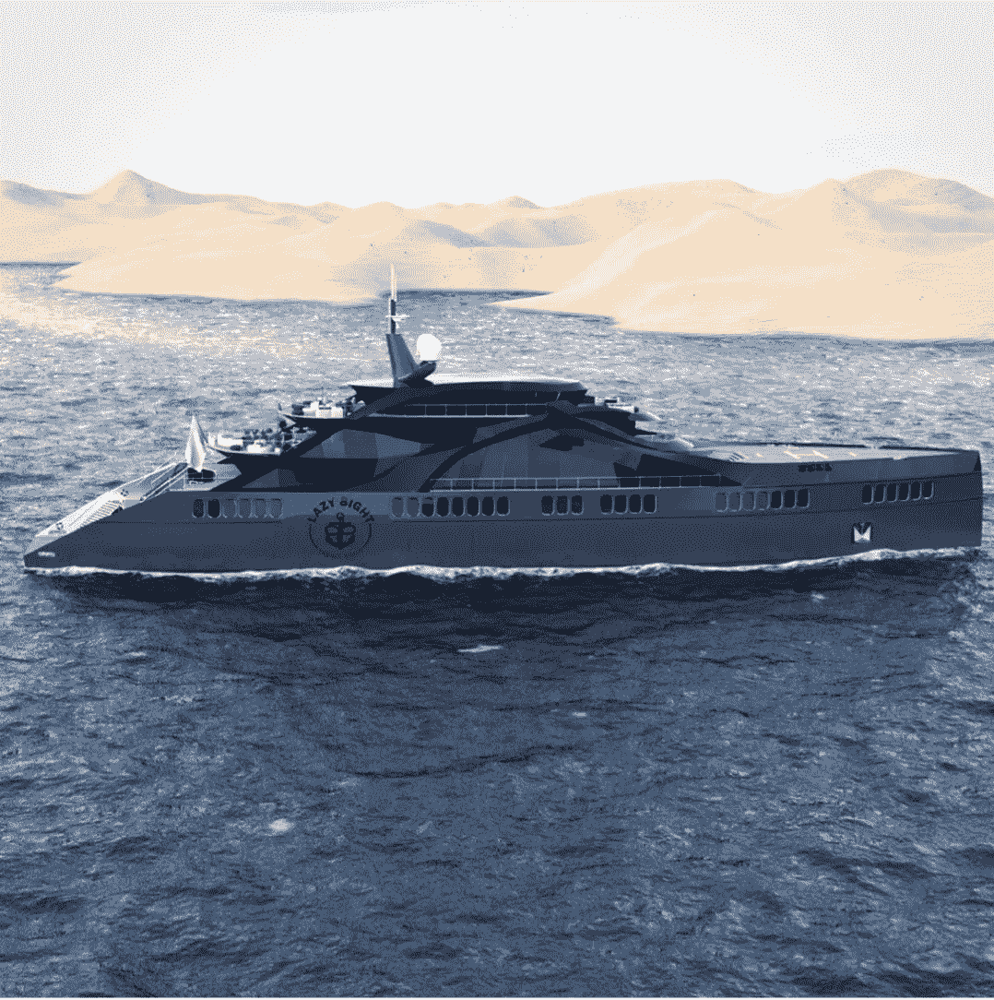

# insta gram NFT-交易、环保采矿和 Lazy 8ight 游艇俱乐部

> 原文：<https://medium.com/coinmonks/instagram-nft-trading-eco-friendly-mining-lazy-8ight-yacht-club-faf294f599fe?source=collection_archive---------35----------------------->

By [Dr. Holly Eimer](https://medium.com/u/e25f399c6d84?source=post_page-----faf294f599fe--------------------------------) for [Message in a Bottle Newsletter by Lazy 8ight YC](https://medium.com/u/6dcb932fb22b?source=post_page-----faf294f599fe--------------------------------)

比特币在周二下午从 20，373 美元的峰值暴跌后，截至周四已回到 19，200 美元附近。而以太坊从周二高点 1399 美元下跌至 1320 美元。在加入一个利益验证网络后，以太坊的价格下降了，这将使系统速度更快，能效更高。最近的通货膨胀数据显示，加密货币价格在上周暴跌。

商品期货交易委员会(CFTC)主席 Rostin Behnam 在纽约大学法学院的一次讨论中表示，加密货币的限制可能会使比特币的价格翻倍。Behnam 表示，扩张可能发生在监管良好的环境中，因为基础设施现金流只有在市场有监管框架的情况下才会发生。“如果有一个 CFTC 监管的市场，比特币的价格可能会上涨，”他说。

在母公司 Meta 周四宣布向其数十亿用户推出期待已久的虚拟资产组件后，Instagram 上引入了不可替代的令牌(NFT)。自 5 月以来，Instagram 的 NFT 功能一直在测试中；但是，从周四开始，所有用户都可以访问它。用户可以将他们的 Instagram 账户与比特币基地、Dapper Labs、MetaMask、Rainbow 和 Trust 等钱包关联起来。根据一篇博客文章，Instagram 用户也可以将他们的 NFT 交叉发布到他们的脸书个人资料上。在一篇博客文章中，Meta 宣布，美国脸书和 Instagram 的用户现在可以链接他们的钱包，分享他们的数字贵重物品。根据声明，Instagram 销售数字收藏品的 100 个国家的每个人现在都可以使用这个工具。该声明是在该公司首席执行官马克·扎克伯格以 10.5 万美元的价格从他年轻时的棒球卡 NFT 中获得的。

DJ Seedphrase 是早期的比特币爱好者，也是不可替代令牌(NFT)社区的名人，他在周三以 3300 以太币(ETH)的价格向得克萨斯州的一名买家出售了他独特的 CryptoPunk 2924，约合 445 万美元。这个朋克是仅有的 24 个猿朋克之一，最后一次是在 2020 年 11 月以 150 ETH(71，300 美元)的价格卖给了 DJ Seedphrase，Danny Maegaard 的别名。其他 20 个朋克，包括他典型的 CryptoPunk 8348，戴着礼帽，浓密的胡子，戴着太阳镜，叼着烟，都在梅加德目前的收藏中。

在决定出售他备受追捧的连帽猿套装之前，他告诉 CoinDesk，他一直在与一位在德克萨斯州经营家族办公室的买家谈判。他告诉 CoinDesk，他知道需要奇迹才能实现一些市场运动，因为他的现金越来越少，NFT 的销量最近下降了。鉴于当前的“加密冬天”，当加密货币价值暴跌，NFT 的销售停滞不前，朋克 2924 的销售意义重大。“经常有人私下出价购买帽衫猿，所以我知道有人对此感兴趣。这只是找到合适价格的问题。”

据阿尔伯克基新墨西哥大学的专家称，当以市值的百分比衡量时，比特币采矿的气候影响相当于养牛或燃烧汽油。因为它需要高度专业化的计算机，而且它使用的大部分电力是通过燃烧化石燃料产生的，所以开采加密货币需要大量能源。根据周四发表在《科学报告》(Scientific Reports)上的一份报告，在 2016 年至 2021 年期间，开采知名数字货币比特币导致与气候变化有关的经济损失占交易天数的 6.4%。

到 2020 年，开采占全球加密货币市场约 41%的比特币所需的能源足以为奥地利或葡萄牙等整个国家供电。根据该报告引用的研究，从 2016 年 1 月到 2018 年 6 月，比特币、以太币、莱特币和 Monero 货币的开采产生了 300 万至 1500 万公吨的二氧化碳排放。这相当于阿富汗、斯洛文尼亚或乌拉圭 2018 年全年的排放量。因为几个矿工为了开采新的硬币而竞争验证区块链上的交易，比特币的碳足迹随着时间的推移而增加。随着越来越多的矿工竞相完成越来越具挑战性的活动，总能耗也在攀升。

根据研究人员的说法，2021 年生产的比特币将产生 113 公吨二氧化碳当量，比 2016 年开采的比特币多 126 倍。根据这项研究，去年开采的单个比特币的经济成本为 11，314 美元，而 2016 年至 2021 年开采的所有比特币造成的所有气候危害的成本可能达到 120 亿美元。

根据本周早些时候发布的另一项研究，该行业的温室气体排放已经减少，这是因为矿工们决定运行更高效的机器，以应对比特币采矿利润率下降。据估计，今年的排放量将比 2021 年低 14.1%，约占全球总排放量的 0.1%，几乎是金矿开采商绝对产量的一半。此外，加密货币矿工正在更加努力地从地热、水电、太阳能和风能等清洁资源中获取更多的能源。

根据阿尔伯克基大学(University of Albuquerque)研究人员进行的模拟，如果风能和太阳能等可再生能源在 2016 年至 2021 年间占开采比特币总电量的 88.4%，气候损害将减少到平均市场价格的 4%。另一个限制气候影响的方法是过渡到不同的交易验证机制——并发行硬币。根据该报告，第二大加密货币以太网(Ether)今年转向了股权证明机制，这应该会将其预期的能源需求降低 99%以上。

拥有全天和半天两种选择，持有者可以享受 500 多艘全天包租的游艇，无论是在美国还是在国际上。L8YC 的内部包机经纪人团队帮助规划完美的包机，无论是在米克诺斯岛过夜游览，还是去阿拉斯加旅行一周。Lazy 8ight 设计一切，从路线和活动，下至船只本身，同时协商最佳价格。

此外，Lazy 8ight 还提供私人厨师服务。他们的餐饮合作伙伴，草药厨师，策划了令人难忘的高端之夜，选择 CBD & THC 注入，以改善多菜餐。Chris Sayegh 和他的团队为活动提供豪华餐饮，提供鱼子酱站、生海鲜吧、豪华自助餐、顶级牛肉切肉站、国王三文鱼片等选项。L8YC 现在也很高兴通过他们的合作伙伴 Security & Consulting 以及他们由经验丰富的军事特种作战人员、前执法人员和情报界退休人员组成的团队来提供活动安保。Lazy 8ight 的安全合作伙伴利用广泛的培训来确保活动的安全，同时为全球的知名客户、贵宾、精选企业和组织提供最高质量的近身保护、监控和应对措施计划。

请务必访问位于[http://L8yachtclub.com](http://L8yachtclub.com)的 Lazy 8ight 游艇俱乐部网站，咨询铸造和豪华酒店服务，或者访问社交媒体上的 Discord、Twitter、Medium 和 Instagram 页面，了解最新的 L8YC 新闻。

> 交易新手？试试[密码交易机器人](/coinmonks/crypto-trading-bot-c2ffce8acb2a)或者[复制交易](/coinmonks/top-10-crypto-copy-trading-platforms-for-beginners-d0c37c7d698c)