# 机构稳定币贷款——10%+APY，但并非没有风险

> 原文：<https://medium.com/coinmonks/institutional-stablecoin-lending-10-apy-but-not-without-its-risks-b6848c6fa48a?source=collection_archive---------12----------------------->

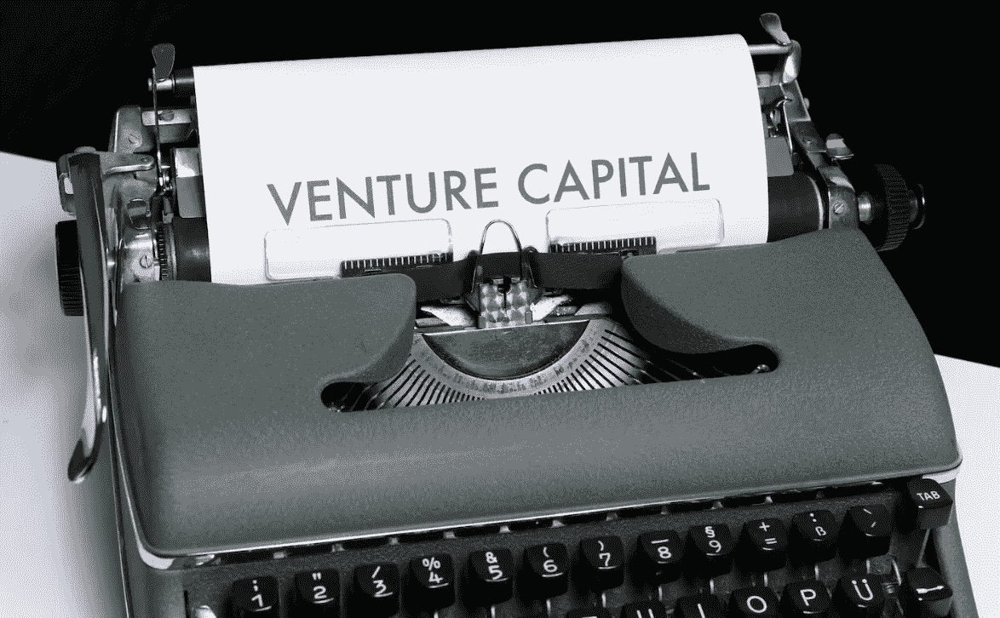

各位好，如果你们读过我之前关于囤积稳定币的文章，你们就会知道我花了很多时间从稳定币中寻找最高、最简便的收益率。同样，这篇文章也将剖析一些能带来最高回报的最佳机构/风投稳定币贷款策略，同时概述它们的一些额外风险。

# 什么是机构/风险资本借贷？

因此，和 [Liquity](/coinmonks/utilizing-lusd-chicken-bonds-to-earn-60-apy-off-of-stables-49c1b9538be) 或 [Aave](https://app.aave.com/) 等对零售友好的贷款协议不同，有一个专门的子协议，你我这样的零售商可以将资本贷款给机构或风投公司。持怀疑态度的人会立刻想到失败的风投公司，比如 [3AC](/coinmonks/think-you-werent-affected-by-the-downfall-of-3ac-think-again-d2b797c0d986) ，说得没错，我认为确保你关注的任何贷款平台都适当地审查他们想要贷款给的机构是谨慎而明智的。

机构/风投贷款协议的独特之处在于，无论是通过有担保贷款还是无担保贷款，它们通常都能为贷款人提供高得多的回报。从技术上讲，这种权衡会被这样一个事实所抵消，即机构/风投比普通散户借款人受到更严格的审查(我稍后会详细说明，即使是风投，也仍然存在风险)。

就像向 TradFi 银行申请贷款一样，借款人需要协商一份计划，梳理财务报表，了解贷款可能如何偿还和(或)如何获得担保的细节。例如，我们来看一下 Maple Finance 的应用程序流程:

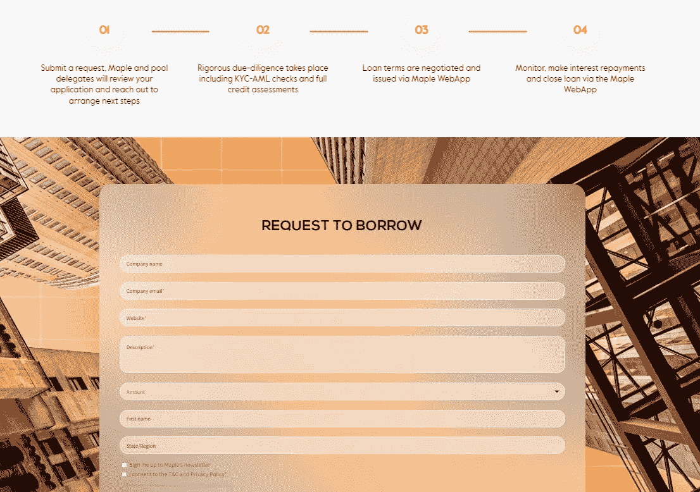

从上图中可以看出，贷款不一定是基于智能合同的，需要就贷款的结构进行具体协商。正如我在下一节将要谈到的，就像你的房子重新装修一样，如果需要，许多这样的平台都可以帮助借款人调整贷款结构。

# 如果贷款违约会发生什么？

如果贷款发生违约，实质上这意味着借款实体无法对贷款进行重新付款。通过加密货币进行制度化借贷的整个概念相对较新，但总体而言无力偿还贷款的机构并非如此。在 TradFi 领域，如果贷款违约，贷款人也许可以通过不同的方式获得补偿，比如控制公司的一些资产。在最坏的情况下，借款公司可能不得不申请破产。

有了加密贷款，监管甚至破产程序都变得不那么透明了。就像我们刚刚看到的那样，在加密货币是否应该被视为证券，以及在破产法庭诉讼中如何计算信托责任等问题上，还存在着大量的不确定性。让情况变得更为复杂的是，持有蓝筹股的国家也可能出现依赖稳定债券或市场波动的情况，而蓝筹股可以从根本上改变借贷条件。

同样，贷款违约并不是加密货币独有的问题，而且加密货币的监管也不那么严格，因此我们很想知道加密货币贷款的违约问题今后会如何处理。最近的例子就是 Blockwater Technologies 拖欠 true fi 340 万美元的加密货币贷款。

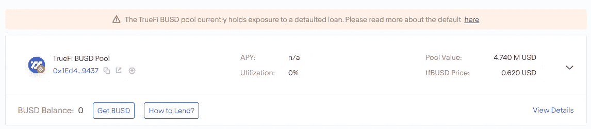

我原本打算把 TrueFi 的 BUSD 资金池也纳入到这个列表中，所以我想借此机会提醒大家，风投公司也可以像普通散户一样拖欠贷款。

在 Blockwater Default 一案中，这一点似乎早在 8 月份就已经板上钉钉了，当时 TrueFi 宣布正在就还款计划的可能终止进行谈判:

在 10 月初 Blockwater 最终将违约的消息传出后，TrueFi 宣布将削减 10%的 TRU 融资，以抵消贷款人的损失:

虽然这一举动可能暂时导致 1 美元的 TRU 代币崩盘，但大部分情况下，降价努力似乎最终都取得了成功，因为 1 美元的 TRU 币价格似乎至少已部分回升:

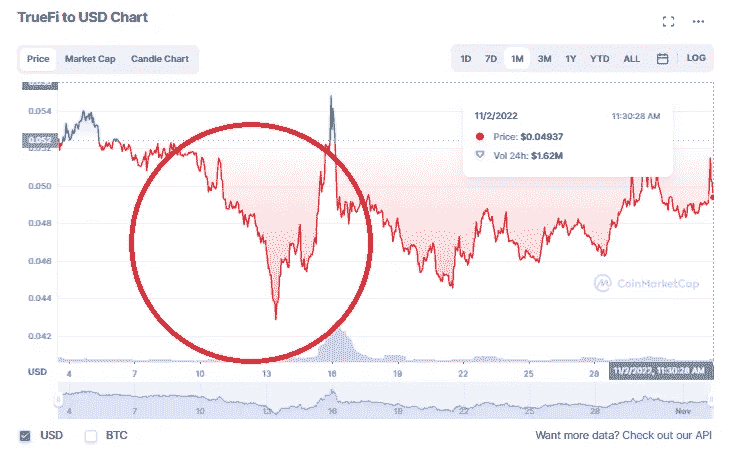

October 12th $TRU Crash

现在，我们已经讨论了可能发生的最坏情况，首先从 TrueFi 开始，让我们看看有哪些不同的机构贷款协议，以及它们可能带来的利润(或风险)。

# [TrueFi](https://app.truefi.io/) :高达 14%APY 以太坊╱乐观

正如我之前提到的，尽管 Blockwater 违约，TrueFi 协议似乎运行良好，管理良好。贷款基本上由$TRU 股东投票表决和批准，然后资金通过以下流程转移:

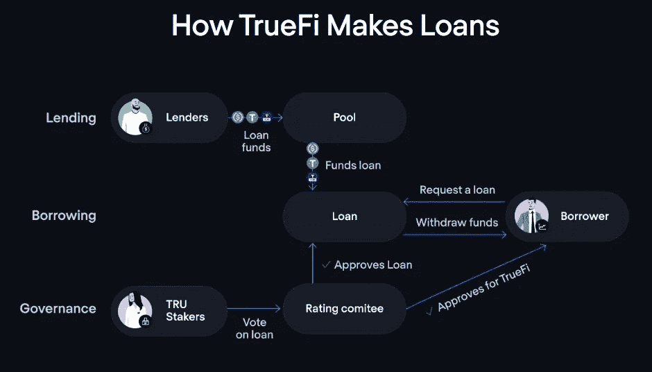

贷款本身差异很大，有些有抵押，有些没有抵押。一般来说，如果 TrueFi 上的贷款是无抵押的，利率会更高，以反映更大风险的更高回报。如果你有兴趣阅读更多关于他们的贷款保障措施，我推荐你阅读他们[早在四月](https://blog.truefi.io/mitigating-risk-truefis-loan-default-process-454359a8c4b)发表的一篇深入的文章。正如我之前所说，TrueFi 上每个借款人的贷款利率可能会有很大差异，但没有锁定期，所有贷款利率的广告如下:

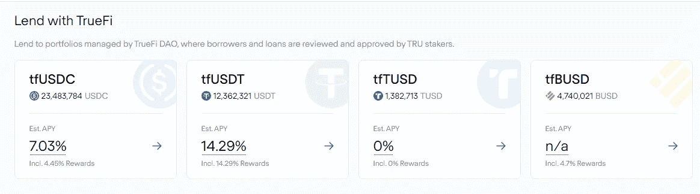

TrueFi 的 APY 为 14.29%，拥有最高的回报率和相当不错的流动性。

说到流动性，TrueFi 要考虑的最后一个因素是他们的总体 TVL。凭借当前 4097 万美元的 TVL，TrueFi 比规模小得多的借贷协议更容易获得 300 万美元的点击量，尽管发生了 Blockwater 事件，但他们的 TVL 仅在过去几个月有所增长，这表明他们对协议本身更加信任:

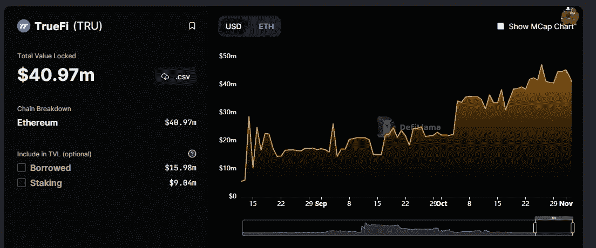

作为参考，Ribbon Lend(我接下来会讲到)在 TVL 只有 1621 万。

# [丝带贷款](https://lend.ribbon.finance/app):以太坊年息 12%

与 TrueFi 类似，使用 [Ribbon Lend](https://lend.ribbon.finance/app) (隶属于 [Ribbon Finance](https://app.ribbon.finance/) )没有存款锁定期，这意味着您可以随时提取资金。 [Ribbon Finance](https://t.co/nxtCVvPwk6) 有很多很酷的金库和功能，例如他们的本金保护金库 [R-Earn 金库](https://app.ribbon.finance/R-EARN)，但也许他们最近的发展之一是他们在以太坊上的机构贷款协议，目前他们有两家机构借款人向供应商提供以下利率:

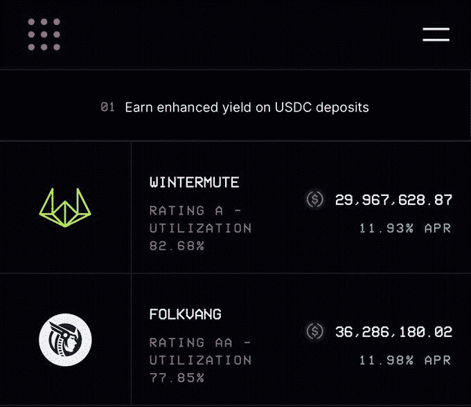

Ribbon 允许投资者选择将他们的美元 USDC 借给哪个机构，随后的奖励在 4 月供应和 4 月#RBN 之间分配。此外，因为超过三分之一的奖励将以美元 RBN 支付，所以注意它的价格波动是很重要的，在过去几个月中，它的总体情况还不错:

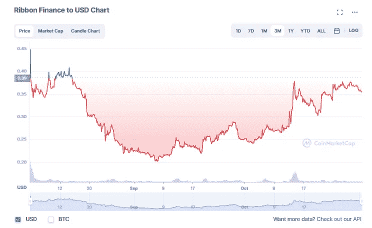

就贷款本身的风险缓解而言，Ribbon 宣传信贷承保的[链外流程](https://docs.ribbon.finance/ribbon-lend/introduction-to-ribbon-lend/off-chain-enforcement-credit-underwriting)以及由借款人支付的储户的[内置保险](https://docs.ribbon.finance/ribbon-lend/introduction-to-ribbon-lend/built-in-insurance)。如果未使用，为保险留出的资金将转化为 Ribbon 的协议收入。

# [枫叶金融](https://www.maple.finance/lend/):以太坊/索拉纳最高 10.7% APY

在我今天列出的所有平台中， [Maple Finance](https://www.maple.finance/lend/) 是收益率较低的平台之一，但也是 TVL 最高的。凭借超过 18 亿美元的贷款发行和超过 3 亿美元的存款，它绝对是我所能找到的最大的机构贷款机器。与 Ribbon Lend 类似，Maple 上的储户可以选择他们希望贷款给哪个实体，利率各不相同:

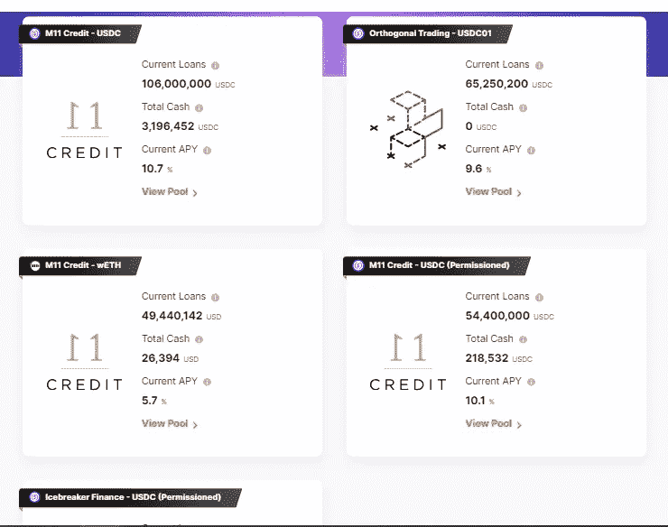

使用 Maple，您将获得$USDC 利息和$MPL 贷款奖励。与 Ribbon Lend 类似，Maple 上的储户在通过 altcoins 赚取任何类型的利息时都需要谨慎，因为如果我们缩小足够远，您会注意到在过去几个月中$MPL 上出现了一些疯狂的价格波动:

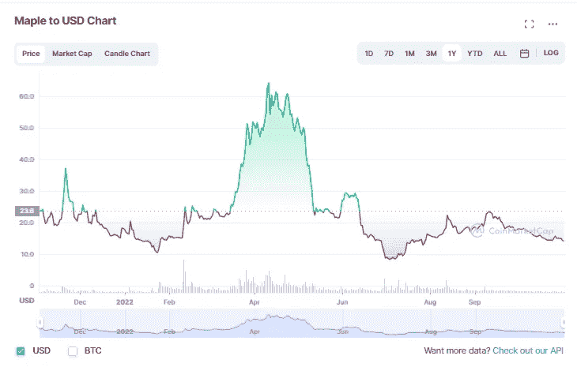

尽管$MPL 存在潜在的波动性，但需要考虑的最后一点是，Maple 要求储户有 90 天的锁定期，这意味着尽管随着资金进出的减少，稳定性可能会增加，但您将无法立即提取您的资金。

# [Clearpool Finance](https://app.clearpool.finance/) :以太坊/Polygon 高达 10.13%的年利率

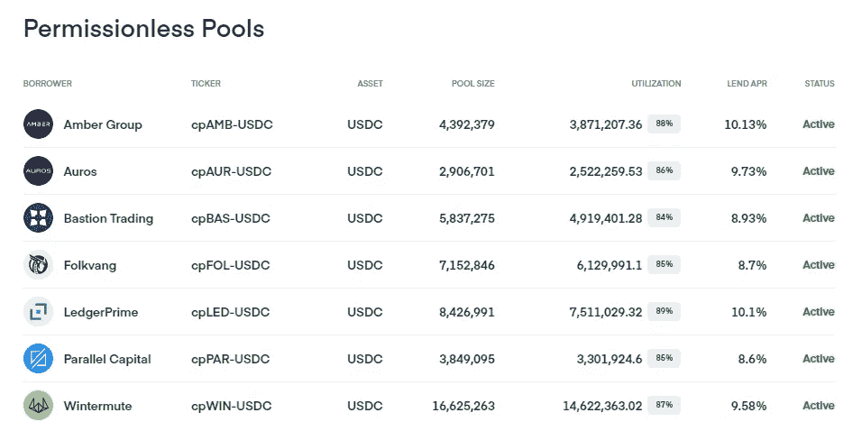

Polygon network 上唯一的一家机构贷款人 [Clearpool](https://app.clearpool.finance/) 拥有与 Ribbon Lend 相似的 TVL(约 1694 万美元)，并宣传没有锁定期，也没有对贷款人的 KYC 要求。与 Maple Finance 类似，储户可以挑选他们希望进入的贷款池，贷款是无担保的，这意味着它们没有抵押。

在风险缓解方面，5%的池利息分配给存款人[保险](https://docs.clearpool.finance/clearpool/how-it-works/protocol/insurance)，如果在贷款结束时未使用，则返回协议收入。此外，潜在的借款人必须通过 KYC 和反洗钱由 [Credora](https://t.co/s1B41QzHzB) 在那里他们接受信贷风险评估之前批准。

关于 Clearpool 的最后一个考虑是，像大多数其他平台一样，您获得的部分利息回报是通过他们的本机 altcoin，在本例中是$CPOOL:

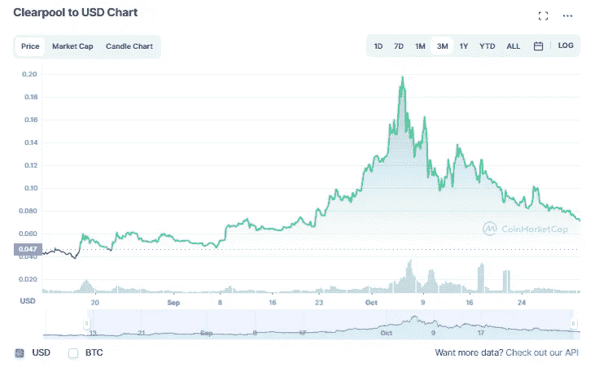

关于 Clearpool 的收益率，我注意到一件事，似乎更大比例的收益率是由本地$USDC 生成的，而不是$CPOOL。例如，在他们的琥珀组池中，您可以看到近 80%的回报以稳定的方式支付:

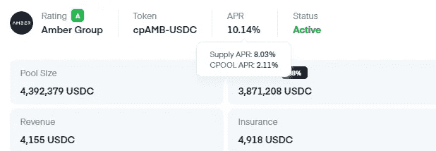

作为参考，Ribbon Lend 的总体收益率略高，但 stablecoins 的收益率仅为 7%:

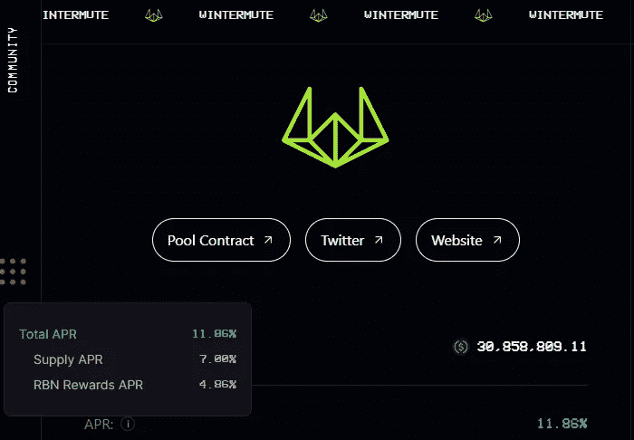

因此，如果你的 perogative 是堆叠更多的马厩，Clearpool 可能是更好的选择。

# 结论:

总的来说，我认为机构贷款是一个非常可靠的选择，可以使你的稳定货币/被动收入策略多样化，同时提供#realyield。然而，与此同时，重要的是要记住，就像任何贷款协议一样(即使是 TradFi)，违约风险总是存在的，尤其是无担保贷款。

随着围绕 3AC 的所有市场恐慌，我认为提醒自己我们现在也处于熊市也很重要，我可以想象，随着我们进入下一个牛市，机构贷款的世界可能会变得更加有利可图。

如果你认为我遗漏了关于机构贷款的任何其他考虑或风险，我很乐意在下面的评论中听到。否则，感谢你花时间阅读这篇文章，并确保在推特(【https://twitter.com/CryptosWith】)上关注我，获取我所有的最新动态。

免责声明:最后提醒一下，这不是财务建议，仅用于教育和娱乐目的。请一如既往地做自己的研究，找到最适合你的投资。干杯大家！

> 交易新手？尝试[加密交易机器人](/coinmonks/crypto-trading-bot-c2ffce8acb2a)或[复制交易](/coinmonks/top-10-crypto-copy-trading-platforms-for-beginners-d0c37c7d698c)