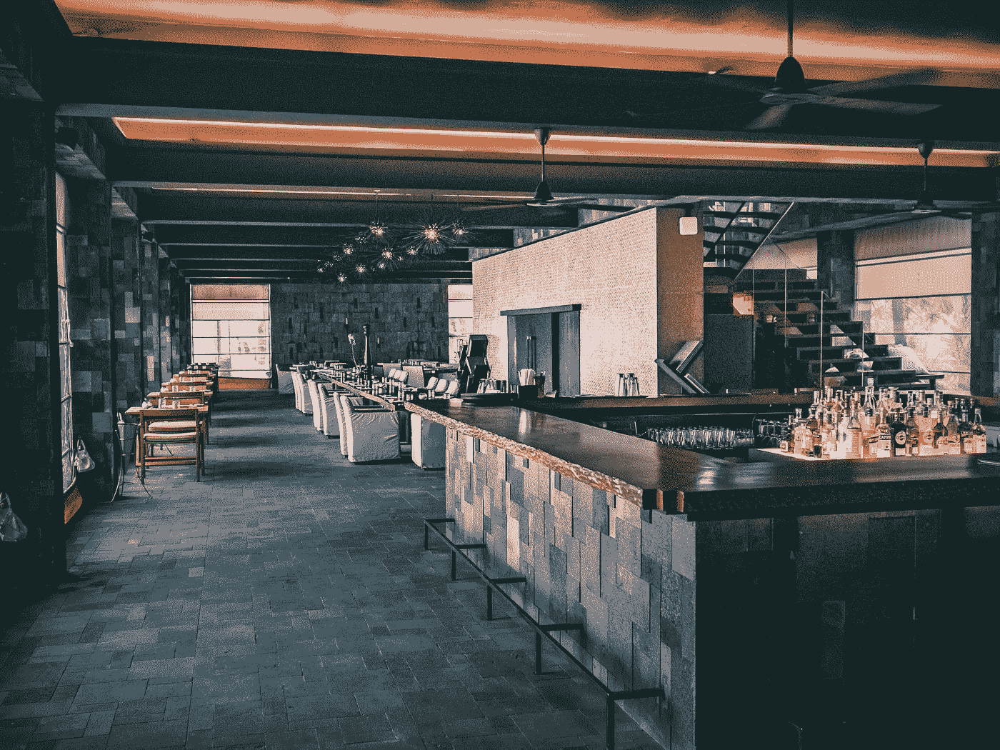

# 意向设定到 2023 年

> 原文：<https://medium.com/coinmonks/intention-setting-into-2023-11b43dd919ed?source=collection_archive---------83----------------------->

作者:[克里斯托弗·h·卢，医学博士](https://www.linkedin.com/newsletters/financial-freedom-with-dr-loo-6992935013231071233/)

Photo by [wewe yang](https://www.pexels.com/photo/modern-interior-of-restaurant-in-dark-tones-4508641/)

嘿伙计们！

每年的这个时候，我都会花时间回顾这一年——回顾哪些事情做得好，哪些事情做得不好，哪些挑战和机遇，以及哪些方面需要成长和改进。

这是一个实验，意图和目标设定的时间。为即将到来的一年做好准备。