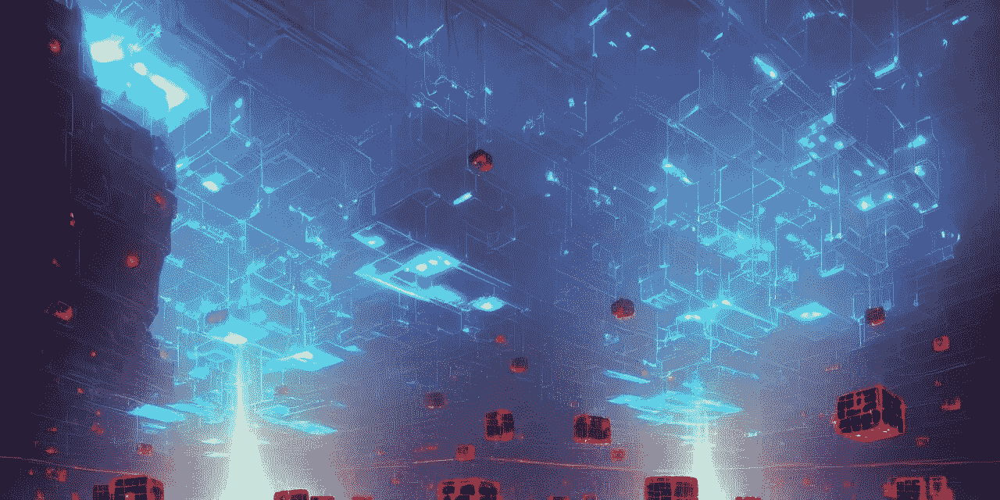

# 区块链间通信(IBC)协议

> 原文：<https://medium.com/coinmonks/inter-blockchain-communication-ibc-protocol-9a82fbc5c97b?source=collection_archive---------26----------------------->

Image generated by Lexica representing the hyper-realistic view of Blockchains

你好！你好！

你的周末前过得怎么样？是只有我还是你们所有人都在考虑度一个长周末😅。请在评论区告诉我。

回到我们的话题，在上一篇博客“ [**区块链**](/@patilsaurabh1799/types-and-problems-of-blockchain-388cb24bc348) 的类型和问题”中，我们讨论了不同类型的区块链，如第 1 层和第 2 层，以及无法与其他区块链交互的主要问题。

这种无法与其他区块链交互的特性让用户不得不在不信任、安全性、每个区块链的多个账户或者现有账户的舒适性之间做出选择。
我们都知道用户总是会选择舒适而不是安全和不信任。没有人喜欢维护多个东西。

> 从顶级交易者那里复制交易机器人。免费[试用](https://coincodecap.com/go/pionex-coinmonks)。

为了解决这个问题，许多开发人员和构建人员开始构建可以帮助人们解决这个问题的协议。其中最著名且呈指数增长的协议是 IBC 协议。

Let’s understand and build on IBC

## 那么这个 IBC 是什么？🤔它是如何解决互操作性问题的？

> IBC 代表**区块链间通信**协议。
> 它是一个用于**在任意状态机之间传递任意数据的协议。**

IBC 是通用消息传递协议，简单来说，任何形式的数据都可以使用 IBC 发送和接收。

拥有一个专用于互操作性的完整协议是不是很神奇？

如果你和我一样是开发人员，你会好奇这个协议是如何工作的。所以，我们开始吧🚀。

## IBC ⚙️的工作

IBC 有两个层面，让一切正常运转。
1]传输层
2]应用层

## 传输层🚗

它为在链之间建立安全连接和验证数据包提供了必要的基础设施。这一层负责在链之间传输 IBC 数据包。

办理**运输**、**认证**和**订购**，这一层也被称为道层。

## 应用层🛠️

这一层定义了将要传输的数据包在发送时应该如何打包，以及在接收时如何解释。

应用层可用于构建各种跨链应用，包括但不限于令牌传输、链间账户(两个链之间的委托调用)、不可替代的令牌传输和 oracle 数据馈送。

你们觉得 IBC 怎么样？？是不是很神奇？？

这确实让我很好奇，我会继续探索下去。我在某处读到过，一个主要的协议已经在此基础上建立起来了，这非常有趣。

期待我的下一篇博客“IBC 上正在建造什么？”。

今天到此为止。下一篇博客再见。

感谢阅读
- SSP

> *加入 Coinmonks* [*电报频道*](https://t.me/coincodecap) *和* [*Youtube 频道*](https://www.youtube.com/c/coinmonks/videos) *了解加密交易和投资*

# 另外，阅读

*   [3 商业评论](/coinmonks/3commas-review-an-excellent-crypto-trading-bot-2020-1313a58bec92) | [Pionex 评论](https://coincodecap.com/pionex-review-exchange-with-crypto-trading-bot) | [Coinrule 评论](/coinmonks/coinrule-review-2021-a-beginner-friendly-crypto-trading-bot-daf0504848ba)
*   [莱杰 vs n rave](/coinmonks/ledger-vs-ngrave-zero-7e40f0c1d694)|[莱杰 nano s vs x](/coinmonks/ledger-nano-s-vs-x-battery-hardware-price-storage-59a6663fe3b0) | [币安评论](/coinmonks/binance-review-ee10d3bf3b6e)
*   [加密交易机器人](/coinmonks/crypto-trading-bot-c2ffce8acb2a) | [Bingbon 评论](https://coincodecap.com/bingbon-review)
*   [Bybit Exchange 审查](/coinmonks/bybit-exchange-review-dbd570019b71) | [Bityard 审查](https://coincodecap.com/bityard-reivew) | [Jet-Bot 审查](https://coincodecap.com/jet-bot-review)
*   [3 commas vs crypto hopper](/coinmonks/3commas-vs-pionex-vs-cryptohopper-best-crypto-bot-6a98d2baa203)|[赚取加密利息](/coinmonks/earn-crypto-interest-b10b810fdda3)