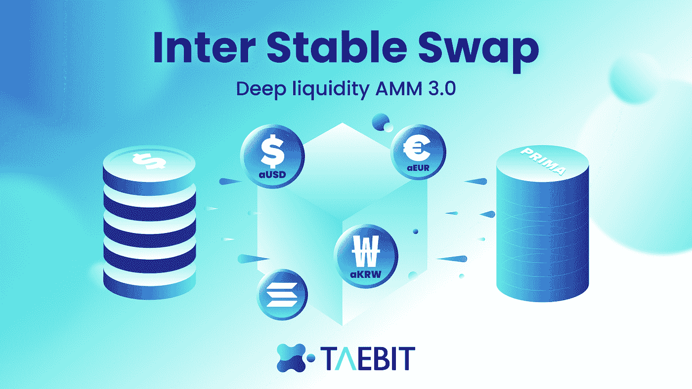
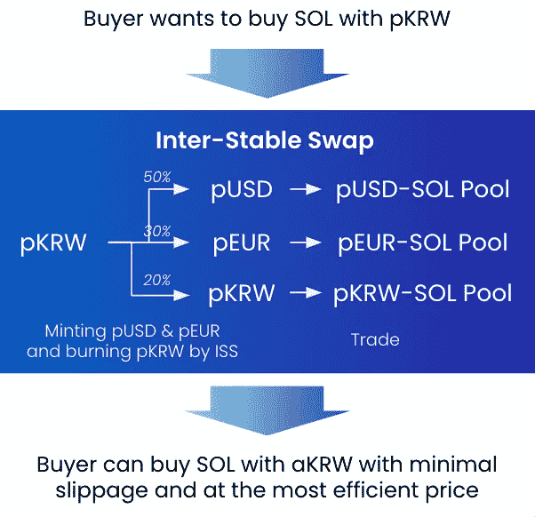
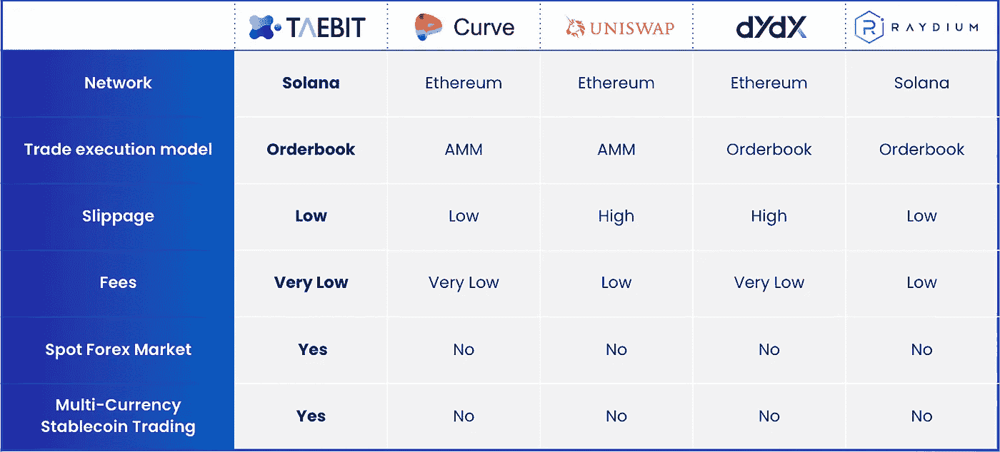

# 内部稳定互换:深度流动性 AMM 3.0

> 原文：<https://medium.com/coinmonks/inter-stable-swap-deep-liquidity-amm-3-0-78330936517e?source=collection_archive---------23----------------------->

**同业互换简介**

绝大多数分散式流动性聚合器和交易所的特点是在真空中有效的互换机制，这意味着它们在理论上可以正常运行，但一旦暴露在市场动态中，它们就会变得低效。这些低效率大多是由于过分关注速度、最小滑点或保持池流动性。

以 [Taebit](https://taebit.io/) 为特色的内部稳定互换系统是一个高效的系统，可以以最小的滑点持续互换多种货币，而不会损害资金池的流动性或速度。

ISS 采用动态挂钩来寻找最佳内部价格挂钩，而不考虑流动性池的大小。ISS 允许在不影响被交换或交易的个别货币的固定汇率的情况下进行货币交换。固定挂钩制度是一种在没有流动性或价格波动考虑的情况下，在一个真空中提取汇率的制度。这意味着在一个固定钉住的体系中交换货币可能会导致普遍的低效率，因为货币量是动态的，而价格保持不变。

ISS 系统不是使用会经历冗余的固定挂钩系统，而是模仿由 [Uniswap v3](/coinmonks/uniswap-v3-explained-57e0cdf86719) 和[曲线 v2](/bytomofficial/reverse-deconstruction-of-curve-v2-e6ca91a34d7b) 引入的 AMM 算法，并且是完全动态的。

国际空间站经过了严格的回溯测试，证明即使在压力最大的情况下，它也能成功地按计划运作，防止大范围的不稳定。

**国际空间站系统的结构**

ISS 系统可以被认为是一台在任何条件下都能平稳运行的机器，因为它有底层代码库。任何自动做市商最重要的方面是在做决定时考虑所有因素的能力。在一个分散的交易所，有价格波动，流动性波动，滑点波动，区块链速度的考虑，以及货币间的动态，所有这些都必须考虑。

当用户决定在 Taebit 上进行货币互换时，ISS 系统可以通过与提供实时价格数据的价格 oracle 和包含每种资产的流动性池进行协调，准确地确定进行交换的价格。类似地，当互换发生时，ISS 系统可以控制平台上每个资产的浮动或未偿百分比份额和总量。对被交换资产的价格以及资产在各自[流动性池](https://www.youtube.com/watch?v=cizLhxSKrAc)中的百分比份额的控制，是自动做市商正常运作的关键。流动性池是由多种资产按照一定比例组合而成的集群，以创造一种没有单一资产构成总流动性的主要部分的环境。流动性池允许快速交换资产，并有助于以自动化方式简化再平衡过程。

Taebit 平台拥有 Omni Currency Shared Reserve Pool，即 LP-shared pools，它是多个流动性池，每次互换都会以独立的方式影响特定的池。根据不同的货币分隔不同的货币池，可以使价格数据高度准确，还可以减少滑点，因为只需要重新平衡一个货币池。

## 更多文章阅读

> [外汇交易员为什么要进入 DeFi？](/@taebitdex/why-should-forex-traders-move-into-defi-a042ae053db8)
> 
> [DeFi vs. CeFi:哪种金融服务更适合你？](/@taebitdex/defi-vs-cefi-which-financial-service-is-more-suitable-for-you-ca38af7609d9)
> 
> [多头对空头:驾驭动荡的市场](/@taebitdex/bulls-vs-bears-navigating-a-volatile-market-26ea286250b6)

**为什么 ISS 机制更好**

分散式系统依靠智能合同技术和健壮的代码系统运行。Taebit 是世界上第一家以分散方式引入区块链外汇市场的交易所。同样，Taebit 是索拉纳区块链上第一家实施高度先进的自动化做市商系统(如 ISS 机制)的交易所。ISS 机制不仅对 Solana 来说是“新的”,而且比 Solana 以前通过分散式交易所使用的做市技术要好得多。

如前所述，在创建分散式交易所时，所有做市系统都必须考虑五个主要因素:

1.  价格波动
2.  流动性波动
3.  滑动波动
4.  区块链速度考虑因素
5.  货币间动态

ISS 系统可以通过在系统结构中加入不同的褶皱来同时考虑所有这些动态。

价格波动和流动性波动被最小化，并通过实时的 oracle feed 进行核算，Oracle feed 为系统提供准确的价格数据，并将这些数据分散到受货币互换影响的各个池中。

通过使用交换资产的价格作为 LP 共享池中相应资产的份额的整体函数中的乘积来减轻滑动波动。通过合并交换资产的价格和这些资产在 LP 共享池中的份额，ISS 克服了其他做市系统面临的最大挑战之一:过度简化导致滑点增加。大多数做市系统会将资产价格视为无效，或者不考虑 LP 池中的百分比份额，这就是导致系统中滑点增加和不必要波动的原因。

区块链速度的考虑对 Taebit 团队来说至关重要，这就是为什么 Taebit 建立在世界上最快的第一层区块链之一 Solana 之上。Solana 还使用 Rust 作为其核心代码库，这使得高度复杂的事务变得易于编程、测试和重复。

货币间动态是 Taebit ISS 系统最重要的组成部分之一。分散式外汇系统依赖于快速有效地交换多种货币的能力。ISS 动态钉住系统从内部交换数据中推断出每种货币的最准确价格，并确保货币之间的互换在最佳价格点执行。许多竞争对手在对基础资产定价时只考虑供求数据，但 Taebit 采用供求数据、内部流入和流出数据以及每个流动性池中资产的百分比份额来确定每项资产的市场价格。

# 加入我们的☯️社区频道

> *推特上的最新内容🐦:*
> 
> **关于不和的交易讨论👾:*[*https://discord.gg/gBjqjFXmn2*](https://discord.gg/gBjqjFXmn2)*
> 
> **[*https://t.me/+4kkLYgMPtZw3NjJl*](https://t.me/+4kkLYgMPtZw3NjJl)电报上的最新公告**
> 
> ***Taebit 网站:*[【https://taebit.io/】T21](https://taebit.io/)**

> **交易新手？尝试[加密交易机器人](/coinmonks/crypto-trading-bot-c2ffce8acb2a)或[复制交易](/coinmonks/top-10-crypto-copy-trading-platforms-for-beginners-d0c37c7d698c)**