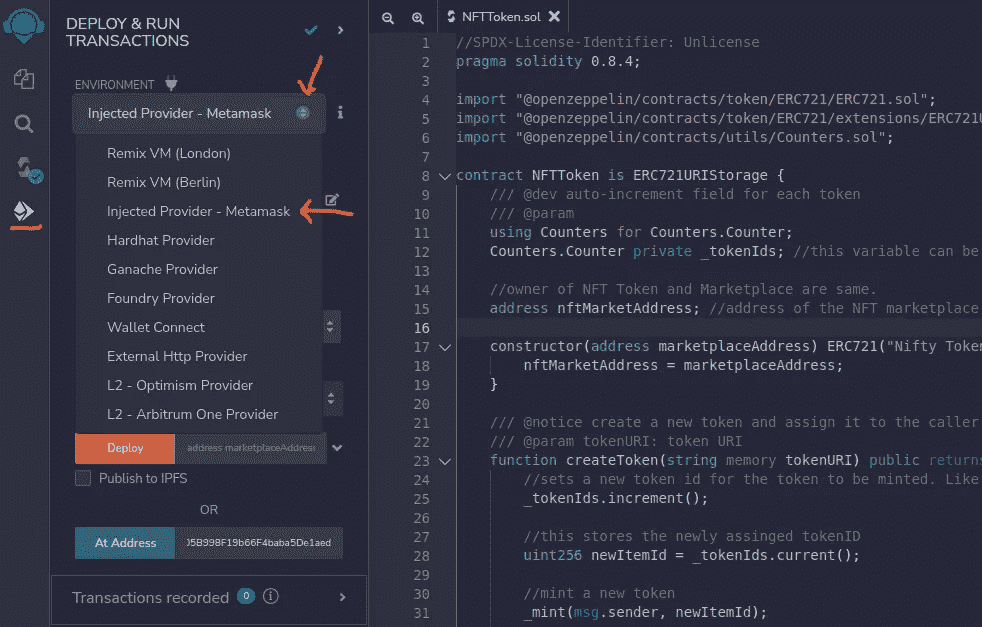

# 使用 Remix IDE 与实时部署的智能合约进行交互

> 原文：<https://medium.com/coinmonks/interact-with-a-live-deployed-smart-contract-using-remix-ide-1ea7e3fde52f?source=collection_archive---------1----------------------->

摘要:本文与部署在区块链的 testnet 或 mainnet 上的智能合约的交互有关。我们总是可以编写测试用例或脚本来与契约进行交互，但是 remix 提供了一种快速的方法来轻松地查询和交互一个活动的智能契约。

在这个例子中，我已经在 [polygon (mumbai) testne](https://docs.polygon.technology/docs/develop/network-details/network/) t 上部署了一个智能契约。

# 要求

1.  已部署的智能合约源代码:请查找下面的代码。
2.  部署合同地址:[0x 68 B1 d 87 f 95878 Fe 05 b 998 f 19 b 66 F4 Baba 5 de 1 aed](https://mumbai.polygonscan.com/address/0x68B1D87F95878fE05B998F19b66F4baba5De1aed)
3.  元掩码；配置了区块链，以及与之连接的令牌合约钱包的所有者，并且钱包中有一些令牌。

```
// NFTToken.sol
//SPDX-License-Identifier: Unlicense
pragma solidity 0.8.4;

import "@openzeppelin/contracts/token/ERC721/ERC721.sol";
import "@openzeppelin/contracts/token/ERC721/extensions/ERC721URIStorage.sol";
import "@openzeppelin/contracts/utils/Counters.sol";

contract NFTToken is ERC721URIStorage {
    /// @dev auto-increment field for each token
    /// @param
    using Counters for Counters.Counter;
    Counters.Counter private _tokenIds; //this variable can be viewed by public, but cannot be called.

    //owner of NFT Token and Marketplace are same.
    address nftMarketAddress; //address of the NFT marketplace

    constructor(address marketplaceAddress) ERC721("Nifty Tokens", "IFTY") {
        nftMarketAddress = marketplaceAddress;
    }

    /// @notice create a new token and assign it to the caller of the function.
    /// @param tokenURI: token URI
    function createToken(string memory tokenURI) public returns (uint256) {
        //sets a new token id for the token to be minted. Like: 0, 1, 2, 3, 4, ...
        _tokenIds.increment();

        //this stores the newly assinged tokenID
        uint256 newItemId = _tokenIds.current();

        //mint a new token
        _mint(msg.sender, newItemId);

        //given the token is valid, tokenURI is created using baseURI and tokenId
        _setTokenURI(newItemId, tokenURI);

        //give marketplace authority to make transaction on behalf of the user.
        //If this is not done, any the marketplace cannot buy and sell
        // this token in the marketplace, here both marketplace and token belong
        //to the same owner so it was easy to supply marketplace address
        //and give the required approval.
        setApprovalForAll(nftMarketAddress, true);

        //returns the new token id as uint
        return newItemId;
    }
}
```

# 步骤 1:在 Remix IDE 中编译契约

*   在浏览器中访问 https://remix.ethereum.org[打开混音 IDE。](https://remix.ethereum.org)
*   复制您已经部署的智能协定的源代码，并再次编译它。成功编译后，您应该会看到类似这样的内容，


successful compile

# 步骤 2:连接你的混音 IDE 到 metamask

在部署配置中设置环境。



Set the envrionment as Metamask

为弹出权限选择是/连接，以便您可以将 remix IDE 链接到 metamask wallet，确保您在连接时选择了正确的帐户。

# 步骤 3:连接你的混音 IDE 到 Metamask

我们不想部署此合同，因为它已经部署。我们需要简单地连接已经部署的契约。

将智能合同的地址粘贴到“地址”部分。


最后，点击“地址”蓝色按钮。


click the blue “At Address” button after pasting the address.


从结果中，我了解到智能合约中没有创建令牌。这是您与实时智能合同进行交互的方式。

由于此功能是一个简单的读取功能，所以不会产生任何气体费用。

> 交易新手？尝试[加密交易机器人](/coinmonks/crypto-trading-bot-c2ffce8acb2a)或[复制交易](/coinmonks/top-10-crypto-copy-trading-platforms-for-beginners-d0c37c7d698c)