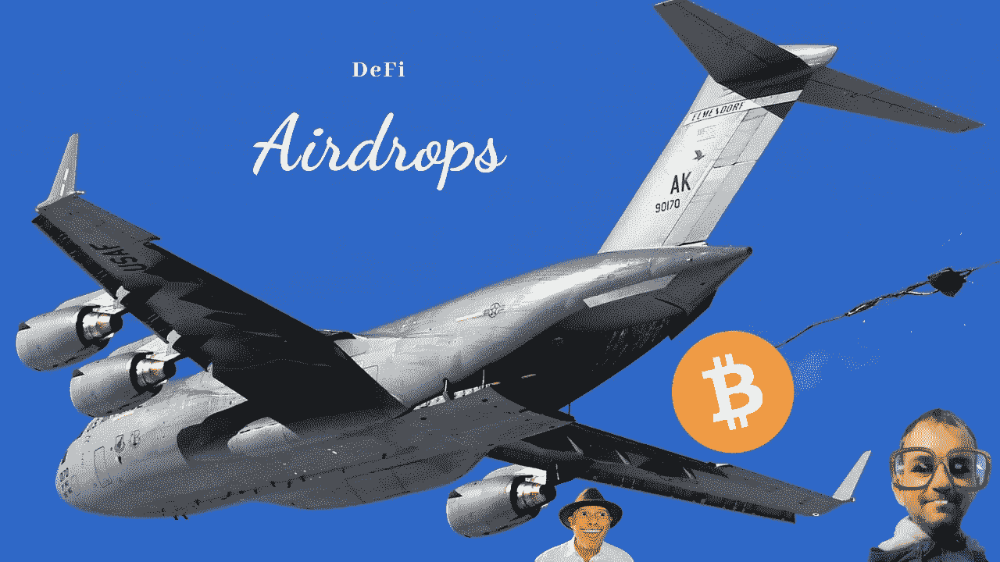

# 与去中心化的财务协议互动是非常有益的。原因如下。

> 原文：<https://medium.com/coinmonks/interacting-with-decentralized-finance-protocols-can-be-extremely-beneficial-here-is-why-c013ff113ec1?source=collection_archive---------23----------------------->

空投有不同的种类。一方面，我认为那些空投毫无价值，纯粹是浪费时间，比如来自 CoinMarketCap 的空投。

老实说，CoinMarketCap 的空投更像是奖金，而不是空投。你必须做一堆无脑的任务，比如在这里关注，在那里转发。如果你幸运的话，你可能会成为一小部分幸运儿中的一员，得到一点小小的奖励。

另一方面，一些空投是非常有益的，空投价值数百，甚至数千美元。我说的是空投给那些持有某种代币或与分散协议互动的人，例如通过在 DEX 上提供流动性。

# 它始于 UniSwap

这些大空投中的第一个是为 Uniswap 的早期用户空投 400 美元的 UNI 代币。任何曾经与 Uniswap 互动过的人都有权领取他们新发行的$UNI token。当时我错过了 Uniswap 空投，因为我从来没有在 DEX 上进行交换，原因很简单。我不愿意支付 Uniswap 的高额油费。

# 找到这些空投物资

这让我想到了这些 DeFi 空投的主要困难。你永远不知道它们什么时候会发生。嗯，这是有道理的，因为这些空投的目的是奖励早期采用者和支持者，如果每个人都知道这一点，那么空投量将大幅减少。最后，你还剩下 50 美分的空投，就像币安学习与收入公司的空投一样。

下一个困难是在空投发生后找到它们。想象一下，你有权要求 1000 美元的空投，但你错过了，因为你根本不知道它。幸运的是，已经有了解决这个困难的方法。

[**earni.fi**](https://earni.fi/) 是一项免费服务，只需输入你的以太坊、宇宙、BNB 连锁店或 EVM 地址，就能帮助你找到无人认领的空投物资。我经常使用这个网站来检查我的钱包地址，寻找无人认领的空投物品。Earni.fi 说，它在空投和 NFT 中平均获得 664 美元。

# 为未来空投做准备

自那以后，越来越多的分散项目采用了 Uniswap 的方法，如 SushiSwap、ENS 等。

多亏了我最喜欢的不可知密码的博客平台 [**Publish0x**](https://www.publish0x.com/@Cryptonators-Airdrop-Hunt?a=5xe7xNOa7r&tid=Medium) 我能够申领大约 4000 美元的第四代币。在这种情况下，我很幸运，我从我的私人钱包里取出了一小笔钱，这样就可以参加 Publish0x 的 Twitter 赠品。

找到奖励 DeFi 协议早期采用者的未来空投几乎是不可能的。你可以试着去寻找一些暗示，但是最终，你没有任何保证。这就是为什么为这样的事件做好准备是极其困难的。

我最近发现了一个潜在的 Taiko 空投 Loopring 用户的提示。部分旧的和当前的 Loopring 团队正在开发一个名为 Taiko 的项目。所有大幸药品的联合创始人都是打圈人。

联合创始人 Daniel Wang 在 discord 上提到，他将尝试为 Loopring 用户提供空投服务。当然，这是没有保证的。

然而，我能说的是，与去中心化的金融协议互动是非常有益的，而且还会有更多的大空投出现。

如果你对潜在的 DeFi 空投有任何提示，那么如果你能留下评论，那将是非常棒的。

感谢你的阅读，如果这是你喜欢在媒体上阅读的东西，我会很高兴关注。

如果你喜欢，你可以在 [Twitter](https://twitter.com/cryptonator_s) 和 [Publish0x](https://www.publish0x.com/@Cryptonators-Airdrop-Hunt?a=5xe7xNOa7r&tid=Medium) 上关注我，这是一个让你获得写作和阅读密码的平台。

> 交易新手？尝试[加密交易机器人](/coinmonks/crypto-trading-bot-c2ffce8acb2a)或[复制交易](/coinmonks/top-10-crypto-copy-trading-platforms-for-beginners-d0c37c7d698c)