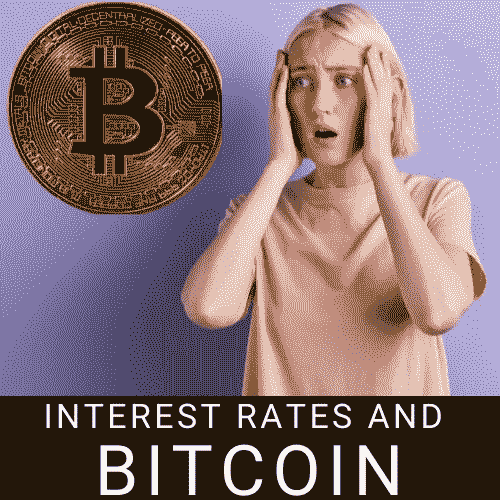

# 检验利率和比特币之间的关系

> 原文：<https://medium.com/coinmonks/interest-rates-and-bitcoin-4aefee885dda?source=collection_archive---------15----------------------->

昨天，消费者价格指数，即 CPI，即通货膨胀[达到了 9.1%(同比)](https://www.bloomberg.com/news/articles/2022-07-13/us-inflation-accelerates-to-9-1-once-again-exceeding-forecasts?sref=AQYRbncw)，比(环比)上涨了 1.3%。普遍的预期是同比增长 8.8%，环比增长 1.1%。

我在这里分析了 CPI