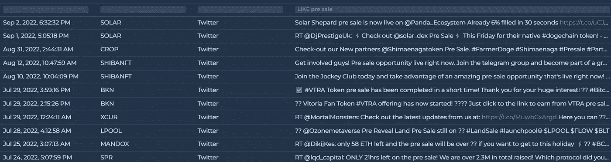

# 对代币预售感兴趣？

> 原文：<https://medium.com/coinmonks/interested-in-pre-sale-of-tokens-1e201c82ac21?source=collection_archive---------35----------------------->

一些加密货币计划在推出初始硬币发行之前，以预定价格向潜在投资者预售代币。如果一切按计划进行，数字货币获得成功，这可能会被视为对投资者和开发团队都有利。

创业公司在预售期间出售令牌，而这些令牌仍在开发中，尚未对公众开放。代币预售的目标是为项目的早期开发筹集资金，或者为 ICO 发布前的运营支付费用。

**预售去哪里找币？**

前往 altFINS news feed:【https://altfins.com/news】
搜索“**【预售】** 在屏幕上看到结果。这些推文代表向他们的社区提供代币预售的项目。

Source: [altfins.com](https://altfins.com/news)

> 加入 Coinmonks [电报频道](https://t.me/coincodecap)和 [Youtube 频道](https://www.youtube.com/c/coinmonks/videos)了解加密交易和投资

# 另外，阅读

*   [加密交易机器人](/coinmonks/crypto-trading-bot-c2ffce8acb2a) | [维护审查](https://coincodecap.com/uphold-review)
*   [十大最佳加密货币博客](https://coincodecap.com/best-cryptocurrency-blogs) | [YouHodler 评论](https://coincodecap.com/youhodler-review)
*   [my constant Review](https://coincodecap.com/myconstant-review)|[8 款最佳摇摆交易机器人](https://coincodecap.com/best-swing-trading-bots)
*   [MXC 交易所评论](/coinmonks/mxc-exchange-review-3af0ec1cba8c) | [Pionex vs 币安](https://coincodecap.com/pionex-vs-binance) | [Pionex 套利机器人](https://coincodecap.com/pionex-arbitrage-bot)
*   [我的加密副本交易经历](/coinmonks/my-experience-with-crypto-copy-trading-d6feb2ce3ac5) | [比特币基地评论](/coinmonks/coinbase-review-6ef4e0f56064)