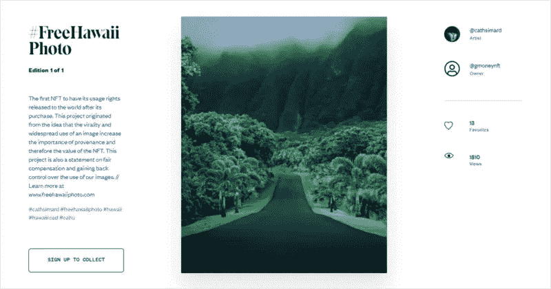
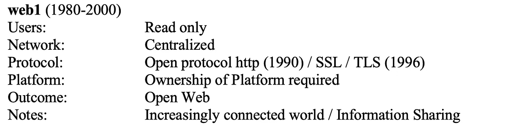
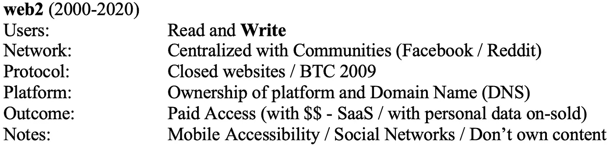
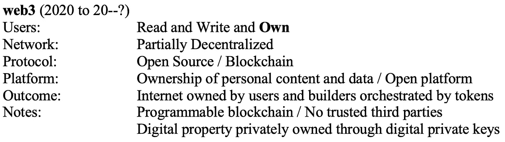
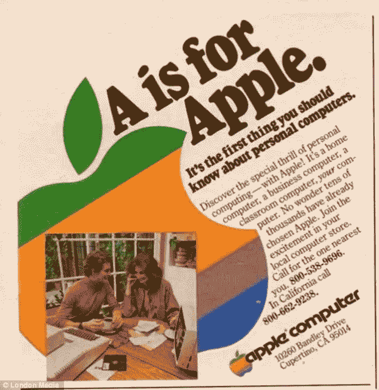

# 对 web3 感兴趣？从脸书到梅塔的明智之举！

> 原文：<https://medium.com/coinmonks/interested-in-web3-the-brilliant-move-from-facebook-to-meta-8feaf98618e3?source=collection_archive---------23----------------------->

Courtesy of [web4.com.au](https://web4.com.au)

## 脸书更名为 Meta 告诉你 web3 将会继续存在。原因如下…

你听过这样一句话吗:

> *“如果你不知道你买的是什么产品，你就是产品”*

虽然脸书不会直接出售你的个人数据，但他们会利用你的信息赚取数十亿美元。

现在想象一下，在一个脸书，每当你发表帖子、点赞或评论，你就会获得报酬。这是 web3 的承诺。

## **创始人的信**

当脸书的创始人马克·扎克伯格(Mark Zuckerberg)写下他的“[创始人信，2021](https://about.fb.com/news/2021/10/founders-letter/) ”，解释将脸书更名为 Meta 的原因时，他遗漏了一些关键信息。

扎克伯格说，“在元宇宙，你将能够……工作、学习、玩耍、购物、创造……”。

他似乎忽略了“拥有”和“获得”，这是 web3 范式的核心部分。

在脸书的 web3 版本中，用户通过使用平台获得报酬。这是对当前脸书商业模式的威胁。这些平台的术语是 SocialFi(社会金融),由像 [Torum](https://www.torum.com/) 和 [Weplay](https://www.weplay.chat/) 这样的项目引领潮流。

## 但是 web3 和元宇宙有什么关系呢？

“元宇宙”是超越现实世界(“元”，来自希腊语“超越”)并进入更沉浸式数字世界的通用参考，结合了虚拟现实(VR)、人工智能(AI)和物联网(IoT)的元素。

Web3 是一个互联网层，支持数字资产的所有权和社区建设。通过对个人数字资产的控制，web3 与元宇宙的集成增强了用户体验。

NFT(不可替代的令牌)已经证明了 web3 支持所有权的好处。一个最简单的例子是一个厌倦了强制执行版权的摄影师。所有者将数字资产(照片)转换为 NFT，并以 30 万美元的价格出售。

From [petapixel.com](https://petapixel.com/2021/09/21/photographer-sells-her-widely-stolen-photo-as-nft-for-300k-makes-it-free/)

在 web3 中，你控制你的数据，你根据你的贡献获得收入，你拥有你的数字资产。这可能会对脸书目前向广告商出售你的信息的模式构成严重威胁。

为了弄清楚我们是如何走到这一步的，有必要探究一下是什么导致了 web3。

## **网络之路 3…**

网络的发展可以大致理解为:

网页 1 —阅读

Web 2 —写/分享

Web3 —自己的

Web 1 是第一次广泛采用互联网，主要集中在阅读在线内容，如新闻、杂志和博客。

Web 2 建立在第三方平台上，这些平台通过对平台收取少量费用(软件即服务——通常称为 SaaS)或通过将个人用户数据货币化(脸书、谷歌)而受益。这些“可信的第三方”攫取了大部分财富。

Web3 提供了一种方式来扭转这种动态，并通过提供所有权而无需“可信”的第三方来改变游戏规则。

互联网的发展是一个持续的过程，从一个阶段到下一个阶段的过渡没有严格的定义。然而，20/20 后见之明让我们有能力对进化进行逆向工程，并定义一些关键的差异。

## 比较了 web1、web2 和 web 3

Courtesy of [web4](https://web4.com.au)

## **Web3 —自己的**

使用区块链而不是依赖“可信的第三方”来分配数字资产的**所有权**的能力是 web3 技术的核心。附加功能包括点对点价值转移(如艺术、金钱、音乐)和社区建设。

虽然有人可能会说这些功能在 web2 中是可用的，但关键的区别在于它们依赖于“可信的第三方”。

例如，你可以“拥有你的飞行常客积分”，但前提是航空公司允许。你可以向另一个人汇款，但前提是银行或支付提供商允许你这样做(并在此过程中收取他们的费用)，并且你可以建立社区，但前提是大型科技公司允许你这样做(并且你乐于接受审查)。

虽然 web3 在“元宇宙”的第一个使用案例是通过支持数字资产的所有权和转让来改善用户体验，但现在的重点正转移到采用现实世界公用事业的[项目，在此过程中增强现有的商业模式并赋予用户权力。](https://proprt.io)

Courtesy of [PROPRT.io](https://proprt.io) — Fractional Real Estate

## **现在去哪里？**

预测未来是不可能的，只要看看早期的苹果麦金塔电脑广告就知道了，广告中展示了一对夫妇坐在餐桌旁，有些困惑。

当你考虑到最近将 NFTs 扩展到 Instagram 和将脸书更名为 Meta 时，web3 的未来看起来是光明的。

 [## Instagram 将 NFT 带给更多人| Instagram 博客

### 今年早些时候，我们在 Instagram 上发布了数字收藏品，从今天开始，我们将扩展人们的能力…

about.instagram.com](https://about.instagram.com/blog/announcements/digital-collectibles-instagram-nft-creators) 

通过区块链而不是“可信的第三方”将价值直接转移给另一个人、建立社区以及保留对个人数字数据的控制权的能力，已经引起了大型科技公司的关注。主流用户并没有落后太多，他们的项目在这个过程中拥抱了效用并使客户受益。

web3 如何改善你的商业模式？你认为 web3 会走向何方？…除了 [web4](https://web4.com.au) 。

我们希望在评论区听到你的想法。

> 交易新手？试试[密码交易机器人](/coinmonks/crypto-trading-bot-c2ffce8acb2a)或者[复制交易](/coinmonks/top-10-crypto-copy-trading-platforms-for-beginners-d0c37c7d698c)