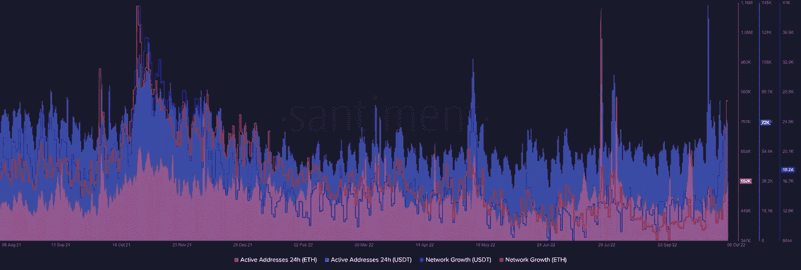
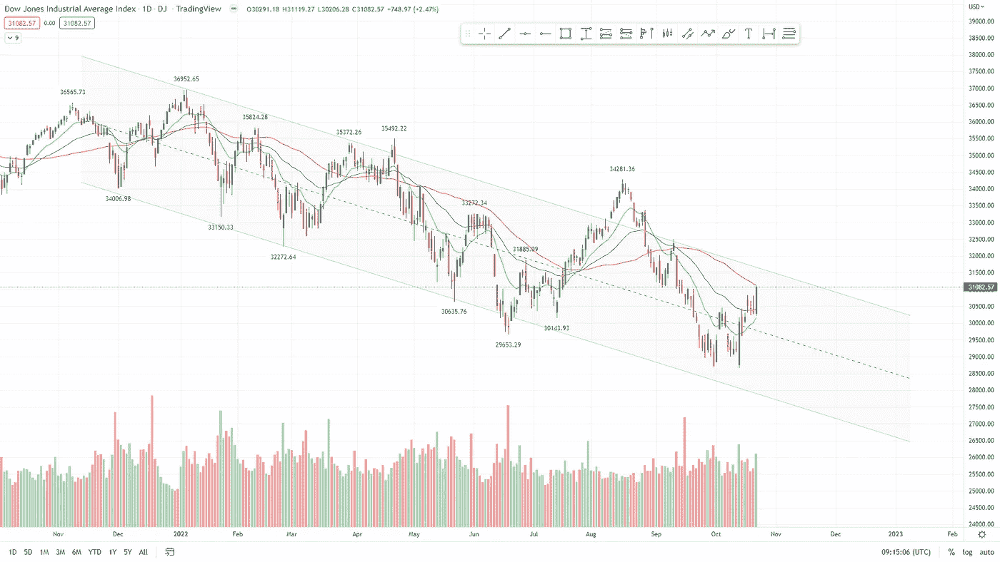
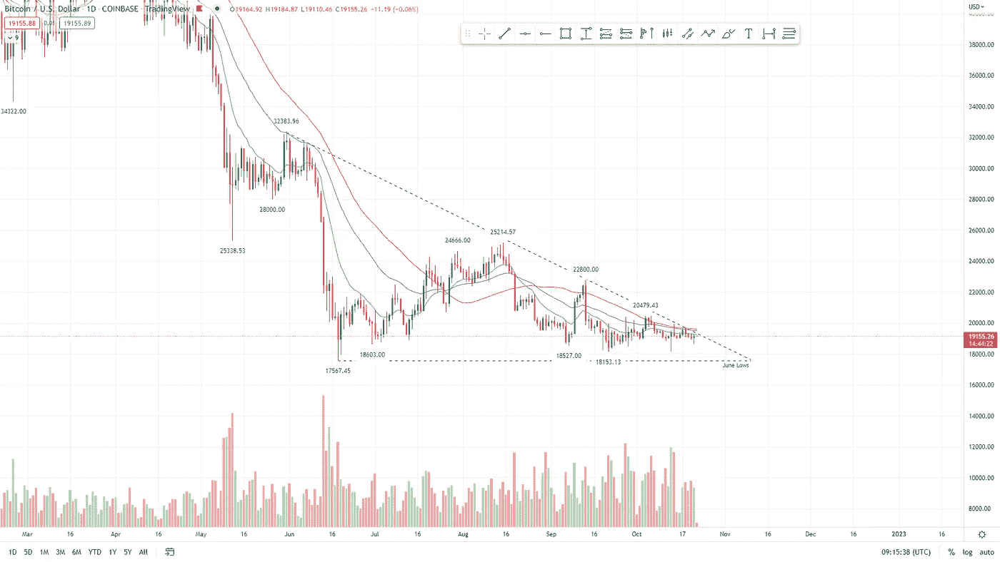

# 监管、战争、增长和宏观经济焦虑交织在一起，首先打破的是什么？

> 原文：<https://medium.com/coinmonks/interlacing-regulation-war-growth-and-macroeconomic-anxiety-what-breaks-first-90e4cb06fa97?source=collection_archive---------38----------------------->

# 在本周的报告中

*   市场期待美联储拯救我们。这不会发生，原因如下。
*   **欧洲当局希望关注以太坊区块链。**
*   **中国监管机构考虑允许虚拟货币资产类别在港交易**
*   以太坊地址创历史新高。
*   **全球升级仍在继续。谣传未来会有更多的经济危机。**
*   **道琼斯工业平均指数(US30)价格分析。**
*   **比特币价格分析。**

‍

This article was originally published at the crypto information hub @ www.boomish.org

‍

# 美联储救不了我们的经济

‍

无可争议的是，股市已被证明是全球经济形势的滞后指标。

‍

它们不是经济危机的原因，而是一个问题的延迟症状，这个问题早在股市崩盘之前就存在了。
‍

自 2021 年 11 月以来，我们已经看到股市出现了相当大的暴跌。这意味着问题发生在 11 月之前，问题深深植根于我们的全球经济。

‍

这个问题的一部分是美联储的历史能力，每当它呼吁他们执行量化宽松(QE)。

‍

这一次，这是不太可能的，因为最终造成这场混乱的是数万亿 QE 元。

‍

不幸的是，这场混乱是完全可以避免的，美联储主席鲍威尔和他的同事们肯定知道这是他们行动的必然结果。

‍

*“与此同时，我们看起来正在整个信贷领域吹一个固定收益期限的泡沫，当利率上升时，这将导致巨大损失。你几乎可以说这就是我们的策略”(鲍威尔，2012 年美联储会议)。*

‍

他们知道，他们正在制造一个巨大的金融泡沫，当他们提高利率时，这个泡沫就会破裂，造成严重的经济损失。

‍

然而，他们不断扩大泡沫，任何有半个大脑和一点点逻辑思维的人都不应该武断地声称央行行长们“盲目”或无知。在许多层面上，这是一场经过深思熟虑、精心策划的崩盘。，而不是我们所希望的意外事故。

‍

他们知道这将会发生，但允许它，为什么？我不会努力去推测。

‍

我几乎可以肯定地说，他们救不了我们，事实上，他们救不了我们。

‍

如果他们回到 QE，那么通胀灾难就会接踵而至，并转移到下一代身上。为了拯救我们的经济，他们不可避免地要伤害经济和人民。

‍

有计划的经济内爆给政府提供一个全面的重置？为了什么？谁知道呢。但这对西方的下层民众来说肯定不太好，因为他们将受到盲目“信任”的官员所造成的灾难的最大影响。

‍

‍

# 加密货币监管

‍

注意到我们“信任的”官员的无能，欧洲当局已经表达了他们对实施自动化软件来监控以太坊区块链上的连锁活动的愿望。

‍

让我们允许政府调查我们仍然拥有的为数不多的私人交流方式之一…

‍

欧盟官员表示，他们的项目名为“分散金融嵌入式监管研究”，*“将寻求受益于区块链以太坊交易数据的开放性，这是 DeFi 协议的最大结算平台。其主要重点将是直接从区块链收集自动监控数据，以测试实时 DeFi 活动监控的技术能力。”*

‍

自从以太坊合并以来，以太坊共识从工作证明网络转变为利益证明网络，以太坊已经放弃了它对分散安全性的大部分保证。

‍

就其本质而言，不能证明股权分散。这是由于共识机制背后没有有形的可追溯商品。

‍

本质上，我们不能证明没有持有超过 60%的网络，并停止不必要的交易的持有者。

‍

再加上政府对网络上所有交易的监控。我们有一个慢慢恶化的“分散”网络，它无疑正在慢慢变成一个由政府管理的集中实体。
*‍* ‍

另一方面，香港监管机构正在考虑允许交易所和其他中介机构直接向散户投资者出售虚拟资产。

‍

它还让企业放心，香港对加密货币的官方立场独立于 mainland China。

‍

‍

# 以太网增长

‍

继续把以太坊作为我们的话题，以太坊网络刚刚在 2022 年见证了它迄今为止最大的一天。

‍

该网络的钱包地址总数在周末创下历史新高(图 1)。

‍

根据加密分析公司 Santiment 的数据，周六以太坊上创建的新地址激增，当时网络上创建的新钱包地址多达 135，780 个。

‍

是什么引发了地址创建的突然激增？我们只能推测。我的假设可能是监管要求或全球涌向一种持有资金的形式，由于当前全球紧张的状态，没有人可以从你那里拿走。

‍

通常情况下，以太坊钱包地址的大幅增长发生在强劲的牛市之前，但这一次是否会出现这种情况还有待观察。

‍

尽管如此，这是网络采用的一个好迹象。

*图 1 活跃以太网地址数量(Santiment)*

‍

# 全球升级

# 欧洲能源危机

‍

俄罗斯已经完全切断了对欧洲的天然气供应，天然气占欧盟全部能源的 40%左右。

‍

Who really is the culprit of this? That is undoubtedly something to debate about, self mutilation doesn’t seem too far-fetched currently.

‍

Europe’s benchmark natural gas prices spiked by 28% a week ago, on top of already existing inflation signaling poorer times.

‍

Oil supplies are also in steep decline for Europe and the EU government has pledged to cut what’s left of Russian oil imports by the sea at the end of the year.

‍

Stress on the global supply chain is also imminent since producers of goods in Europe will have to cut down on energy expenditure, meaning less production of goods, no bueno.

# Putin, Russia, China, Ukraine and the Western Choice

‍

Vladimir Putin is set to meet with China’s Xi Jinping and the nature of the conference is not clear.

‍

China and Russia have obvious immense mutual interest, if they do band together a new global superpower has indisputably formed.

‍

With the amount of propaganda coming from Ukrainian Intelligence and NATO, it’s hard to pin down exactly what is going on in Ukraine, but either way, that doesn’t look too favorable for the global situation either.

My problem is as follows. US officials have repeatedly admitted the war is unwinnable for the west, but they also refuse to go into peace talks with Putin, so what exactly is the game plan?

‍

It’s a complete and obvious lose-lose situation in that case. They are providing the American and western populations with just one option: war and destruction.

‍

I believe it is obvious that the ball is in the court of the western officials to form a more peaceful agreement, but they seem hell-bound on destruction.

‍

And unfortunately, this destruction is not just the wherefore mentioned economical destruction, but evermore likely the destruction of millions of homes and lives.

‍

‍

# Dow Jones Industrial Average (US30) Price Analysis

‍

As stated in our newsletter last week:

‍

*“While the major indexes continuing lower is still more likely than not, countertrend rallies tend to come once the index reaches a high level of extension below key moving averages in a bear market.”*

‍

*“In these extended downtrends, you tend to see shorts taking profits, this can lead to a nice rally in between the immense bear pressure.”*

‍

*“To me, it would appear that this isn’t the bottom and is a short rally before continuing lower is more likely than a long-term bottom.”*

‍

And here we have it.

‍

Since I wrote these quotes last week we have seen a rally of over 7% in the US30.

‍

We are getting close to the top of the channel, which means people will begin to get cautious one more soon.

‍

A continuation up to 32500 seems the most likely scenario, this price target is reached at about the same time as the next Fed Rates meeting and would be the perfect catalyst for the beginning of a strong new down-trend.

*Fig. 2 1D DJIA Oct 2021 — Oct 2022 (TradingView)*

# Bitcoin Price Analysis

与股市相比，比特币表现出了极大的稳定性，几乎没有上下波动。

‍

市场的这种完全犹豫不决表明，人们可能不仅将比特币视为一种长期投资，而且这是持有者愿意让价格下滑的最低水平。

‍

不幸的是，如果(很可能)跌破这些价格，它将迅速下跌。

‍

尽管如此，自 6 月份的低点以来，比特币没有再创新低，与我们在股票中看到的持续低点相比，这对比特币多头来说是一个好迹象，社区肯定会回顾并感到自豪。

‍

BTC 熊市的最终目标似乎仍在 9-14k 之间。

‍

根据最终目标，图 3 中当前的下降三角形对比特币多头来说不是好兆头。

‍

正如我上周所说的，在合适的全球市场条件下，向上突破是可能的，但在 T2 肯定没有什么可赌的。

*图 3 1D BTC 2022 年 2 月—2022 年 10 月(TradingView)*

> 交易新手？尝试[加密交易机器人](/coinmonks/crypto-trading-bot-c2ffce8acb2a)或[复制交易](/coinmonks/top-10-crypto-copy-trading-platforms-for-beginners-d0c37c7d698c)