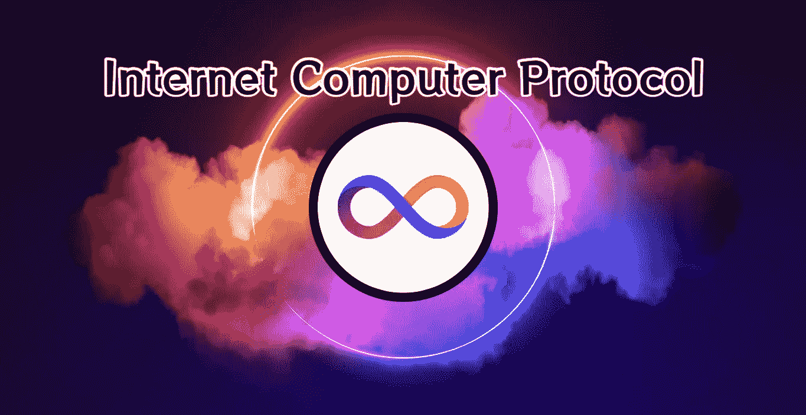

# 互联网计算机协议

> 原文：<https://medium.com/coinmonks/internet-computer-protocol-b51d2a63758c?source=collection_archive---------17----------------------->

互联网计算机协议(ICP)是一项新的革命性技术，有可能彻底改变我们使用互联网的方式。ICP 由总部位于区块链的公司开发，是一个分散的平台，允许超高的性能和可伸缩性，以及增强的安全性和隐私性。

ICP 的一个关键特性是它能够每秒处理大量交易，远远超过传统区块链系统的能力。这意味着它有潜力支持广泛的应用和用例，包括从在线市场到社交网络到视频流媒体服务的一切。

国际比较方案的另一个主要优势是它的分散性质。与由少数大公司控制的传统互联网基础设施不同，ICP 由世界各地的独立计算机网络提供动力。这种分散的结构确保系统能够抵御审查和中断，因为没有单点故障。

除了其高性能和分散的性质，ICP 还提供了增强的安全性和隐私性。该平台利用先进的加密技术来保护用户数据和交易，使黑客几乎不可能访问敏感信息。

那么，国际比较方案的未来会怎样呢？虽然它仍处于发展的早期阶段，但这项技术的潜在应用是广泛而多样的。许多专家认为，ICP 有潜力成为更加开放、透明和安全的新型分散式互联网的基础。

国际比较方案可能产生重大影响的一个领域是在线市场领域。凭借其处理大量交易的能力及其分散的结构，国际比较方案有可能为在线买卖商品和服务创造一个更有效和更安全的平台。

国际比较方案的另一个潜在用例是创建分散的社交网络。这些网络将由 ICP 驱动，不会受到困扰传统社交媒体平台的审查和隐私问题的困扰。

除了这些应用，ICP 还可以用于支持视频流服务、在线游戏平台，甚至云计算服务。可能性确实是无穷无尽的。

当然，ICP 多快被采用，如何融入主流互联网，还有待观察。然而，早期迹象是有希望的，许多专家认为，ICP 有可能从根本上改变我们使用互联网的方式。

总之，互联网计算机协议是一项革命性的技术，它提供了高性能、分散性以及增强的安全性和保密性。虽然它仍处于早期发展阶段，但国际比较方案的潜在应用是广泛而多样的，它有可能成为一个新的、分散的因特网的基础。

@StofAxeCap 的文章

推特🔗 [StofAxeCap(@ StofAxeCap)/Twitter](https://twitter.com/StofAxeCap)

Swop 推特🔗https://twitter.com/The_Swop

Swop DSCVR 门户(国际比较方案上的分散式社交平台)
[https://dscvr.one/p/the-swop](https://dscvr.one/p/the-swop)

# 另外，阅读

*   [8 大加密附属计划](https://coincodecap.com/crypto-affiliate-programs) | [eToro vs 比特币基地](https://coincodecap.com/etoro-vs-coinbase)
*   [最佳以太坊钱包](https://coincodecap.com/best-ethereum-wallets) | [电报上的加密货币机器人](https://coincodecap.com/telegram-crypto-bots)
*   [交易杠杆代币的最佳交易所](https://coincodecap.com/leveraged-token-exchanges) | [购买 Floki](https://coincodecap.com/buy-floki-inu-token)
*   [3Commas 对 Pionex 对 Cryptohopper](https://coincodecap.com/3commas-vs-pionex-vs-cryptohopper) | [Bingbon 评论](https://coincodecap.com/bingbon-review)
*   [加密复制交易平台](/coinmonks/top-10-crypto-copy-trading-platforms-for-beginners-d0c37c7d698c) | [如何在 WazirX 上购买比特币](/coinmonks/buy-bitcoin-on-wazirx-2d12b7989af1)