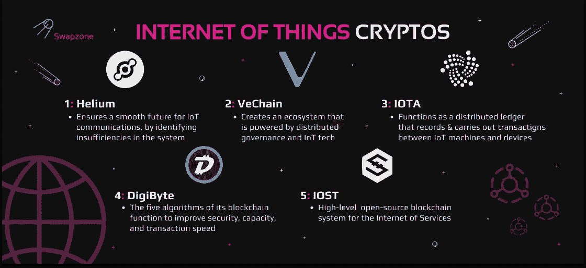
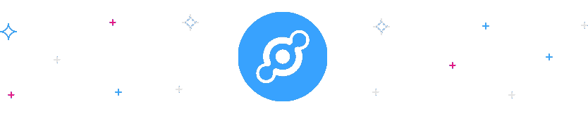
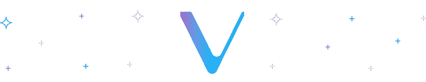
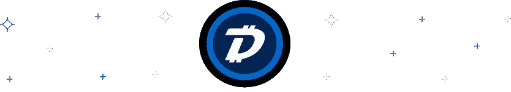

# 物联网和区块链:HNT，兽医，DGB，IOTA，IOST

> 原文：<https://medium.com/coinmonks/internet-of-things-and-blockchain-hnt-vet-dgb-iota-iost-37ec5a23aeb8?source=collection_archive---------6----------------------->

分布式账本技术 (DLT)或区块链拥有巨大的潜力，可以帮助解决物联网(IoT)面临的一些问题，如可扩展性和安全性。许多人将区块链视为物联网数字信息游戏的改变者，因为它提供了独特的能力和优势。为此，我们已经看到了一些物联网融合区块链的开发，如 VeChain、DigiByte、Helium、IOTA 和 IOST，我们将在本文中讨论其中的一些。

# IoT 是什么？

[物联网](https://internetofthingsagenda.techtarget.com/definition/Internet-of-Things-IoT) (Internet of Things)是一个网络，包括互联的计算机、数字和机械机器、人，甚至动物，它们都配有唯一标识符(uid)。它们都拥有通过网络系统传输信息的能力，不需要人与计算机或人与人之间的交互。

物联网可以是任何东西，从装有生物芯片应答器的家畜到内置传感器的车辆，或者任何其他可以获得 ip 地址的人造或自然物体。该地址支持物联网网络中的数据传输。

# 物联网特征

物联网提供分析、连接、主动参与、集成等功能。下面讨论了其中的一些功能:

*   ***连通性***

物联网的功能之一是通过物联网平台将若干设备连接在一起，该平台可以是云或服务器。这使得所有设备能够在一个实例中使用高速消息相互通信。

*   ***解析***

所有设备连接后，便开始对收集的信息进行实时分析，这有助于构建高效的商业智能，从而形成智能系统。

*   ***整合***

从收集的数据开发的不同模型的集成有助于提供改进的用户体验。

*   ***人工智能***

物联网的使用产生了智能系统，该系统通过利用数据来改善生活和用户体验。例如，一个咖啡机可以感觉到你的咖啡豆不足，并从零售商那里订购你喜欢的咖啡豆。

*   **传感器**

感知、检测和测量环境中的任何变化并报告状态是物联网提供的一部分。这是通过构成物联网技术一部分的传感器设备实现的。

# 什么是区块链？

许多人看到区块链，他们想到的只是一种加密货币，如 IOST 密码、VeChain 硬币、氦令牌、Digibyte 硬币等。然而，区块链不仅仅是加密货币，尽管它是加密货币的本质。这是一种公共分类账，记录了已处理和当前交易的不可逆记录。区块链还可以说明商业网络中的资产跟踪。

这些资产可以是有形的(即建筑物或文件)，也可以是无形的(专利或知识产权)。只要这种资产被认为是有价值的，那么它就可以在区块链网络上被跟踪或交易，同时消除交易的高成本并保证安全性。

# 区块链是如何工作的？

人们经常对区块链的功能感到好奇。区块链是一个分布式数据库系统，由通过加密技术连接的各种数据块组成，保存着网络上每一笔交易的信息。

网络中的每个节点不仅可以处理事务，还可以查看事务，从而更容易在单个块上进行汇总和记录。每个块还利用散列来链接其前一个块和历史。最后，矿块由矿工验证。

矿工更像是簿记员，他们在区块链的网络中至关重要。它们确认网络交易的合法性。

此外，节点被设计为提供足够的计算能力，以使用“强力方法”来计算每个块的预定义散列。这也称为工作证明(PoW)。

当一个新的块完成时，来自完成的块的信息被传送到区块链网络中的所有节点，然后保存在网络的本地副本上。此外，区块链不允许任何形式的更改，即使是轻微的更改也会对哈希产生巨大的影响。

# 什么是物联网区块链解决方案？

物联网区块链解决方案旨在方便每个人使用区块链技术。物联网为设备提供了向私有区块链网络发送数据和创建共享交易的不可变记录的能力。

借助[物联网区块链解决方案](https://www.ibm.com/blogs/blockchain/2020/08/how-blockchain-adds-trust-to-ai-and-iot/)，可以轻松解决捕获数据的信任问题。从制造到目前使用区块链的操作阶段，识别、确认和验证设备也成为可能。在这里，我们将讨论一些融合物联网或以物联网为中心的区块链网络。

# 氦气(HNT)

HNT 是一个分散的区块链网络，专门用于由氦的原生令牌(氦币 HNT)供电的物联网设备。[氦加密](https://coinmarketcap.com/currencies/helium/)于 2019 年 7 月推出，旨在通过识别系统中的不足之处，确保物联网物联网通信的顺利未来。

[Helium](https://swapzone.io/currencies/helium)mainnet 的设计方式是在允许无线设备之间通信的同时，允许通过其节点网络传输数据。

这些节点被设计成热点，结合了无线网关和区块链采矿设备。通过热点，设备用户可以操作节点和挖掘。矿工获得氦原生代币奖励(HNT)。

> 交易新手？试试[密码交易机器人](/coinmonks/crypto-trading-bot-c2ffce8acb2a)或[复制交易](/coinmonks/top-10-crypto-copy-trading-platforms-for-beginners-d0c37c7d698c)

# VeChain(兽医)

什么是[兽医币](https://coinmarketcap.com/currencies/vechain/)？VeChain 硬币是 2015 年开始的兽医区块链的土著象征。众所周知，VeChain crypto 是一个区块链驱动的供应链平台，该平台于 2016 年 6 月推出。

VET coin crypto 的目标是创建一个由分布式治理和物联网技术驱动的生态系统。借助这个生态系统，VeChain 希望解决一些供应链管理问题。

[Vechain exchange](https://swapzone.io/currencies/vechain) 平台上有两个原生令牌，分别是 VET 令牌和 VTHO。

# IOTA(米欧塔)

什么是 [IOTA 加密](https://swapzone.io/blog/what-is-iota-and-how-to-find-the-best-iota-miota-rates)？就像氦区块链一样，IOTA 也建立在物联网生态系统中。IOTA (MIOTA)作为分布式分类账，记录并执行物联网机器和设备之间的交易。IOTA 由其本地加密货币 IOTA Coin (mIOTA)提供支持。mIOTA coin 还负责网络中的会计交易。

[IOTA](https://swapzone.io/currencies/iota) 脱颖而出的原因之一是它的纠结系统。IOTA 区块链背后的唯一创新。Tangle 是一种用于验证交易的节点网络，被誉为比常规区块链更高效、更快速。

# 数字字节(DGB)

DigiByte DGB 公司也是一个开源的区块链，具有多种功能，如资产创建和智能合同。DGB 于 2013 年 10 月左右成立，后来于 2014 年开采了其 DGB 硬币的创世纪块，作为比特币的一个分支。Digibyte DGB 区块链是一项出色的加密货币技术，它利用了五种算法。

这五种算法用于提高安全性、容量和交易速度。DigiByte DGB 网络也有三层，分别是数字资产层、公共分类账层和协议核心层。核心负责中继事务，它由节点组成。

# IOST(IOST)

什么是 [IOST 令牌](https://research.binance.com/en/projects/iost)？IOST 是下一代加密和分散区块链之一，为其用户提供优质功能。IOST 加密声称是一个非常快速和完全分散的区块链。它也是一个生态系统，拥有自己的节点、钱包和被称为可信度验证的下一代共识协议。可信度证明确保网络上的所有交易都是安全高效的。

IOST 令牌可以被描述为一个高层次的区块链系统的互联网服务和 IOST 区块链结构是开源的。IOST 本身就是一个互联网服务的象征。

# 区块链和物联网是重要的数字化转型技术

多年来，区块链与物联网的应用在银行、金融服务、汽车公司和农业部门等行业的各个领域都引人注目。它不止于此。它还将其触角伸向了智能家居、供应链、物流，甚至智能合同。

只要满足一系列条件，利用智能合同将区块链科技应用于物联网生态系统只是时间问题。这也保证了智能设备的分散能力，以在没有集中机构的许可的情况下单独运行。

此外，区块链能够通过分散或分布式分类帐对加密设备生成的数据进行身份验证和授权，从而实施高标准的安全性。这是可能的，因为分布式账本更多的是跨越数百万设备的数据计算和存储单元。

因此，无论何时出现设备或服务器故障，物联网生态系统都不会受到影响。即使节点离线，网络也可以继续运行，因为区块链网络的弹性已经达到容错能力。

# 在 Swapzone 上选择最适合您的物联网加密

你可以在 [Swapzone](https://swapzone.io/) 上轻松选择最好的物联网密码。您可以在 VeChain coin exchange、IOTA exchange、IOST coin exchange 等网站上交易任何物联网加密硬币。该 Swapzone 将为您编译。

1.  访问 Swapzone 并选择合适的交易所，如 IOST 交易所、氦交易所、VET 硬币交易所、IOTA 令牌交易所。
2.  从代币列表中选择任何物联网硬币配对。之后，Swapzone 将调出与所选令牌配对相关的所有物联网令牌交换。例如，如果您想将 LTC 换成 IOTA，Swapzone 将为您编译一个 [LTC 到 IOTA 交换](https://swapzone.io/exchange/ltc/iota)的列表。
3.  在 ***“发送”*** 部分输入您想要交换的密码量，然后您可以通过点击 ***“交换*** ”按钮来选择适合您的交换。
4.  输入您想要接收加密的地址。
5.  还有一个退款地址的选项，这是您用于交换加密货币的资产在出现任何问题时将被退款的地址。
6.  点击 ***进行交换*** 按钮进行交换。
7.  等到交易处理完毕。现在你可以给供应商打分，留下诚实的评论。这对我们非常重要！