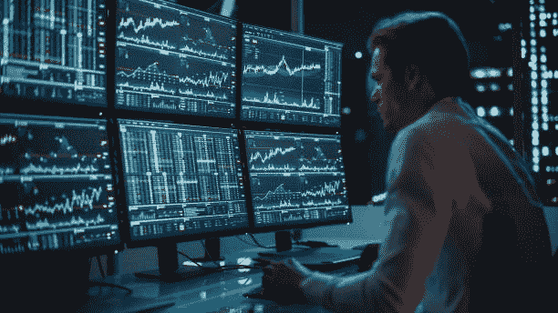
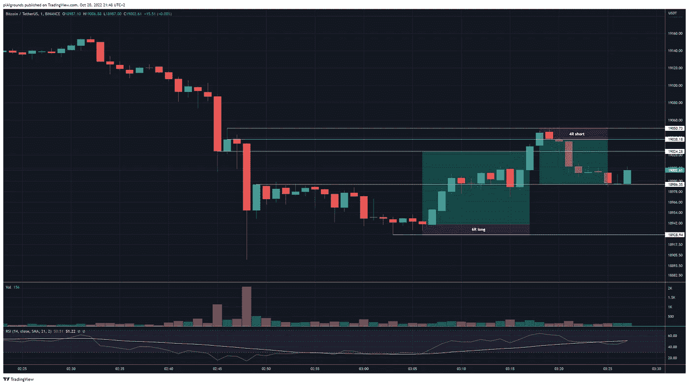
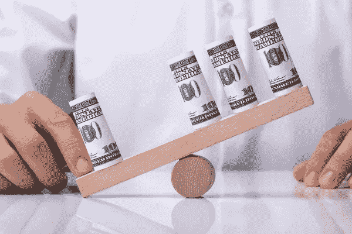
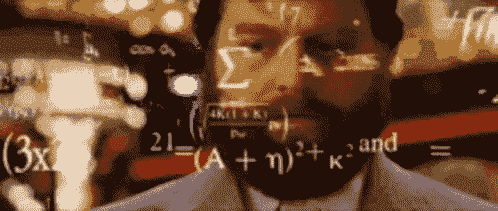

# 职业交易员访谈:如何(有利可图地)头皮比特币

> 原文：<https://medium.com/coinmonks/interview-with-a-pro-trader-how-to-profitably-scalp-bitcoin-1b3e2e7749a0?source=collection_archive---------1----------------------->

这是一个和市场本身一样古老的故事:有人从 100 万张图表中赚了一点点利润，然后上瘾了，在你知道之前，他每天交易 100 万张图表几个小时，在试图重现最初的成功时，亏损越来越多。

听起来熟悉吗？这是因为这是一个令人难以置信的普通故事，特别是因为加密货币交易所向大众开放了一个日间交易机会的世界。

你以前看过统计数据:“95%的日内交易者亏损”(轶事)，你应该买入并长期持有。虽然对绝大多数人来说这是真的，但你没有点击这篇文章，因为你想坐以待毙很长一段时间，是吗？

在这篇文章中，我们采访了一位专业交易者，他告诉我们他保持盈利、最小化风险的方法，以及如何确保你带着更多的钱离开。

*注意:本文不应被理解为财务建议。日内交易，尤其是加密货币，本来就有风险。不要冒险超过你能承受的损失。*

首先，让我们介绍一下我们的主题。汤姆是欧洲一家大型衍生品和大宗商品公司的专业交易员。由于与他的雇主有协议，他要求我们保留他的姓氏。闲暇时，汤姆在币安和 FTX 等交易所倒卖加密货币。我们问了汤姆一系列关于他的方法的问题，以及普通人如何成为更好的日内交易者。

**对于想开始日内交易的普通人，你的第一条建议是什么？**

> 好吧，如果这真的是普通人，我建议他们不要做日内交易。在短时间内交易并保持盈利需要一些我认为一般人不具备的特质:非凡的耐心、自律和情感上的分离。
> 
> 然而，我知道交易加密货币非常诱人，所以如果有人坚持日内交易**，我的第一个建议是从非常小的金额**开始，比如 10 英镑。有些人可能会说使用纸质交易所(不使用任何实际货币进行交易)，但这没有任何风险，为了培养直觉，你需要了解拥有真实货币的感觉。
> 
> 纸上交易有利于练习，但你更有可能从事高风险的交易行为，因为你不会遭受任何后果，所以我会说从 10 英镑开始，进入极小的头寸作为练习——这样，如果你失去了所有的钱，在你的账户上再增加 10 英镑的行为会给你一个负面的反馈，即“哦，我刚刚搞砸了我的账户，操我”，而不会实际上毁掉你的银行。
> 
> 问题是，我知道我可以在几周内把 10 英镑变成 100 英镑，所以即使是很小的账户也完全有可能获利。一旦你用一个小账户持续赚钱，你可以开始增加一点。但是这需要数百个小时的练习，而且你可能会在这个过程中损失一些钱。但不多，如果你从小处着手，不失控。
> 
> 这是关键:识别你什么时候在走下坡路，并阻止自己。

你提到了这些一般人不具备的特质。你认为哪个最重要？

> 我会说纪律，因为它包含了其余的大部分。在我的世界里，纪律意味着严格遵守我为自己设定的界限，同时保持自己的情感独立。亏损后开始报复交易很诱人，但我不这么做，因为我的规则不允许。
> 
> 当我剥下比特币的 1m 图表时，我通常会执行大约三笔交易，然后离开。随着时间的推移，我发现在我开始犯错之前，这是我能做的最大交易次数。第一笔交易是最难的，需要最大的耐心——这是我等待风险最小的完美进场的时候。一旦这个位置成功了，接下来的两个通常就很明显了。
> 
> **我最喜欢的交易模式是突然下跌后的反转。**你看到价格箱里有几根大的红蜡烛，得到一根漂亮的深底蜡烛芯，然后反弹，通常会回到最大的红蜡烛的底部收盘。一旦成交量消退，我们通常会看到一个 doji 或至少是一个压缩，然后一个绿色的蜡烛开始形成。那是我带着严格的止损买入的时候，我通常在价格开始下跌的下方结束交易。
> 
> 然后我做空，平仓我之前的仓位。最后，我再做多一次，带着更大的止损，让它继续。有时我会使用跟踪止损，其他时候我会在几分钟或% s 后关闭它。这种模式经常发生在 BTC 和大多数其他硬币上，就像时钟一样。

An example trade based on Tom’s favorite setup.

**你提到了止损。你对倒票的风险管理系统是什么？这和你的工作有什么不同吗？**

> 在我的日常工作中，我们的风险管理系统非常复杂，由统计学家和财务人员团队设计，他们决定我们作为交易者能做什么，不能做什么。我被严格禁止违反这些规则，否则我会失去我的工作，所以很容易遵守他们的准则。
> 
> 当谈到我自己的交易活动时，我经常使用与日常工作类似的风险管理程序，但规模要小得多。而且也不那么复杂。比如风险承受能力，你愿意每笔交易冒多大的风险，等等。—但我认为这甚至不是首要的一课。
> 
> 相反，我会说最好的办法是确保你永远不要进入一个你没有十亿分之一把握会盈利的行业。很难，你知道，在价格上下波动时阻止自己，你想参与波动。**但是你交易的越少，当你交易的时候你的信念越坚定，你的利润就越多。**
> 
> 我要说的最后一件事是，限制自己每天只做几笔交易，即使它们都是输家。就像我之前说的，我通常总是在三次交易后停下来。有时候我会在一笔交易后停下来。有时我根本不交易，因为没有完全明显的交易可做。
> 
> 如果你盯着图表看了足够长的时间，你会开始看到非常明显的模式展开。如果你等待那些出现，并且你有好的时机，你会比一般人好很多。如果对你来说没有什么是显而易见的，那就别费心了。走开，明天或者下周再来。把钱存起来，改天再用。

**你之前说过你可以在几周内把 10 英镑变成 100 英镑。那需要多少次交易？**

> 这取决于，主要取决于我使用了多少杠杆。有时我可以在一次交易中完成，有时我会做 10-20 次交易。横盘整理比方向明确的市场更难交易。现在我们正处于横盘整理(2022 年 10 月)，但很明显，2021 年的大部分时间是直线上升的。当然，那个夏天有点令人担忧，但到了 8 月，一切都变了。
> 
> 在牛市中卖出 100 万英镑非常有趣，整天坐在那里玩图表非常诱人，但是一旦你赚了钱，你就必须离开。
> 
> 在熊市中走开要容易得多，但我要说，在像现在这样明确的熊市中交易也很容易。这种模式通常是一系列的反弹，然后是横盘，随着交易量的枯竭和散户的离场，价格会接近一个明显的点，开始慢慢跌落悬崖。我喜欢这样，因为我把它缩短了，很明显会发生什么。
> 
> 当然，我不会把农场押在这个空头上，但我可以打开交易，然后离开，因为我知道波动即将来临，所以我倾向于等待几个小时甚至几天。
> 
> 但是一旦你这样做了足够多的次数，最终价格会再次触底，当你认识到横盘，或者我们称之为“螃蟹市场”(螃蟹横着走)，那就是你必须平仓并寻找新机会的时候。

**所以你黄牛的时候用杠杆？你用了多少？你觉得散户用杠杆有风险吗？**

> 我是说，当然有风险。我想用多少就用多少。通常不会超过 20 倍，但很少超过 5 倍。在没有杠杆的情况下，刷单 100 万张图表是不容易的，你需要一连串的赢家，才能获得有意义的回报。
> 
> 就像我说的，我做了几笔好交易然后离开。有时我在一次糟糕的交易后离开，我能看出我什么时候不在状态。如果你能坚持这样做，你会没事的。
> 
> 在进入一个位置之前做计算。交易公司让你在面试时在脑子里做疯狂的数学运算是有原因的，他们想看看你是否能比手动输入数字更快地计算和输入头寸。这些额外的几秒钟可以产生巨大的差异，尤其是在交易波动性的时候。

你可以在脑子里计算整个头寸，包括杠杆？

> 当然，但是需要练习。你可以在网上找到大量免费的游戏来练习这些计算。如果你真的想剥头皮，那就去吧。最终你将能够在 1-2 秒内计算进场、仓位大小、出场、止损、R:R，所有这些都考虑到了杠杆和资金等等。

**你觉得你什么时候能再去趟 BTC？**

> 现在吗？我两边都玩，我只是渴望和做空，但我想你的意思是买入并持有。我在这里和那里补充了一点，但老实说，自从比特币发明以来，从来没有出现过全球性的衰退/萧条，所以如果即将到来的衰退打击相当严重，我不会惊讶地看到比特币遭到更多的屠杀。当然，如果 BTC 再下跌 90%，其他地方也会下跌 99%。我不会现在就全押，我会等待一些严重的恢复，然后再以一定的规模入场，我认为这不会很快发生。

**谢谢你的真知灼见！我相信每个人都感谢你的建议。**

> 很乐意帮忙。我想说的最后一点建议当然是学会识别什么时候你在报复性交易——你知道，什么时候你损失了一点，然后试着用新的交易赚回来。如果你能学会在这样做的时候立即识别，并能阻止自己，你就能避免 90%的损失。非常有效。
> 
> 在外面注意安全！

你想建立和测试强大的交易策略，而不必编写成千上万行代码吗？试试 ArcTaurus 吧！我们的无代码平台允许你设计任何你能想象的交易机器人，用一个强大的内置回溯测试工具来确保你的策略是真正盈利的！

访问 www.arctaurus.com 或 www.linktr.ee/arctaurus，像专业人士一样学习更多的交易知识！

> 交易新手？试试[密码交易机器人](/coinmonks/crypto-trading-bot-c2ffce8acb2a)或[复制交易](/coinmonks/top-10-crypto-copy-trading-platforms-for-beginners-d0c37c7d698c)