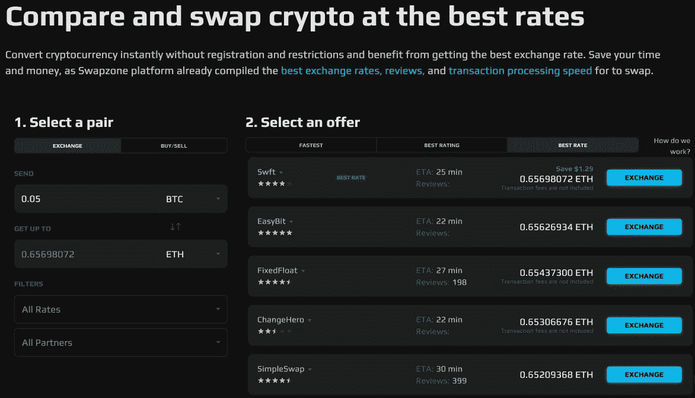

# Swapzone 首席运营官访谈:交易所如何度过加密寒冬

> 原文：<https://medium.com/coinmonks/interview-with-swapzone-coo-how-the-exchange-aggregator-survives-crypto-winter-3cfcb29b0ba7?source=collection_archive---------20----------------------->

Swapzone 交易所的首席运营官 Irina N 谈到了该公司的计划和挑战、加密的冬天、Swapzone 的团队以及她自己的态度。

加密交易可能是一个挑战。Swapzone 真正了解这一点，并创造了一种省时省钱的服务，帮助有经验的交易者和加密新手以尽可能最好的利率和最低的费用购买和交换加密货币。从 2019 年开始征服加密市场 Swapzone 现在正面临着加密冬天，以及其他 Web3 参与者面临的所有挑战。Swapzone 的首席运营官伊琳娜·N 概述了公司的计划和内部运作，揭示了公司如何在这一困难时期继续发展。

**—给我们介绍一下你自己和 Swapzone 吧？首席运营官在 Swapzone 做什么？**

— Swapzone 是一家充满活力、快速发展的公司，这太不可思议了！我在 2022 年 3 月加入了这个项目，并立即投入到团队氛围中。我们一直在努力改善对顾客的服务。Swapzone 最初是最受欢迎的加密交易的信息资源，现在是一个高级工具，为其用户提供 700 多种加密资产和数千个交换对的最佳报价。我们还通过建立推荐计划积极发展我们的业务部门，为我们的客户和合作伙伴开辟额外的收入来源。至于职责，我帮助我的团队最有效地使用他们的知识和资源，设定项目的整体业务和产品方向，并控制业务流程。我还负责财务绩效、技术逻辑和用户满意度。

**——你在密码领域的道路是怎样的？**

我不是一个超级专注的加密投资者，但我有一个小的投资组合，偶尔交易。基本上，我很好地代表了 Swapzone 的一部分观众——我寻找最好的加密交易，但总是太忙而无法从一个交易所切换到另一个交易所，最终以随机交易告终。

在专业上，我以前主要开发电子商务项目。现在投身于密码市场是非常令人着迷的——一个全新的世界已经为我打开。虽然我以前的经验与加密没有直接联系，但这主要是一个优势，因为采用对齐领域的方法总是有益的。

**—从事加密和电子商务的主要区别是什么？**

—电子商务更多的是关于构建良好的销售流程，当谈到商品业务时，主要使用互联网和电子邮件营销。Crypto 更多的是一个想法，而 fintech 一般来说是让用户更容易与工具和服务进行交互。在 Swapzone，我们解决了这个确切的问题—通过在一个界面中聚合最具吸引力的 exchange 产品，帮助用户节省资金、时间和个人数据。

“隐秘的冬天”如何影响 Swapzone？

—现在可能很难找到一个不受加密冬天影响的加密项目，对加密货币的信任度显著下降，但我们正在积极利用这段时间来改善我们的服务。我们的用户和我们在一起，我们非常感谢如此高的忠诚度。至于交易所，当然，我们在 6 月上半月(即所谓的加密崩溃月)经历了交易量的小幅下降，然而，一些主要货币的交易所对(例如 [BTC 到 ETH](https://swapzone.io/exchange/btc/eth?utm_source=media&utm_medium=referral&utm_campaign=press-release-interview) )并没有显示出交易量的任何下降。

**——swap zone 发展的短期和长期计划是什么？**

—就在最近，我们进行了一次重要的更新——增加了使用菲亚特购买和销售加密货币的功能，我们计划在不久的将来增加更多的菲亚特优惠和支持菲亚特支付的合作伙伴。这意味着我们的客户现在可以用美元[购买 BTC——也是最优惠的价格，无需注册和验证。至于长期发展，我们肯定有让用户惊喜的想法。我从分享中得到了什么——在不改变我们主要原则的情况下，可获得的硬币和兑换商的数量成倍增加——兑换方便、价格最优、无需注册、24/7 支持。](https://swapzone.io/buy/usd/btc)

**—你认为团队成员有哪些品质？**

—我会很简短:思想开放，独立，能够接受建设性的批评，不欺骗，不害怕新事物。我们鼓励实验，跟随市场趋势，尊重彼此和我们的客户。

迄今为止，Swapzone 的管理是一个巨大的成功还是一个巨大的挑战？

—今年春天，我们一直在为 Swapzone 的合作伙伴积极改进 referral API 解决方案。在短短两周内，我们成功完成了看似不可能的任务——现在我们有了一个超级方便的工具，为加密钱包、交换者、硬币、博客以及任何拥有自己平台的人提供了一种赚取额外收入的新途径。我们的解决方案包括一个推荐链接、一个小部件(可以在 5 分钟内嵌入)和一个方便的 API，可以根据任何流量进行调整。至于挑战——最近 Terra 的发布给了我们一个挑战。Swapzone 是首批同时列出 LUNA (Terra 2.0)和 LUNC (Terra Classic)的平台之一。这些列表是在 Terra 大崩盘后出现的，因此我们预计不会有大量用户涌入。然而我们错了，swapzone.io 经历了艰难的几分钟，为比我们预期多三倍的用户提供服务。在这里，我要向我们的开发人员团队致意，他们在几分钟内就找到了解决方案。现在，我们比以往任何时候都准备好迎接这个激动人心的时刻。

> 加入 Coinmonks [电报频道](https://t.me/coincodecap)和 [Youtube 频道](https://www.youtube.com/c/coinmonks/videos)了解加密交易和投资

# 另外，阅读

*   [加拿大最佳加密交易机器人](https://coincodecap.com/5-best-crypto-trading-bots-in-canada) | [Bybit vs 币安](https://coincodecap.com/bybit-binance-moonxbt)
*   [阿联酋 5 大最佳加密交易所](https://coincodecap.com/best-crypto-exchanges-in-uae) | [SimpleSwap 评论](https://coincodecap.com/simpleswap-review)
*   购买 Dogecoin 的 7 种最佳方式 | [ZebPay 评论](https://coincodecap.com/zebpay-review)
*   [最佳期货交易信号](https://coincodecap.com/futures-trading-signals) | [流动性交易所评论](https://coincodecap.com/liquid-exchange-review)