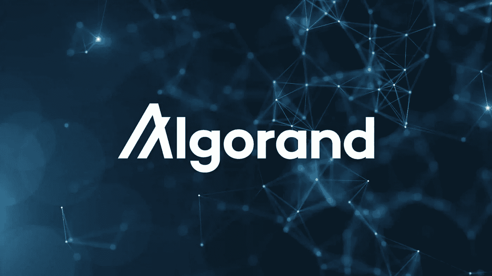
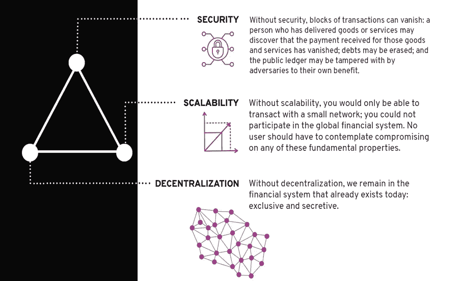
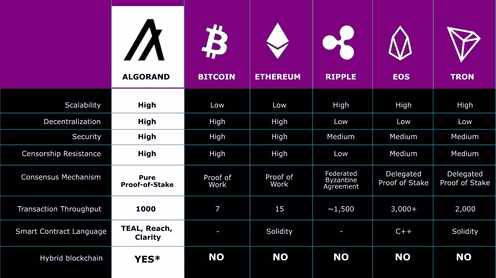

# 阿尔格兰简介

> 原文：<https://medium.com/coinmonks/intro-to-algorand-be11c7304661?source=collection_archive---------48----------------------->

阿尔格兰德区块链及其性质

# 什么是区块链？

区块链是一种去中心化和分布式的账本，可以用于在多个位置存储信息，而无需任何集中的监控系统。

区块链特征

*   分散的
*   永久安全
*   不变的
*   透明度

现在，我们知道区块链的定义，但有许多不同的区块链，如以太坊，索拉纳，Tezos，阿尔格兰德等..但是我们在这篇文章里要讲的是 Algorand 区块链。

# 什么是阿尔格兰德？

Algorand 是一个分散的区块链智能合约平台，其原生硬币 ALGO。这是一个分散的、自我维持的、以区块链为基地的网络，支持广泛的应用。

## 基础

*   Algorand 由图灵奖获得者、零知识证明的共同发明人、世界著名的密码学和信息安全领域的领导者希尔维奥·米卡利创立。

## 关键要素

*   三个关键要素是安全性、去中心化和可伸缩性，通常，在区块链中，其中一个要素会为了另外两个要素而受到损害。

*   Silvio 和他的团队通过发明新的纯利害关系证明(PPoS)共识协议解决了这三个关键要素。

# 纯粹的利害关系证明

*   Algorand 使用基于拜占庭共识的纯利害关系证明(PPoS)协议。
*   PPoS 的工作方式是在每一轮投票中选择一组提案人和一组投票委员会，分别提出一组提案和验证提案。
*   提议者和委员会是从所有令牌持有者(持有算法的帐户)的池中随机选择的，以提议块并对块提议进行投票。
*   所有在线用户都有机会被选中去提议和投票。一个用户被选中的可能性，以及他的建议和投票的权重，与他的风险成正比。在网络中(即相对于整体有多少算法)。
*   有一堆非常酷的加密算法进入这一过程，它们有着像“可验证的随机函数(VRF)”和“加密排序”这样的花哨名称，以确保投票是公平的，没有人可以串通，并且整个系统是高度安全的。我不会在本指南中详细介绍，但是我强烈建议从其他资源中查找这些内容。

# 性能

现在，当我们讨论算法和协议时，我们来讨论属性。

## 公开

*   阿尔格兰德是完全开放的，没有权限。世界上任何地方拥有 Algos 的任何人都可以加入共识。

## 分散

*   在 Algorand 上，由于协议是开放的和无许可的，节点可以并且确实存在于世界各地。

## 透明度

*   我们怎么知道阿格洛尔和基金会告诉我们的事情是真的呢？我们可以检查它，因为核心协议的所有代码都是开源的。任何人都可以对其进行审查并做出贡献。
*   Algorand 源代码可从[这里](https://github.com/algorand/go-algorand)获得

## 分叉(或缺少分叉)

*   分叉是指区块链分叉成两条不同的路径。有时这种分叉是有意的，比如当社区的重要部分想要改变协议的基础时。其他时候，这种分叉是偶然的，发生在两个矿工几乎同时找到一个区块的时候。
*   由于 Algorand 是纯粹的利害关系证明，并使用投票机制来验证块，因此分叉是不可能的。在最坏的情况下，如果委员会花更长的时间达成协议，区块链将放缓或暂时停滞。

## 表演

*   生成块的速度、块中可以容纳的事务数量以及这些事务何时被视为最终事务是选择区块链时要考虑的重要因素。对于 Algorand 而言，性能是并将永远是核心开发团队的重点关注领域。

**吞吐量**

*   在 Algorand 上，每 4.5 秒生成一个块，最多可容纳 5，000 个事务，因此每秒的吞吐量约为 1，000 个事务(1000 TPS)。

**终局**

*   在工作证明区块链中，由于分叉是一种可能性，事务不能被认为是最终的，直到一定量的时间过去，并且事务在孤立链上的可能性几乎为零。这意味着这种类型的区块链的实际吞吐量受到最终延迟的限制。应用程序中的下游流程必须考虑到这一点，以避免在事务最终无效时出现复杂的问题。
*   如前所述，Algorand 没有分叉，因此交易一旦在一个块中被确认就是最终的。1，000 TPS 的吞吐量实际上意味着每秒钟完成 1，000 个事务。

# 与他人的比较

> 注意:上图是以太坊合并前的。合并后，以太坊是可扩展的，它使用利益证明作为共识机制，交易吞吐量为 1，500–4，000

# 结论

因此，阿尔格兰德是一个满足区块链三元悖论的区块链，使用纯粹的利害关系证明(PPoS)作为共识机制，ALGO 是其原生货币。

# 在我们结束之前…

我希望你喜欢阅读这篇文章，并发现它很有见地。如果有，请点赞/评论/分享。这对我意义重大。

我们来连线。如果您有进一步的问题、疑虑或想讨论任何有关这方面的问题，您可以通过，

*   [推特](https://twitter.com/rdodiya2001)
*   [领英](https://www.linkedin.com/in/raj-dodiya-31baa31ba)

继续写作，继续分享知识😍 😍

> 交易新手？尝试[加密交易机器人](/coinmonks/crypto-trading-bot-c2ffce8acb2a)或[复制交易](/coinmonks/top-10-crypto-copy-trading-platforms-for-beginners-d0c37c7d698c)