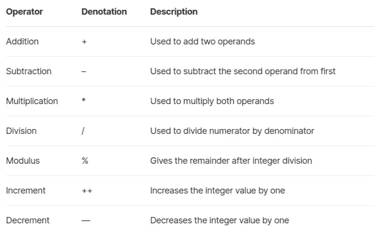
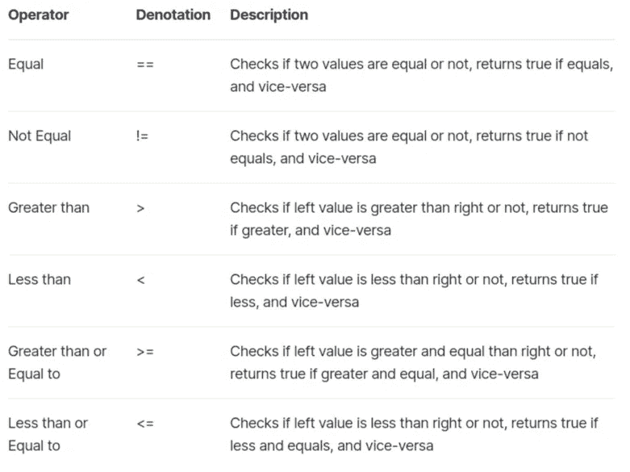
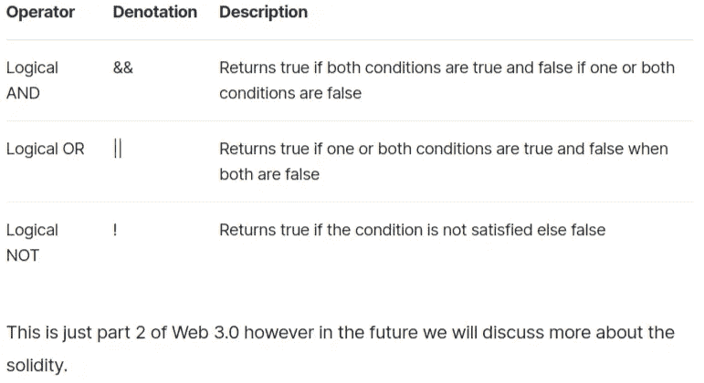

# 坚实度运算符简介

> 原文：<https://medium.com/coinmonks/intro-to-solidity-operators-2bdae43f930?source=collection_archive---------33----------------------->

在我们的 YouTube 上观看视频的同时，享受这个流的资源！

YouTube:[https://youtu.be/YSZ3iEhojk4](https://youtu.be/YSZ3iEhojk4)

不和:【https://discord.gg/J73qhkj7kr】T2

推特:【https://twitter.com/CryptoverseDAO】

linktree:[https://linktr.ee/cryptoversedao](https://linktr.ee/cryptoversedao)

Solidity 中的运算符:

运算符在每种编程语言中都很重要，因为它们为编程奠定了基础。同样，如果不使用运算符，Solidity 的功能也是不完整的。

坚固性支持以下类型的运算符:

算术运算符
关系运算符
逻辑运算符
位运算符
赋值运算符
条件运算符

然而，现在，我们将只研究其中的 3 个，但在将来我们会解释所有的问题。

算术运算符

这些运算符用于执行数学运算。

关系运算符

这些运算符用于比较两个值

逻辑运算符

这些运算符用于组合两个或多个条件

1.算术运算符

+, -, *, /, ++, — , %

2.比较运算符

==, !=, >, <, >=, <=

3.逻辑运算符

&&, ||, !

4.按位运算符

&, |, ^, ~, <<, >>, >>>

5.赋值运算符

=, +=, -=, *=, /=, %=

条件运算符

条件运算符首先计算表达式的真值或假值，然后根据计算结果执行两个给定语句中的一个。

^0.8.0 实用主义；
合同测试{
uint a = 6；
单位 b = 2；
单位 c = (a > b)？真:假；
函数结果()公共视图返回(uint){
返回 c；
}

> 加入 Coinmonks [电报频道](https://t.me/coincodecap)和 [Youtube 频道](https://www.youtube.com/c/coinmonks/videos)了解加密交易和投资

# 另外，阅读

*   [3 商业评论](/coinmonks/3commas-review-an-excellent-crypto-trading-bot-2020-1313a58bec92) | [Pionex 评论](https://coincodecap.com/pionex-review-exchange-with-crypto-trading-bot) | [Coinrule 评论](/coinmonks/coinrule-review-2021-a-beginner-friendly-crypto-trading-bot-daf0504848ba)
*   [莱杰 vs Ngrave](/coinmonks/ledger-vs-ngrave-zero-7e40f0c1d694) | [莱杰 nano s vs x](/coinmonks/ledger-nano-s-vs-x-battery-hardware-price-storage-59a6663fe3b0) | [币安评论](/coinmonks/binance-review-ee10d3bf3b6e)
*   [加密交易机器人](/coinmonks/crypto-trading-bot-c2ffce8acb2a) | [Bingbon 评论](https://coincodecap.com/bingbon-review)
*   [Bybit Exchange 审查](/coinmonks/bybit-exchange-review-dbd570019b71) | [Bityard 审查](https://coincodecap.com/bityard-reivew) | [Jet-Bot 审查](https://coincodecap.com/jet-bot-review)
*   [3 commas vs crypto hopper](/coinmonks/3commas-vs-pionex-vs-cryptohopper-best-crypto-bot-6a98d2baa203)|[赚取加密利息](/coinmonks/earn-crypto-interest-b10b810fdda3)