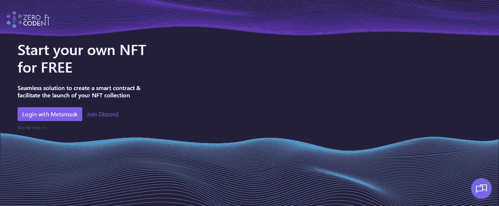
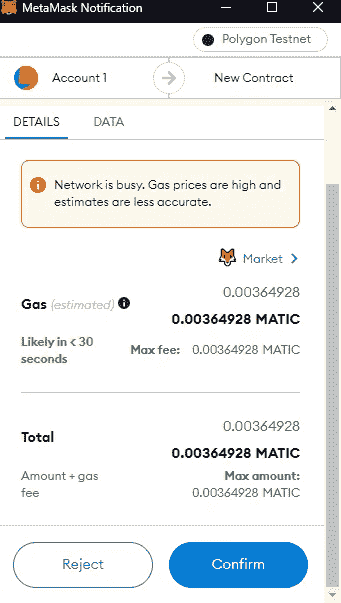

# 零代码简介:如何成功推出你的 NFT 系列

> 原文：<https://medium.com/coinmonks/intro-to-zerocodenft-how-to-successfully-launch-your-nft-collection-6a901da7fbac?source=collection_archive---------17----------------------->

根据 Nonfungible.com NFT 数据公司的报告，NFT 的销售额去年跃升至 170 多亿美元，比 2020 年的 8200 万美元大幅增长了 21，000%。

这种增长要归功于特定 NFT 项目的成功，如月鸟、无聊猿游艇(BAYC)、隐朋克等。此外，更多的 NFT 效用已被发现，导致更多的创造者加入空间。

今天，有各种各样的惊人的创作者和他们的 NFT 收藏。然而，推出自己的 NFT 系列可不是在公园里散步。首先，你必须了解 NFT 是如何工作的，它们的创造，推出你的收藏的最佳区块链，智能合约，以及其他 NFT 行话。

零代码 NFT 正在帮助创作者和艺术家打破创作、发布和销售其作品的门槛。我们的平台为创作者提供了他们成功发布所需的易用工具，同时提供了必要的支持。

这篇文章将向您介绍零代码 NFT，我们激动人心的功能，以及它是如何工作的。

# 什么是零代码 NFT？

零代码 NFT 是世界上第一个无代码 NFT 发射台之一。简而言之，任何地方的用户都可以用很少或零智能合约开发技能来开发和打造他们的 NFT 集合。像现有的 NFT 发射台，零代码 NFT 提供了一个仪表板和访问多个区块链。然而，除此之外，我们还提供了更多的功能。

例如，在零代码 NFT 上，你可以在 testnet 上启动你的 NFTs。testnet 是区块链网络的一个版本，人们可以在类似沙箱的环境中部署和测试他们的代码。你不需要花费任何真正的加密货币来部署智能合约或在那里进行交易。但是，您应该获得测试令牌来支付费用。稍后，您仍然可以将合同部署到 mainnet。

因为收藏在测试网上，对你的 NFT 感兴趣的收藏者必须向铸币厂支付汽油费，并将代币转移到他们的钱包里。此外，您不必担心托管铸造网页，因为我们会为您托管它。

# 零代码 NFT 平台的特点

如上所述，零代码 NFT 为您提供了一个易于使用的仪表板来管理您的收藏。有了这个仪表板，你或任何人都可以控制 NFT 智能合同，开始/暂停销售，提取余额等。此外，您可以在部署后更改 NFT 的价格。

与其他 NFT 发射台不同，零代码 NFT 专注于简化创作者的 NFT 收集创作和下降。正因为如此，我们的平台提供了大量可供选择的功能，您可以将其应用到您的产品系列中。

这些功能包括:

*   **白名单:**给予特定买家比其他人更早的铸造权限
*   [**延迟揭示**](https://www.youtube.com/watch?v=It05AkP_Wt4) **:** 造币/购买后，可以选择未来某个日期来揭示 NFT
*   **主要销售收入分割**:登录后记录您的钱包。您可以添加多个钱包，并设置每个钱包获得的销售额百分比
*   **每人最大点数:**在白名单销售期间，一个人可以铸造的最大令牌数，与公众无关
*   **每人前 X 次免费:**某人可以免费铸造的 NFT 数量。受每人最高非功能性交易费和每笔交易最高非功能性交易费限制。
*   **Airdrop:** 向您的社区免费发送您的 NFT，让他们大吃一惊
*   [**定制功能**](http://drop@zerocodenft.com?subject=Custom%20Projet) **:** 获得定制的智能合同和铸造网站，满足您的独特需求

值得注意的是，所有特性在 testnet 中都是可用的。但是，当您想要部署到 mainnet 时，您需要根据所选的功能付费。

对于那些想要像 OpenSea 设置、铸造页面集成、Discord 和聊天支持这样的高级功能的用户，我们提供 499 美元以上的启动包。我们还提供定制构建——面向那些喜欢为他们的项目使用独特的智能合约和/或 dApp 的创作者。

# 如何用零代码 NFT 推出你的 NFT 系列

现在你知道零代码 NFT 是什么和它的特点，这里告诉你如何用平台**在短短 5 分钟内发布你的收藏！**开始使用:

**第一步:**转到[zerocodenft.com](https://www.zerocodenft.com/?utm_ads_source=blog_post)。

第二步:点击**启动 App** 。这会带你去魔法发生的地方。

*   这是**登录页面**，您必须使用元掩码钱包登录。不用担心；如果您没有，系统将启动入职流程！**注意**需要禁用比特币基地钱包扩展；不然也会不停的弹出来！

*   将出现一个元掩码窗口，要求您对连接进行签名/授权。点击**标志**连接钱包。这样做只是确认你是钱包的主人。它从未授权零码 NFT 使用您的资金或批准任何形式的交易。公海市场使用相同的机制。

**第三步:**登录后，您会被自动重定向到您的**仪表盘。在那里，您可以通过点击**添加新的开始创建您的收藏。**这将带您进入下一页，在这里您可以选择您喜欢的[合同](/zero-code-nft/best-erc-token-standards-for-launching-your-nft-collection-3bcc148f5be4)类型。选择前两个合同将进入下一页。(您可以通过点击**查询来获得关于其他人的更多信息。**)**

**第 4 步:**在这里，选择您选择的区块链，这将带您进入下一页。

**第五步:**输入您的 NFT 藏品信息，如藏品名称、符号和大小。填写必填字段后，选择**下一步**进入下一页。

**第六步:**你可以添加首选功能，如延迟展示、白名单(每个买家的最大 NFT、NFT 价格)等。如果你是 100%的股东，那么**不需要**打开收入分割；我们会不由自主地做出这样的假设。

第七步:选择 marketplace，添加你的收藏名称、版税等信息。由于您使用 MetaMask 登录，您的地址会自动添加到**版税接收字段**中。

**第八步:完成！**你现在可以将你的收藏保存为草稿，或者用测试令牌将它部署在 testnet 上。请注意，要获得测试令牌，您需要在您的[元掩码](https://youtu.be/WkIbgobZfUM)上添加测试网络。

**步骤 9:** 要在 testnet 上发布您的收藏，您需要**测试令牌。**复制您的**钱包地址。**点击**龙头链接，**按照提示获取测试代币。

*   在 Polygon 水龙头上，粘贴您的**钱包地址**并提交。

*   点击**确认。**这将确认操作并将令牌发送到您的钱包。

*   返回零代码 NFT 页面，点击**部署合同。**

*   **MetaMask** 在你的浏览器右侧弹出，显示部署的总量。记住，这仍然是使用测试令牌。没有真正的密码被花费。点击**确认。**

*   成功！！您的 NFT 收藏已成功部署。

您现在可以通过仪表板查看您的收藏。

页（page 的缩写）你想知道更多吗？

还是对推出自己的系列还心存疑虑？

然后，加入我们的 [discord](https://discord.gg/BG6vmFM2UX) ，介绍你自己并与我们的社区互动。

页（page 的缩写）PS:值得注意的是，你可以通过推荐其他创作者从零代码 NFT 获得佣金。

> 交易新手？试试[密码交易机器人](/coinmonks/crypto-trading-bot-c2ffce8acb2a)或者[复制交易](/coinmonks/top-10-crypto-copy-trading-platforms-for-beginners-d0c37c7d698c)