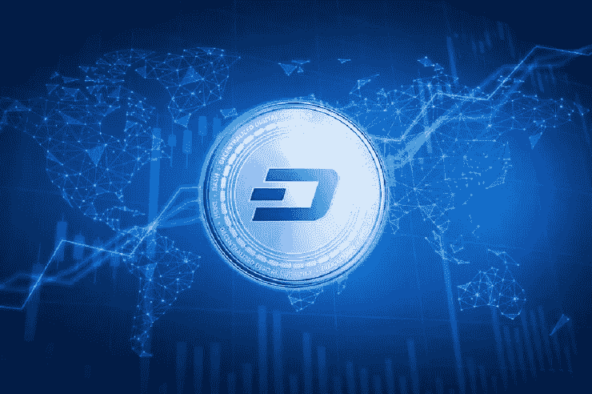
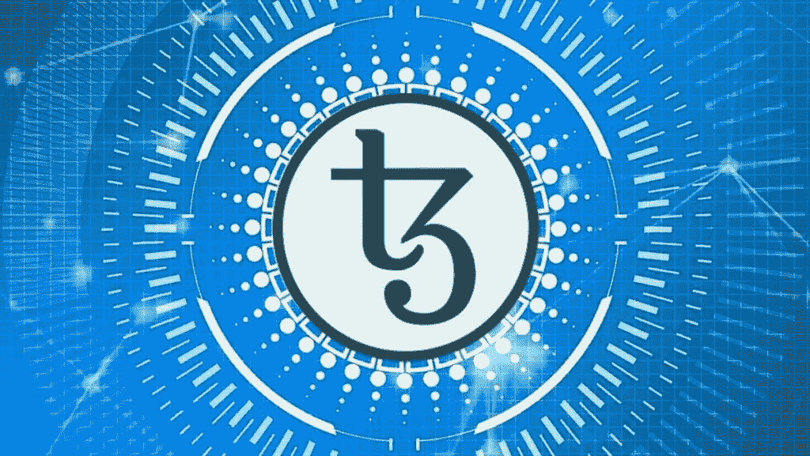
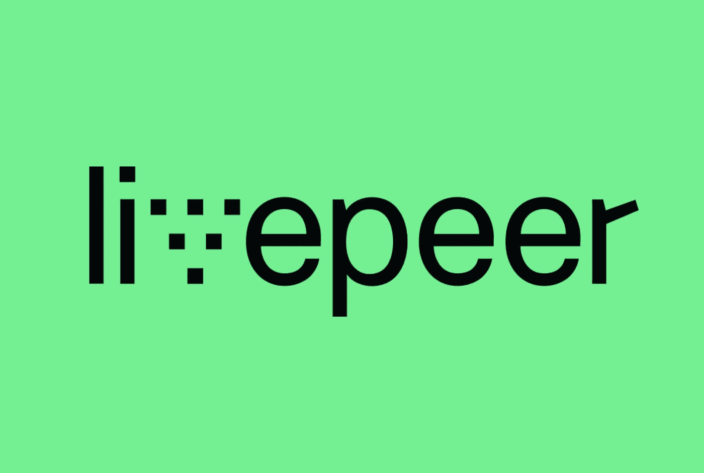

# 5 种重要的投资加密货币

> 原文：<https://medium.com/coinmonks/introducing-5-important-cryptocurrencies-for-investment-48f17a00928a?source=collection_archive---------8----------------------->

我们该买什么加密货币？

1- Monero (XMR):一种基于隐私的古老但前景广阔的加密货币。Monero 是一种私人的、不可追踪的安全货币。像 Monero 这样的货币也被称为保密硬币或保密货币。XMR 加密货币于 2014 年推出，并在加密货币社区中获得了很大的人气。这种加密货币的发展完全基于其社区的天赋和决定。

XMR 令牌在 2021 年 5 月达到 517.62 美元的历史高点，比 2015 年 0.213 美元的历史低点增长了 243，000%。购买 Monero 也可以被认为是数字货币领域最好的未来加密货币投资之一。

2- Dash:面向未来的私有加密货币

与本文中介绍的许多最好的新兴加密货币相比，Dash 是一种更古老的加密货币。该项目于 2014 年命名，是一个开源的区块链和加密货币，专注于提供一个快速廉价的分散式全球支付网络。是根据这种加密货币的开发者在其白皮书中提供的解释开发的，Dash 试图通过提供更高的隐私和更快的交易来改善比特币。

Dash 加密货币项目的年龄并不是它被列入最佳未来数字货币名单的原因。很多加密货币甚至在 Dash 之前就已经诞生了，但是今天却没有听说过。但是 Dash 从一开始就一直在稳步提升。另一方面，这是一枚隐私币；政府越是努力控制加密货币空间，特别是最有前途的数字货币和著名且广泛使用的网络内的交易，Monero 和 Dash 等私人硬币的价值就会增加。

3- Tezos (XTZ):快速实施最新功能的领导者

Tezos 是基于智能合约的区块链网络，与以太坊几乎相似，但有着本质的区别；Tezos 的目标是提供一个更先进的基础设施，这样它就可以随着时间的推移而发展，而没有硬分叉的风险。不幸的是，这是比特币和以太坊从诞生之初就一直在处理的事情。

Tezos 自称“安全、可扩展、经久耐用”这种说法是可以接受的，XTZ 可以被认为是未来的数字货币之一。开发者声称其智能契约语言提供了高价值用例所需的精确性。根据开发者的说法，Tezos 方法是前瞻性的，并将在未来很长一段时间内保持最新，这意味着它可以非常快地实现区块链行业的最新成就(不需要硬分叉)。

4- GALA:区块链最强大的游戏开发平台之一。

联欢晚会，作为最有前途的数字货币之一，是联欢晚会游戏平台的标志。在元宇宙概念变得炙手可热后，这个强大的平台显著增长，但考虑到它的高潜力，我们预计它在未来将经历很大的增长。随着 Infinity Photo 的飞速发展,“游戏赚钱”的概念比以前更受关注，许多用户被它所吸引。现在，对于开发者来说，制作区块链游戏的最强大和最好的平台之一是 Gala Games。它的专属令牌被认为是未来的加密货币之一。

作为最强的游戏开发平台之一，Gala Games 希望借助区块链技术，以控制游戏和特殊游戏内资产的可能性，为玩家带回创造性思维。它的加密货币是元宇宙领域中最好和最有前途的。购买 Gala 可能是一项不错的投资。

5- LivePeer (LPT):下一代视频流。

与 YouTube 等传统视频流媒体服务不同，LivePear 不需要托管、存储或分发视频。该项目开发了一种创新技术，利用节点的额外计算能力，更有效地从广播公司向消费者共享视频。知道全世界互联网带宽使用的主要来源是视频流就不错了；全球约 80%的互联网使用都与 it 有关。无论如何，视频文件的音量要大得多！

正如 FileCoin 等其他分散式区块链项目一样，与集中式服务相比，LivePeer 也大大降低了成本，增加了隐私。出于这个原因，我们认为它是一种有前途的数字货币，购买 LPT 货币是有利可图的。

> 交易新手？试试[加密交易机器人](/coinmonks/crypto-trading-bot-c2ffce8acb2a)或者[复制交易](/coinmonks/top-10-crypto-copy-trading-platforms-for-beginners-d0c37c7d698c)