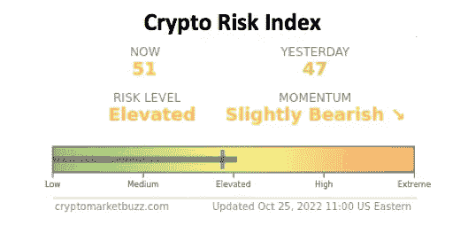
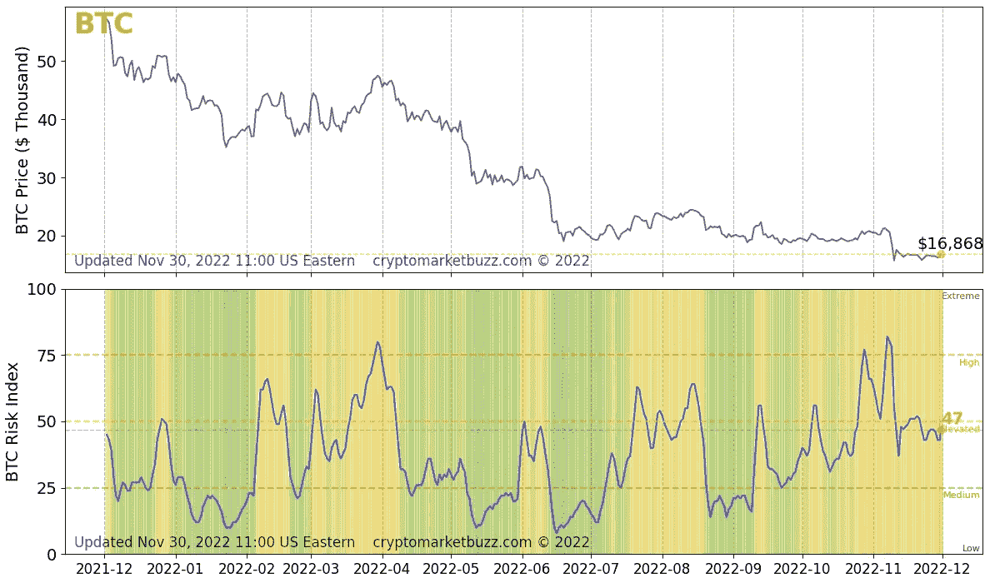
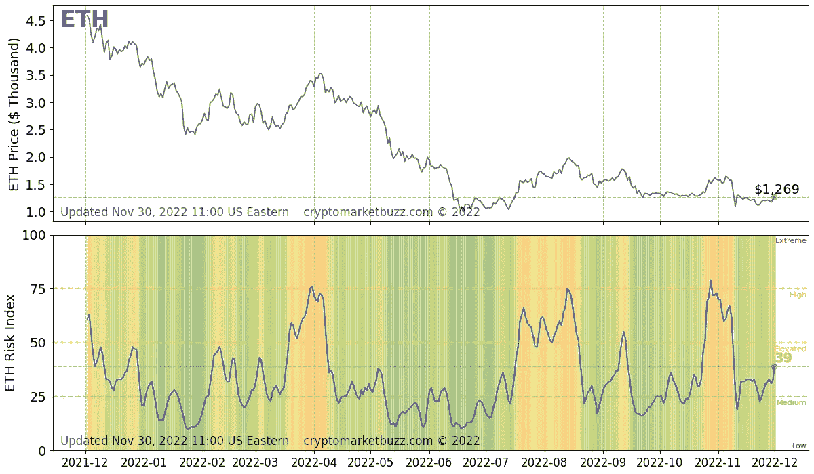

# 加密风险指数简介:满足您加密货币交易需求的终极技术指数

> 原文：<https://medium.com/coinmonks/introducing-crypto-risk-index-the-ultimate-technical-index-for-your-cryptocurrency-trading-needs-f0204a952e4e?source=collection_archive---------24----------------------->

本文概述了**加密风险指数**，这是一个创新指数，提供了加密货币市场投资风险水平以及前 5 大加密货币的风险水平(基于市值)。这个指数是你的加密交易工具箱中的另一个工具，可以为你的交易策略提供信息。

最近，随着加密货币交易变得越来越受欢迎，投资者一直在寻找一种可靠的技术指数，他们可以用它来指导他们的交易策略。其他指数也存在，但它们要么不可靠，要么受到社交媒体活动的严重影响。

为了满足这一需求，**加密风险指数**由[加密市场消息](https://cryptomarketbuzz.com/) (CMB)作为技术指数推出，该指数每小时更新一次，因此您可以全天候了解最新的加密市场。该网站是一个加密指南和教育资源，除了加密索引之外，还包括[实时市场](https://cryptomarketbuzz.com/pricetrends.html)、[加密市场新闻](https://cryptomarketbuzz.com/news.html)，以及关于加密货币交易的[最常见问题(FAQ)的回答](https://cryptomarketbuzz.com/guide.html)。

[加密市场传言(CMB)](https://cryptomarketbuzz.com/index.html) 使用专有算法计算每种主要加密货币以及每小时加密市场的风险指数和市场势头。使用这些风险指数，您可以深入市场，随时随地为您的加密投资策略提供信息。CMB 的风险指数基于对底层加密资产基本面的技术分析。因此，该指数不受社交媒体营销活动、**或精心策划的 [**泵&**](https://cryptomarketbuzz.com/guide.html#q19)运动的影响。你可以把 [**加密风险指数**](https://cryptomarketbuzz.com/index.html) 当做你技术分析工具箱里的另一个工具。**

**[**加密风险指数**](https://cryptomarketbuzz.com/index.html) 项目符号图显示当前指数(截至最后一个小时更新)与最后一个每日收盘指数(截至最后一个上午 12:00 UTC 更新)的对比，因此您可以看到截至最后一个每日收盘的市场趋势。此外，您可以在色谱上看到风险级别，从(指数 0)到(指数 100)级别。摘要还包括市场动力，这是市场强弱的指示。**

**[**加密风险指数**](https://cryptomarketbuzz.com/index.html) 通过将技术分析指标简化为一个单一指数来评估进入加密投资的风险，为您提供市场深度知识。你可以用这个指数来指导你的投资策略。该指数背后的专有算法从历史价格和交易量数据中学习，并考虑了每种加密货币和全球市场的以下技术基础:**

*   **短期、中期和长期价格变动**
*   **短期成交量变化**
*   **短期和中期波动**

**当风险水平为低时，这仅仅意味着价格下跌的可能性很小(但绝不是零)。指数越低，这个概率越低。同时，当风险水平为**高**或**极端**时，出现价格回调的概率较大，指数越高，这种概率越高(但不一定是 100%的价格回调概率)。下图显示了比特币(BTC)和以太坊(ETH)价格与比特币风险指数历史(每小时更新)之间的关系，以及风险领域和风险(截至 2022 年 11 月 30 日)。关于最新的趋势，你可以访问 https://cryptomarketbuzz.com/**

****

**Bitcoin Risk Index history from [https://cryptomarketbuzz.com/](https://cryptomarketbuzz.com/) as of Nov 30, 2022**

****

**Ethereum Risk Index history from [https://cryptomarketbuzz.com/](https://cryptomarketbuzz.com/) as of Nov 30, 2022**

**在一个势头强劲的市场中，加密风险指数只会接近 0 ( **低**风险)或 100 ( **极端**风险)。尽管 0 和 100 在理论上是可能的，但该指数在现实中可能达不到这些数字，因为市场通常会自我平衡，并在接近风险范围的末端时反转方向。应该注意的是，在牛市中，加密风险指数可以在较长时间内(例如 2021 年 1 月至 4 月)保持在**高**或**极端**风险区域。同样，在熊市中，指数可以长时间保持在**低位**或**中位**水平(例如 2021 年 6 月至 7 月)。因此，加密风险指数应在市场趋势的背景下使用，并结合基础加密货币的一般知识。**

# **市场势头如何？**

**市场动量显示了市场的力量和方向。下跌的市场要么**看跌**(强势)要么**略看跌**(弱势)，上涨的市场要么**看涨**(强势)要么**略看涨**(弱势)。横盘整理的市场有中性的 T21 势头。**

# **如何解读加密风险指数？**

**一般来说，当风险指数从**低**升至**中**风险或更高时，这是牛市的迹象。而当它从**极限**下滑到**高位**以下低于 75 时，就是看跌的信号。低于 40 的指数表明基础加密货币面临压力，低于 25 的指数(**低**风险)表明由于大量出售，价格面临极大压力。同样，指数高于 60 表示基础加密货币因高需求和购买量而膨胀，当指数高于 75 ( **极端**风险)时，它表明价格高度膨胀，通常是由于市场炒作和非常大的购买量。**

**缺乏经验的交易者，受情绪和社交媒体宣传的影响，**在风险指数高或极端时买入，当价格修正发生时，变成[**【bag holders】**](https://cryptomarketbuzz.com/guide.html#q21)或在风险指数低或中等时恐慌性抛售资产，导致资金损失。另一方面，有经验的交易者在风险低或中等，动量看涨时买入，在风险高或极端，动量看跌时卖出(或[**【HODL】**](https://cryptomarketbuzz.com/guide.html#q15))。****

# ****最后的想法…****

****CMB 网站上提供的信息以及加密风险指数仅供参考，不构成投资建议、财务建议、交易建议或任何其他类型的建议，您不应将网站的任何内容视为此类信息。****

****加密风险指数不是灵丹妙药。它也不是一个预测指数(不存在这样的东西！).加密风险指数只给你更多关于加密市场的信息，这是你交易工具箱中的另一个技术指数。在交易加密资产时，您需要充分了解加密货币市场的基本原理，并结合自己的知识、直觉和风险承受能力使用技术指标。****

****Crypto Market Buzz 不建议交易加密货币，包括购买、出售或持有任何类型的加密货币。你需要自己做研究，了解加密货币市场的潜在波动性以及法律和政治方面。此外，在投资加密货币之前，您需要咨询您的法律、金融和税务顾问。加密货币投资存在风险。自己做研究，明智投资。本文或 CMB 网站不对您的资金损失负责。****

> ****交易新手？在[最佳加密交易](/coinmonks/crypto-exchange-dd2f9d6f3769)上尝试[加密交易机器人](/coinmonks/crypto-trading-bot-c2ffce8acb2a)或[复制交易](/coinmonks/top-10-crypto-copy-trading-platforms-for-beginners-d0c37c7d698c)****