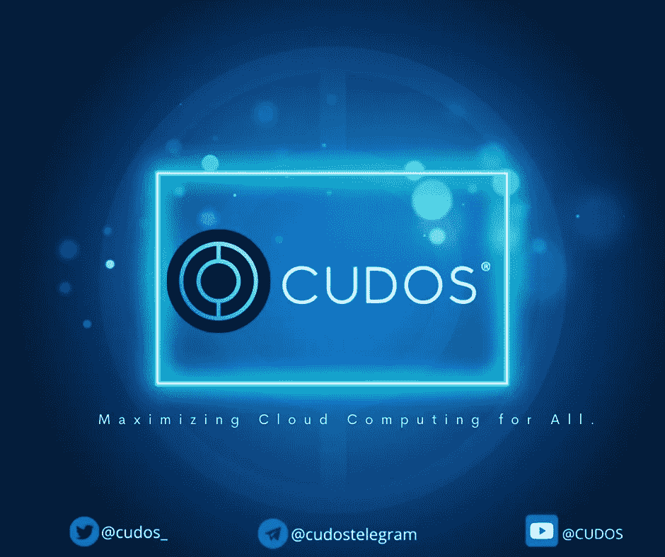

# 介绍 Cudos:解决区块链可扩展性和互操作性问题的可行工具

> 原文：<https://medium.com/coinmonks/introducing-cudos-a-viable-tool-to-solve-blockchains-issue-of-scalability-and-interoperability-18a4e44fd409?source=collection_archive---------23----------------------->

作为负责链上交易(如涉及比特币、BNB 链或以太坊的交易)及其支持基础设施的基础网络或主要区块链网络，Cudos 是一个授权的利害关系证明(DPoS)第 1 层区块链，目标是使分散计算在链上可用。在这里，区块链的验证和共识技术被称为授权的利害关系证明。这是 PoS 想法的一个受欢迎的发展，其中网络用户通过投票选择代表来验证下面的块。为了验证交易和推进区块链组织，DPoS 与现有工作证明(PoW)和 PoS 方案竞争。

拜占庭容错(BFT)共识模型用于驱动 Tendermint 核心引擎，其充当区块链共识引擎。它确保在每个系统上捕获相同的事务序列。它支持对等网络，并提供基于利益证明(PoS)的共识。使用利害关系证明共识，验证者负责向区块链添加新的块并保护网络。不到三分之一的拜占庭验证者同意 BFT 模型接受它。它是业内最受欢迎的共识引擎，被视为利益相关共识的基准。

Cudos 网络的设计将共识和执行分开，以提供对大规模高性能计算的安全、分散和免许可的访问。

**构建在网络上的用户获得访问的杠杆:**
-应用程序的卓越性能
-公共区块链的透明性
-可组合资产的管理

**对链用户的好处包括:
-** 高级密码术
-区块链对所有人透明
-链间通信
-碳中和的交易

Cudos 验证器是确认和验证交易、向 Cudos 区块链添加新块以及为 Cudos 网络上运行的 dApps 提供所有数据的节点。运行 Cudos 客户端软件的计算机被称为“节点”验证者通过广播投票来参与共识协议，投票被加密并用属于每个验证者的私钥签名。投票给验证者的用户会因为帮助保护网络而获得回报。

# 需要建立 Cudos 节点吗？

运行 Cudos 节点时，参与旨在解决当今区块链可伸缩性和互操作性问题的项目和更大生态系统的可能性非常大。

验证器和委托器作为 DAO 的工具,
Cudos 系统依赖于验证器节点来中继事务，并提出、验证和完成块，这就是为什么运行一个验证器节点如此重要。Cudos 网络的安全和维护依赖于一群验证者来完成特定的任务。通过利用他们的“股份”对提议的网络治理变更进行投票，验证者也为网络的成长和发展做出了贡献。你现在拥有了控制 Cudos 网络未来进程的权力。每个网络都有唯一的验证器。测试网
主网

通过运行任一类型的节点，您都可以成功地为链分析或其他数据用例提取区块链数据。如果你想加入网络，我们建议在转移到 Testnet 之前先在本地运行一个节点。Testnet 提供了一个学习环境，您可以在其中探索，而不必担心丢失实际令牌。

验证者响应者有资格绑定他们自己的 CUDOS 令牌，并由其他令牌持有者向他们“委托”或下注额外的 CUDOS。已经委托的 CUDOS 令牌的总量决定了谁有权进行验证。候选人的投票权取决于他们持有多少 CUDOS 代币。只有拥有最高投票权的顶级验证者才能参与验证过程。作为一个额外的激励，验证者可以选择佣金百分比，该百分比将被添加到他们的委托人的费用中。

验证者和他们的委托者通过执行共识协议获得作为块供应的 CUDOS 和作为交易费用的令牌。

然而，如果一个验证者变得不可用或者在同一高度上签名，那么他们的赌注就会被削减。他们的股份 cudo(包括委托给他们的用户的 cudo)可以被削减。处罚取决于违规的严重程度。一个好的 Cudos 验证器需要以 99.99%的正常运行时间为目标，并且<0.01% missed blocks.

To ensure maximum uptime and availability:
验证器应该确保它们总是运行软件的正确版本。
验证者应该实现一个哨兵节点架构来保护他们的节点免受 DDoS 攻击
成为一个验证者，需要 2，000，000 个 CUDOS 令牌。Cudos 是支持 CUDOS 网络的本地实用令牌，具有 ERC20 令牌合约地址:0x 817 bbd BC 3 E8 a 1204 f 3691d 14 bb 44992841 E3 db 35。CUDOS 令牌是一个有上限的供应令牌。流通供应量约为 28 亿，总上限固定为 100 亿。

另一方面，委托人将 CUDOS 与他们选择的验证人绑定或股份，以换取验证人奖励的一部分。保税 CUDOS 形成了验证人的投票权。然后，具有最大投票权力的验证者被选择用于奖励验证过程。

代币始终保留在委托者的钱包中，一旦取消委托，可以再次访问。取消授权过程快速且易于执行。

# 为什么使用 Cudos 网络？

**集成工具包**
集成工具包允许用户在网络上执行以下操作:
-编写智能合同、
-部署智能合同、
-构建 dApp 以与智能合同集成，以及
-使用分散式云基础架构进行计算和存储

**跨链互通**
Cudos 可以与整个区块链生态系统互通。为了促进令牌、资产、NFT 和数据在 Cosmos 生态系统中与其他区块链之间的顺畅移动，它使用了 Cosmos 内部区块链通信(IBC)协议。Cudos 可以与整个区块链生态系统通信。为了促进令牌、资产、NFT 和数据在 Cosmos 生态系统中与其他区块链之间的顺畅移动，它使用了 Cosmos 内部区块链通信(IBC)协议。

**库多斯桥**
库多斯桥现在连接到以太坊，最终将连接到其他重要的区块链。

**开发者友好**
通过 CosmWasm，一个为 Cosmos 生态系统(Cudos 是其中的一部分)创建的智能合约平台，Cudos Network 促进了编译为 Web Assembly 的智能合约的构建。像 Cudos Blast 和一个全功能的 testnet 这样的开发人员 SDK 只是众多工具中的几个，这些工具可以帮助 Rust 开发人员启动和运行。我们将在其他文章中深入讨论 CosmWasm 和 Rust 语言的更多细节，包括如何设置它以及它如何对 Cudos 网络的开发做出贡献。

# 设置 Cudos 帐户

Cudos 帐户有两种设置方式:

将 Keplr 钱包连接到 Cudos 网络。
在命令行上使用 cudos-noded 二进制

同样重要的是要记住，Cudos 网络上的每个节点都有一个钱包和一个账户。你的钱包里的记忆法也可以用。

**创建 Cudos 账户指定一个密钥对。** 公钥(PubKey)和私钥(PrivKey)。

**公钥**
PubKey 是派生生成的地址。这些地址用于识别用户(以及其他方)。地址也与消息相关联，以识别消息的发送者。

**私钥**私钥用于生成数字签名，以证明与私钥相关联的地址认可给定的消息。

因此，当公钥被用于将加密货币发送到钱包中时。私钥用于验证交易和证明区块链地址的所有权。如果有人给你发来一个比特币(BTC)，你需要一把私钥来“解锁”交易，并证明你现在是那个比特币的主人。

要在本地生成帐户，建议使用以下 cudos-noded 命令:

cudos-noded keys 添加<account_name>—key ring-后端</account_name>

cudos-noded keys 添加<account_name>—recover；</account_name>

如果您使用的是分类账钱包:
cudos-noded keys 添加< account_name > —分类账(已编辑)

# 连接 CUDOS 生态系统

[推特](https://twitter.com/CUDOS_) | [网站](http://www.cudos.org/)|
[不和](https://discord.com/invite/cudos) | [电报](https://t.me/cudostelegram)
[YouTube](https://www.youtube.com/channel/UCbS48Q09D5xMDCVX0T_OeCw)|[LinkedIn](https://www.linkedin.com/company/cudos1/)
[Spotify](https://open.spotify.com/show/2lZuBXJ270g7taK06tnK35)|[媒体](https://medium.com/cudos)
[脸书](https://www.facebook.com/cudos.org/)

> 交易新手？尝试[加密交易机器人](/coinmonks/crypto-trading-bot-c2ffce8acb2a)或[复制交易](/coinmonks/top-10-crypto-copy-trading-platforms-for-beginners-d0c37c7d698c)