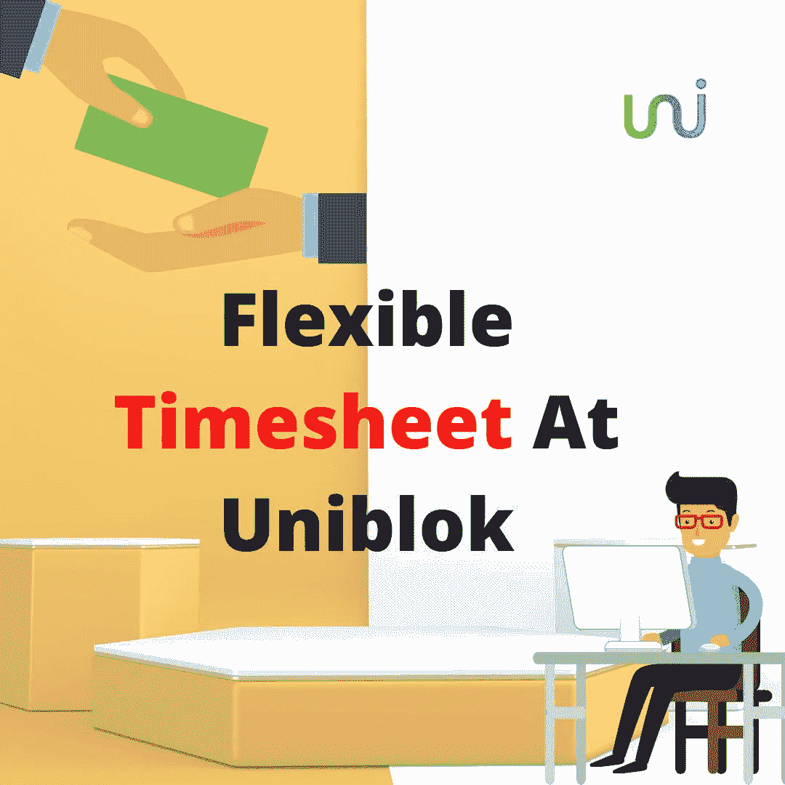

# 引入灵活的时间表，这是客户端和服务即时协同工作的更好方式

> 原文：<https://medium.com/coinmonks/introducing-flexible-timesheet-a-better-way-for-client-and-service-to-instantly-work-together-172cab0511c0?source=collection_archive---------20----------------------->

Introducing Flexible Timesheet, a Better Way for Client and Service to Instantly Work Together

Uniblok 是一个总部位于区块链的分散平台，它将人才和客户聚集在一起，为他们提供更好的隐私和服务。我们提供的平台允许他们轻松地相互交流，通过智能合同协商条款和条件，并确定他们的支付条款和时间表。

正如我们之前在名为 uniblok 的 [**加密货币支付网关的文章中提到的，在 uniblok，我们接受加密货币支付，这比传统支付更安全、更快捷，因为远程支付需要时间，而且更昂贵。**](/@uniblok/cryptocurrency-payment-gateway-at-uniblok-1024953692d7)

对于那些没有加密货币或喜欢用法定货币支付的人，我们也接受我们平台上的法定支付。

当客户向人才支付报酬时，需要解决的主要问题是，人才应该在什么基础上获得报酬？人才需要多久才能得到报酬？如何处理人才不符合客户期望的情况？通过使用 Uniblok，我们使我们的客户和人才更容易满足所有这些需求。

**目前 Uniblok 在人才和客户之间有两种支付形式；**

1.  **固定成本模型**
2.  **灵活的时间表模型**

# 固定成本:

Fix Cost

在这种模式下，在人才完成任务后，一旦在双方(客户和人才)共同商定的特定时间内完成分配给人才的任务，客户将向人才支付费用。

**例如:**

考虑以下场景:客户和人才同意一个月 100 美元的预算，付款将基于固定成本方法。

客户给人才分配任务，客户和人才共同商定一个月的时间框架。客户和人才之间商定的时间表是一个月，所以人才在 15 天或 20 天内完成给定的任务并不重要，因为人才只会在这段时间到期后得到补偿。人才将向客户开具发票，显示任务完成，客户将支付 100 美元，并向客户收取 10%的平台使用费。

***注:*** 如果客户需要为其完成静态工作，建议使用这种方法。

# 灵活的时间表:

Flexible Timesheet

根据弹性时间表的概念，人才应该根据工作的小时数得到报酬。有了这个概念，你可以每周、每两周或每月付款。

在每周选项的情况下，人才将被要求为支付工作时间提出每周发票。人才开出的发票将包括客户每天工作的小时数。

Uniblok 平台上客户与人才的每一笔交易都要缴纳平台使用费。例如，在为期五周的项目和每周付款的情况下，Uniblok 将对每次付款收取使用费。

***注:*** 如果客户打算为一个动态的、长期的项目招聘人才，建议使用这种方法。

# 结论

Uniblok 在人才和客户之间有两种支付形式；固定成本模型和灵活时间表模型。在固定成本方法中，一旦任务在双方同意的期限内完成，客户将支付人才。Uniblok 的灵活时间表概念允许自由职业者根据工作小时数获得报酬。有了这个概念，你可以每周、每两周或每月付款。将向客户收取 10%的平台使用费。

## 上查看 [Uniblok](https://uniblok.io/)

[Instagram](https://www.instagram.com/uniblok_techpvtltd/) | [脸书](https://www.facebook.com/Uniblok-Tech-Pvt-Ltd-115934447782742/)|[Linkedin](https://www.linkedin.com/company/uniblok-tech-pvt-ltd)|[Twitter](https://twitter.com/UniblokPVTLTD)|[Pinterest](https://in.pinterest.com/UniblokTechPvtLtd/)

> 加入 Coinmonks [电报频道](https://t.me/coincodecap)和 [Youtube 频道](https://www.youtube.com/c/coinmonks/videos)了解加密交易和投资

# 另外，阅读

*   [瓦济里克斯 NFT 评论](https://coincodecap.com/wazirx-nft-review) | [比茨盖普 vs 皮奥克斯](https://coincodecap.com/bitsgap-vs-pionex) | [坦吉姆评论](https://coincodecap.com/tangem-wallet-review)
*   [如何使用 Solidity 在以太坊上创建 DApp？](https://coincodecap.com/create-a-dapp-on-ethereum-using-solidity)
*   [加密交易机器人](/coinmonks/crypto-trading-bot-c2ffce8acb2a) | [OKEx vs 币安](https://coincodecap.com/okex-vs-binance)
*   [币安 vs FTX](https://coincodecap.com/binance-vs-ftx) | [最佳(SOL)索拉纳钱包](https://coincodecap.com/solana-wallets)
*   [如何在 Uniswap 上交换加密？](https://coincodecap.com/swap-crypto-on-uniswap) | [A-Ads 评论](https://coincodecap.com/a-ads-review)