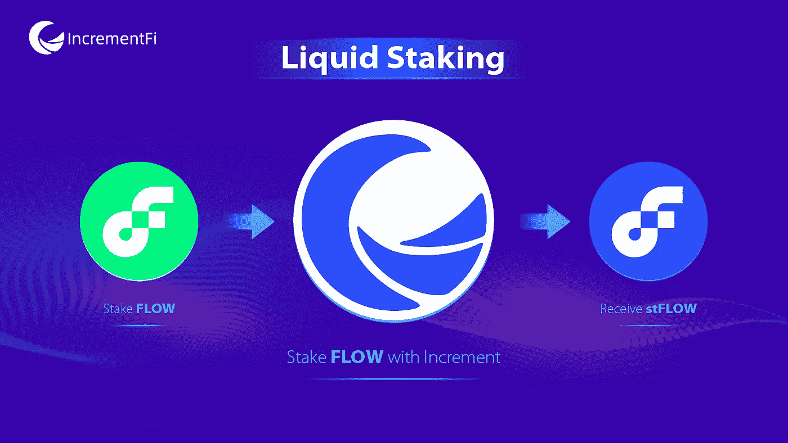

# 引入增量液体打桩

> 原文：<https://medium.com/coinmonks/introducing-increment-liquid-staking-2cc04e7eae9d?source=collection_archive---------11----------------------->

# 你好世界

增量开发和[推出](https://app.increment.fi/staking)第一个领先的非托管 **L** iquid **S** 带 **P** rotocol(即 **LSP** ) on Flow。

通过允许用户**赚取赌注奖励**和**享受解锁的流动性**到**同时参与 Flow 的 DeFi** 生态系统*，我们相信 LSP 为整个 Flow 网络、节点运营商、赌注者和令牌持有者创造了巨大的新机会。*

*LSP 有助于*分散网络*、*缓解赌注过程*、&、*分散风险*、*释放未锁定资本*，创造*更多收益&可组合性*机会。*

*这里只举一个例子:目前大约有 719，000，000 `$flow`个令牌锁定在赌注中。如果我们能够将这些赌注代币的 10%变现，我们将拥有价值约 1 . 21 亿美元的 TVL 来参与 Flow 的 DeFi 生态系统。*

# *特征*

*截至目前，用户可以:*

*   *💧用 LSP 下注$flow 以获得$stFlow。用户可以在 Flow 的 DeFi 生态系统中持有、转移或使用$stFlow。*
*   *📈$stFlow token 的价格(相对于$flow token)会随着时间的推移而增长:下注奖励会在每个纪元开始时自动重新下注(从而复利)。*
*   *💱使用＄ST flow 兑换已下注的 flow &生成的下注奖励，或者在[AMM/指数](https://app.increment.fi/swap?in=A.d6f80565193ad727.stFlowToken&out=A.1654653399040a61.FlowToken)将＄ST flow 换回＄flow，无需等待 7 ~ 14 天的解除绑定期。*
*   *📥 ***迁移*** —专为现有委托人构建的功能。因此，如果您已经委托给了一个节点，那么您不需要从该节点取消 staked，而是可以将 staked 位置“迁移”到 LSP，并在 1 个事务中立即接收$stFlow。查看我们的用户指南[此处](https://docs.increment.fi/protocols/liquid-staking/user-guidance#4.-migrate)了解更多信息和某些限制。*

*👨‍🌾在接下来的 24 小时内，我们将为**` $ flow<>$ ST flow`**互换对开放一个 [LP-farm](https://app.increment.fi/farm) ，以激励 LP，为需要即时解冻流动性的用户创建一个深度流动性池。在不久的将来，还将在货币市场上启用 stFlow 作为抵押品。*

# *节点列表，委托策略*

**(*如果您没有运行流验证器节点，可以跳过这一部分)**

*我们 ***不*** 旋转我们自己的节点，所以委派的令牌不会被提交给我们。最终目标是让令牌持有者(将来我们会发布令牌)投票，并以加权的方式分配代表。然而，现在有一个节点的 allowlist，只有 allowlist 中的节点有资格接收来自 LSP 的委托。*

*   *列表中的节点是根据信誉、以前维护节点基础设施的经验、合作关系等来选择的。列表中的第一波节点包括由 *HashQuark* (HashKey 的 infra arm)*Flow vs*、 *Blockchain at Berkeley* 运行的节点，我们正在与其他专业节点运营商进行谈判。*
*   *众所周知的节点列表可以在[这里](https://github.com/onflow/flow/blob/master/nodeoperators/NodeOperatorList.md)找到。如果你是一个节点运营商，并希望加入节点计划，请通过 discord / twitter / email 找到我们，让我们知道。*

*有 4 种类型的节点有资格获得赌注奖励:`Execution`、`Consensus`、`Collection`和`Verification`。现在所有的奖励权重都是一样的，但是将来可能会根据 Flow 的计划而改变。此外，目前节点不能定制`nodeCut`参数，因为它是固定的`8%`，然而，这也是未来可更新的。*

*因此，目前的委托策略非常简单:它会尝试将委托平均分配给合格的节点。但是在将来，一旦升级了节点权重和节点切割功能，委派策略也将相应地升级，包括但不限于像自绑定数量、正常运行时间、切割历史等指标。*

# *更多信息*

*请查看我们的[用户指南](https://docs.increment.fi/protocols/liquid-staking/user-guidance)和[常见问题文档](https://docs.increment.fi/protocols/liquid-staking/faq)了解更多信息。*

*今天是一个历史性的时刻，用户不必选择押$flow 或在 DeFi 中使用它-有了增量 LSP，现在你可以两者兼得🔥*

*非常感谢我们的朋友、合作伙伴、团队和社区成员，他们一路鼓励和支持我们实现这一目标！❤️*

# *关于*

*increment——领先的具有真实收益率的整体 DeFi 平台:一站式服务，包括 *AMM/DEX 交易*、*流动性挖掘*、*货币市场*、*流动性押注*。*

***应用**:[https://app . increment . fi](https://app.increment.fi/)*

*【https://twitter.com/incrementfi】推特 : [推特](https://twitter.com/incrementfi)*

***不和**:[https://discord.gg/r2keKxuKqX](https://discord.gg/r2keKxuKqX)*

> *交易新手？尝试[加密交易机器人](/coinmonks/crypto-trading-bot-c2ffce8acb2a)或[复制交易](/coinmonks/top-10-crypto-copy-trading-platforms-for-beginners-d0c37c7d698c)*