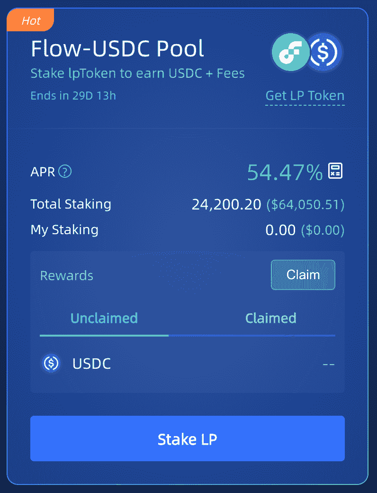
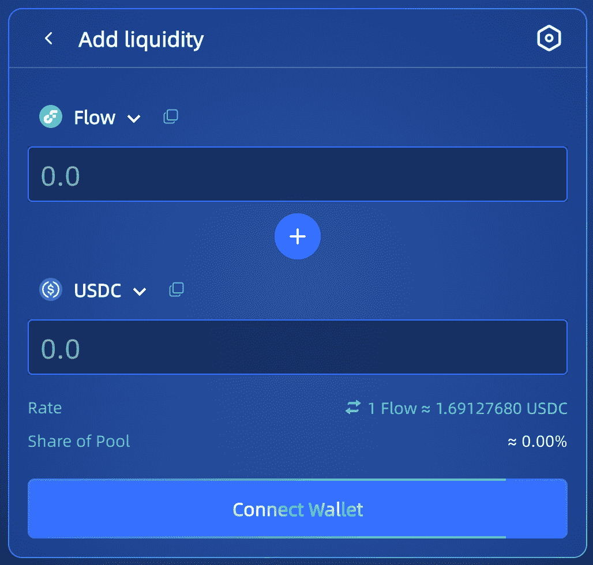
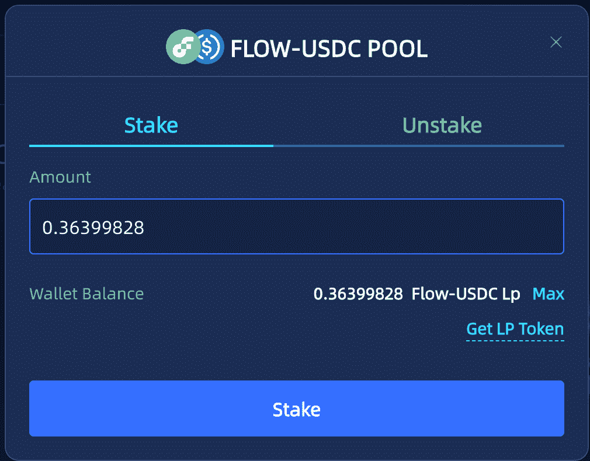
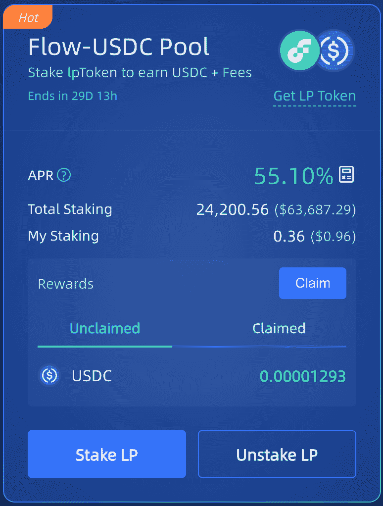
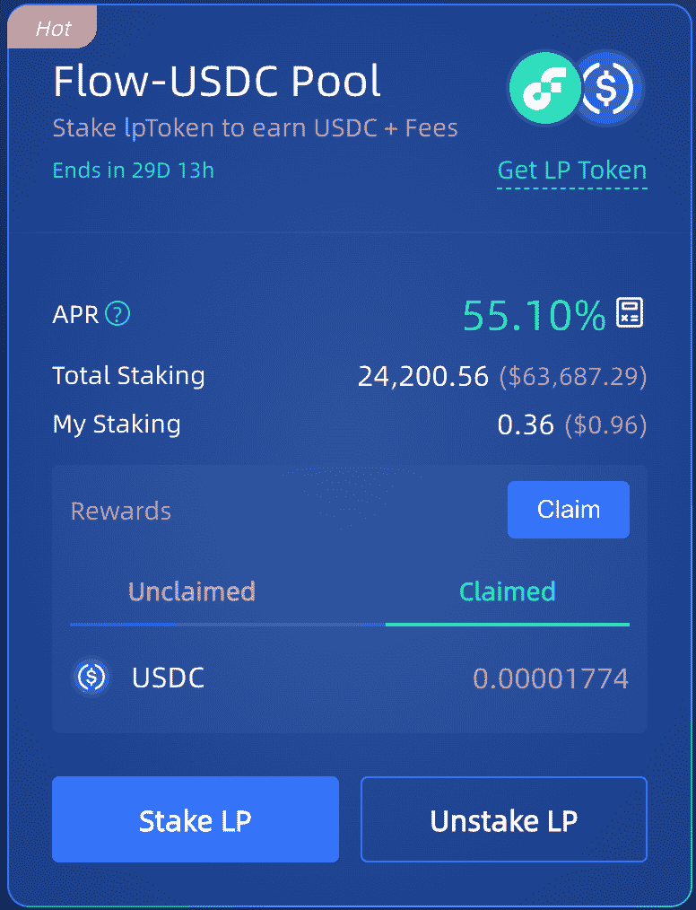
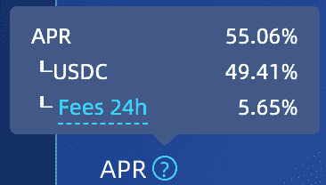
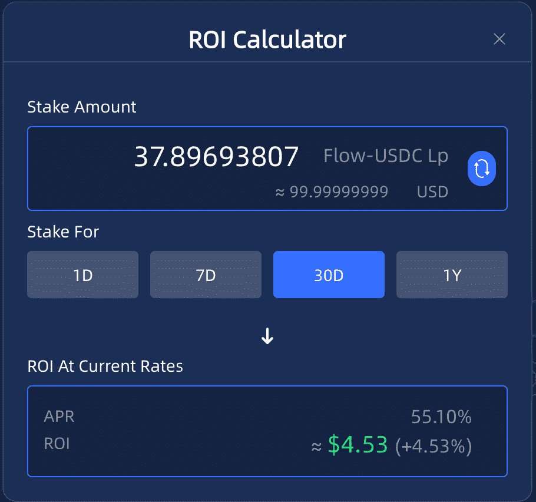

# 介绍令牌农场

> 原文：<https://medium.com/coinmonks/introducing-lp-farms-22861d5b0e92?source=collection_archive---------10----------------------->

***——用户指导***

Farm 是 IncrementLabs 在 Flow 上推出的新产品，旨在激励去中心化交易所的流动性提供商增加更多流动性，为用户提供更友好的互换体验(更小的滑点)。

这个想法实际上并不新鲜，被称为*【流动性挖掘】*:通过向 amm dex 上的交易对提供流动性，将收到的 lpTokens 进行赌注，并获得一些 tokens 作为奖励(外加费用)。

第一个代币农场是为 ***“流-USDC”***对准备的，它将持续 *30 天*，最初播种的是来自我们的*1000 USDC*奖励。我们会继续观察数据，并在必要时提高奖励。 ***(更新:我们已经完成了第一次提升，现在奖励池是 2500 USDC)***

这篇文章作为农场的用户指南。转到[https://app.increment.fi/farm](https://app.increment.fi/farm)，一个令牌农场如下图所示:

# 1.获取 LP(流动性提供商)令牌:

第一步，连接钱包，获取相应的 LP 令牌，点击 ***【获取 LP 令牌】*** 链接，进入增量掉期的 AddLiquidity 页面:

我们不会在这里过多地讨论这个话题，你可以在这里找到我们之前发布的[具体指导。](https://incrementfi.medium.com/a-user-guidance-to-decentralized-exchange-110cb8b2202)

# 2.将 LP 令牌标到服务器场

获得“Flow USDC”对的 LP 令牌后，返回/farm 并单击“Stake LP”按钮。

将 LP 令牌加入服务器场就像您在上面看到的一样简单。请注意，现在“取消标记”标签是不可点击的，因为我们还没有标记任何东西。

下注后，您会注意到现在“认领”按钮被激活，无人认领的未决奖励实时累积，可随时认领，甚至在未来农场结束后。从资金池中提取的所有奖励都将作为簿记永久记录在“已提取”部分。

# 3.取消堆叠 LP 令牌

“拆垛 LP”按钮现在可见，拆垛过程就像打垛一样简单。这里有一点值得一提:下注和退牌动作*不会自动为你领取未决奖励*，所以你必须自己去领取。

# 4.多方面的

## * 4 月数据:

悬停在 apr 问号上，它详细解释了 APR 由两部分组成:*来自奖励的 APR+来自交易费用的 APR*。

有限合伙人从所有交易中赚取 0.3%的费用，与他们在资金池中的份额成比例。费用被添加到池中，实时累计，并可在从池中提取流动性时申请。并且*我们使用过去 24 小时的交易量数据来估计*基于费用的 apr。

## *投资回报率计算器:

我们还提供了一个简单的 ROI 计算器，单击绿色 apr 数据旁边的计算器图标(在我们的示例中为 *55.10%* )来调用它:

请注意，这是根据当前年利率计算的*，目的是简化收益率计算，而*绝不代表保证收益*。在现实中，预计在一些大的股份数量的赌注行动后，4 月份的数据会下降。*

# [关于 IncrementFi]

一站式 DeFi 平台可提高流动性，并在 Flow 区块链上创造机会。
**应用**:[https://app . increment . fi](https://app.increment.fi/)

**推特**:[https://twitter.com/incrementfi](https://twitter.com/incrementfi)

**不和**:[https://discord.gg/increment](http://discord.gg/increment)

> 交易新手？试试[加密交易机器人](/coinmonks/crypto-trading-bot-c2ffce8acb2a)或[复制交易](/coinmonks/top-10-crypto-copy-trading-platforms-for-beginners-d0c37c7d698c)