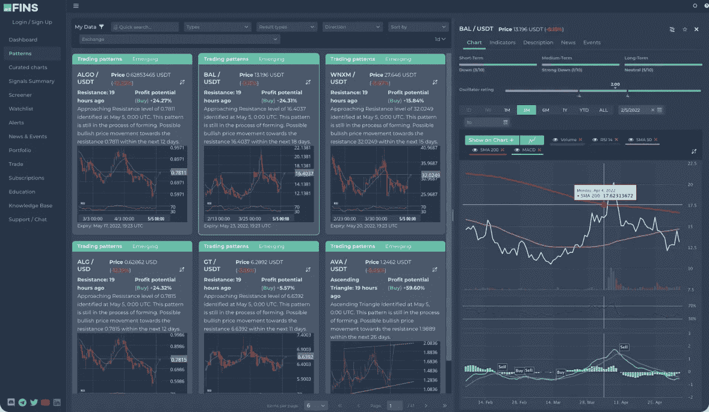
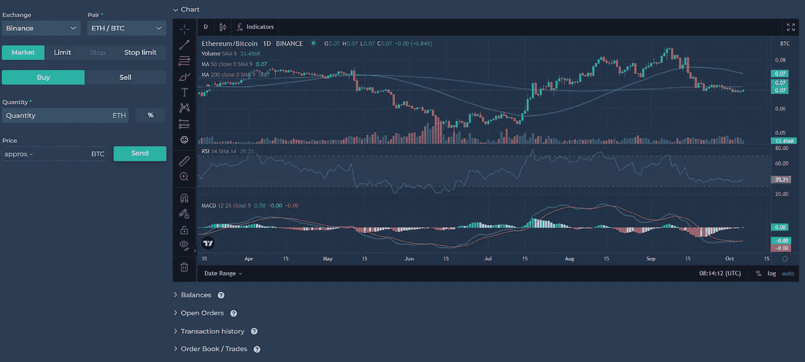
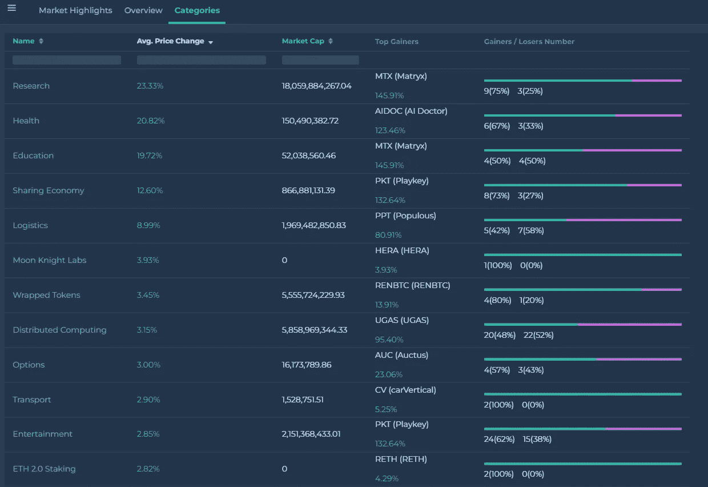
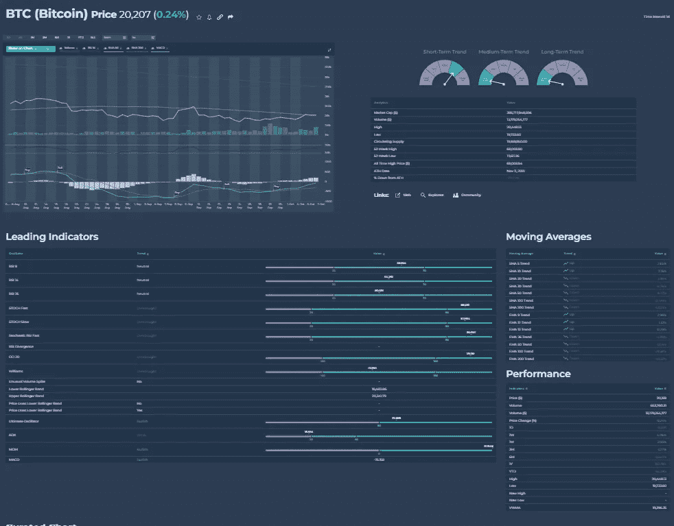

# 在 altFINS 上推出新的强大功能！

> 原文：<https://medium.com/coinmonks/introducing-new-powerful-features-on-altfins-fe813601e955?source=collection_archive---------40----------------------->

Source: [altFINS](https://altfins.com/)

altFINS 于 2020 年推出，从那时起，它仍在改进并添加新功能，帮助每个加密交易者和投资者找到并执行加密交易和投资。

**altFINS 这次增加了**:

1.  **交易视图图表**
2.  **类别**
3.  **硬币详情**

**交易视图图表。**使用具有高级分析功能的 TradingView 图表，在 altFINS:[https://altfins.com/trade](https://altfins.com/trade)的交易部分进行自己的技术分析

在多个交易所交易硬币。您可以通过 API 连接轻松地将 altFINS 帐户连接到 exchange 帐户。

目前，altFINS 支持与以下交易所的 API 连接。

1.  币安([见如何连接)](https://altfins.com/knowledge-base/connect-with-binance/)
2.  Bitfinex ( [参见如何连接)](https://altfins.com/knowledge-base/connect-with-bitfinex/)
3.  Bittrex ( [参见如何连接](https://altfins.com/knowledge-base/connect-with-bittrex/))
4.  HitBTC ( [参见如何连接](https://altfins.com/knowledge-base/connect-with-hitbtc/))
5.  北海巨妖([看如何连接](https://altfins.com/knowledge-base/connect-with-kraken/))
6.  Poloniex ( [见](https://altfins.com/knowledge-base/connect-with-poloniex/)如何连接)

altFINS 不收取任何交易费用或加价。执行交易的交易所会收取费用。

Source: [altFINS](https://altfins.com/trade)

**2。类别。搜索不同类别的硬币，如研究、健康、教育、共享经济、物流等。找出哪个类别表现最好，哪些硬币在该类别中是最大赢家和最大输家。**

Source: [altFINS](https://altfins.com/crypto-markets/crypto-categories)

3.**硬币细节。** altFINS screener 为 aprox 提供一个页面详情。2000 种加密货币。这个硬币的详细信息包括图表，领先指标，移动平均线，性能，图表模式和技术分析(如果可用)，加密新闻，加密事件和特定硬币的描述。

进入 altFINS screener，点击“眼睛”图标，查看每枚硬币的所有重要分析和新闻。

Source: [altFINS](https://altfins.com/crypto-screener/btc-bitcoin)

你有什么问题吗？通过营销@altFINS 联系我们或访问我们的官方 altFINS 电报聊天:[https://t.me/altfinsofficialchat](https://t.me/altfinsofficialchat)。

> 交易新手？试试[加密交易机器人](/coinmonks/crypto-trading-bot-c2ffce8acb2a)或者[复制交易](/coinmonks/top-10-crypto-copy-trading-platforms-for-beginners-d0c37c7d698c)