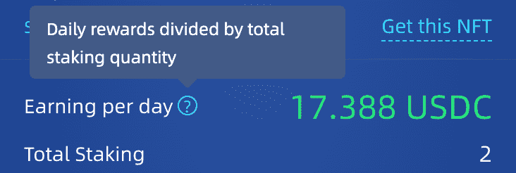

# 介绍 NFT 农场

> 原文：<https://medium.com/coinmonks/introducing-nft-farms-7c55d5a3596?source=collection_archive---------9----------------------->

NFT 农场是 IncrementLabs 在 Flow 上推出的一种新型实验。它允许 nft 持有者通过将他们的 NFT 投入特定的养殖池来获得一些额外的代币甚至一些新的 NFT。

该产品的潜在使用案例可能远远超出我们最初的设计。下面仅举几个例子:

*   这使得 [TopShot](https://nbatopshot.com/) 稀有版持有者可以将他们的稀有版下注到 TopShot 农场，在下注超过一个月后可以获得一些普通版的奖励。
*   这使得[彩车](https://floats.city)的收藏者有可能通过将史诗版的彩车投入到彩车 nft 农场来“赚取”一些美元的祖母绿代币。
*   它使 nft 创作者能够将他们的部分版税投入到 NFT 农业基金中，以奖励长期支持者。
*   还有更多的事情要披露…

***(请注意:以上是一些假设的潜在用例，可能不代表真实情况)***

我们相信这个新的实验是一个很好的例子，将 DeFi 和 NFT 结合在一起，使它们能够组合起来产生积极的协同作用。

Nft 农场将从 [**FLOAT**](https://floats.city) 开始，这是 Flow 区块链上流行的出勤证明协议。为了展示这一新产品的首次亮相，我们将为的 [**【核心会员】彩车**](https://floats.city/0xa886e89209bca080/event/326723707) **持有者开放**第一个 nft 养殖池。这是一个非常罕见的浮动，被手动分发给我们的一些社区成员，他们为我们之前的 testnet 发布提供了建设性的反馈和/或错误报告，在社区建设和活动参与方面做出了巨大贡献，在社区、图形、模因等方面自愿提供帮助。(加入我们的不和谐频道[这里](https://discord.gg/r2keKxuKqX)了解更多)****

该浮动农场池的第一场比赛将于 2008 年 8 月 24 日至 2008 年 31 月 25 日举行，最初将为该浮动赌注者提供 800 USDC 代币奖励。

前往[https://app.increment.fi/farm](https://app.increment.fi/farm)，如下所示:

点击“连接钱包”按钮后，用户界面应该足够简单。如果您的帐户持有任何这种浮动，将启用“赌注”按钮，赌注和取消赌注的浮动就像一个简单的点击。

农场启动后(*上图显示“1 小时 8 分钟内启动”*)，你将可以领取 USDC 奖励。USDC 奖励是实时发放的**，并且可以在任何时候领取**，甚至在未来农场结束之后。

有一个指标值得解释一下，那就是**“每日收入”**字段。这里显示的数据是动态的:在 08/08 ~ 08/31 期间，该池的总赌注奖励固定为 800 USDC。因此，随着越来越多的“核心会员”股票被下注，“每日收入”就会越来越少。这完全在意料之中。

# [关于 IncrementFi]

一站式 DeFi 平台可提高流动性，并在 Flow 区块链上创造机会。
**应用**:[https://app . increment . fi](https://app.increment.fi/)

**推特**:[https://twitter.com/incrementfi](https://twitter.com/incrementfi)

**不和**:[https://discord.gg/r2keKxuKqX](https://discord.gg/r2keKxuKqX)

> *加入 Coinmonks* [*电报频道*](https://t.me/coincodecap) *和* [*Youtube 频道*](https://www.youtube.com/c/coinmonks/videos) *了解加密交易和投资*

# 另外，阅读

*   [3 commas Review](/coinmonks/3commas-review-an-excellent-crypto-trading-bot-2020-1313a58bec92)|[Pionex Review](https://coincodecap.com/pionex-review-exchange-with-crypto-trading-bot)|[coin rule Review](/coinmonks/coinrule-review-2021-a-beginner-friendly-crypto-trading-bot-daf0504848ba)
*   [莱杰 vs Ngrave](/coinmonks/ledger-vs-ngrave-zero-7e40f0c1d694) | [莱杰 nano s vs x](/coinmonks/ledger-nano-s-vs-x-battery-hardware-price-storage-59a6663fe3b0) | [币安评论](/coinmonks/binance-review-ee10d3bf3b6e)
*   [加密交易机器人](/coinmonks/crypto-trading-bot-c2ffce8acb2a) | [Bingbon 评论](https://coincodecap.com/bingbon-review)
*   [Bybit 交易所评论](/coinmonks/bybit-exchange-review-dbd570019b71) | [Bityard 评论](https://coincodecap.com/bityard-reivew) | [Jet-Bot 评论](https://coincodecap.com/jet-bot-review)
*   [3 commas vs crypto hopper](/coinmonks/3commas-vs-pionex-vs-cryptohopper-best-crypto-bot-6a98d2baa203)|[赚取加密利息](/coinmonks/earn-crypto-interest-b10b810fdda3)