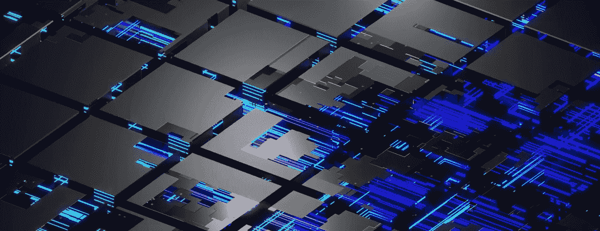

# 介绍为我们的未来提供动力的网络

> 原文：<https://medium.com/coinmonks/introducing-the-network-powering-our-future-fd391f019efa?source=collection_archive---------14----------------------->

**加密货币和区块链三难困境**

最近有了这么多关于加密市场本身的信息，很容易忘记有一种真正的潜在的革命性技术在推动这些数字资产:区块链

简单地说，区块链技术是一种协议，通过这种协议，你可以以分散的方式发送信息，跳过任何一种可以看到、修改甚至拒绝发送这些信息的中央组织。

可悲的是，这个模型并不是完美的；许多本应分散和可信的区块链未能兑现承诺，失去了用户的信任，并表现出不可靠性。

以太坊的创始人维塔利克·布特林(Vitalik Buterin)将无法提供理想的区块链定义为“区块链困境”(block chain Trilemma)；该术语包含传统第 1 层网络始终无法同时提供的三个基本方面:可扩展性、分散性和安全性。

通常情况下，区块链只能实现其中两个目标，必须牺牲其中一个才能发挥作用。比如以太坊和比特币虽然 100%去中心化，安全，但是由于交易成本高，TPS 低，缺乏可扩展性。

**不同的做事方式**

这就是 Zenon 的用武之地；发展中的双币区块链的 DAO(去中心化自治组织)引入了理解这项技术的新方法。

通过重新思考其基本方面，并提出新的沉积物，动量网络旨在解决区块链三难问题，提供传统区块链未能提供的东西。

动量网络(NoM)是一个智能的、真正去中心化的区块链，设计用于在其生态系统内开发 zApps(使用区块链技术的去中心化应用),并由双 PoS-PoW 系统提供燃料。

但是，为了解决区块链三难问题，提名做了什么呢？首先，它在不牺牲去中心化的情况下提供了可扩展性，这要归功于旨在解决传统网络的气体成本问题的反垃圾邮件机制 Plasma。

这通常会以牺牲安全性为代价，但这个问题以一种独特的方式得到了解决，这要感谢 Zenon 的 DAO 特性和 NoM 的 PoS-PoW 系统，它们允许一个真正分散的、安全的区块链存在。

如前所述，NoM 和其他区块链的主要区别之一是它的双币机制。ZNN (Zenon)和 QSR (Quasar)是这个网络的发动机。

第一个将允许您参与共识协议，通过将它锁定在四个不同的层中，您可以通过燃烧一定量的第二个来解锁，第二个也可以被锁定以赚取等离子体，这是一种网络费用接近于零的第三维资产。

**柱子**

这些是 NoM 的基本构件；支柱积极产生和验证势头，同时还参与 Zenon 的治理框架，对社区倡议等事项进行投票或选择 Accelerator-Z 项目进行资助，使其成为 DAO 的“管理者”。

建立自己的支柱将需要线性增长的 QSR 燃烧量和最低 15000 ZNN 锁定，APYs 上升到 80%。

> 交易新手？试试[加密交易机器人](/coinmonks/crypto-trading-bot-c2ffce8acb2a)或者[复制交易](/coinmonks/top-10-crypto-copy-trading-platforms-for-beginners-d0c37c7d698c)

**委托人**

如果支柱是管理者，你可以把授权者想象成投票给他们的人；他们选择将其 ZNN 委托给哪个支柱，从而增加该支柱在网络和治理框架中的权重。

在报应中，支柱可以选择与委托人分享多少收入，在两者之间创造一种共生关系。成为委托人的最低金额只有 1 ZNN，APYs 达到 72%。

**赌注者**

这是你已经熟悉的经典赌注；在一定时间内锁定最少 1 个 ZNN，在惩戒中获得奖励。年利率高达 24%。

**哨兵**

哨兵是作为网络运行观察者的典型节点。这些节点存储、共享和被动验证 NoM 分类帐。

你需要锁定 5.000 ZNN 和 50.000 QSR 来产生前哨淋巴结，它可以提供高达 60%的 APYs。

**可用性**

你可能注意到动量网络是一个特殊的区块链，不同于任何其他的。但是，它是用来干什么的呢？

这项技术的主要用途是开发 zApps，它受益于 NoM 的可伸缩性和智能性，为开发人员打开了新的大门。你可以查看 [AcceleratorZ](https://zenon.network/accelerator.html) (Zenon 的资助项目)，看看用户群在做什么。

另一个用途是创建新的令牌；通过使用专用的 [syrius wallet](https://zenon.network/index.html#downloads) ，您可以在 NoM 基础设施上轻松创建新代币，无需编码，而且由于有了 Plasma，几乎没有任何费用。

**结论**

正如你所看到的，NoM 与其他区块链完全不同，如果我们看到加密货币和 zApps 的未来由这种创新技术运行，这并不奇怪；天空是极限。

我们即将结束这篇文章。如果你想看看关于 Zenon 和动量网络的最新消息，可以去看看他们的 [Twitter 账号](https://twitter.com/Zenon_Network)。如果你想看一些很酷的视频，可以看看 T2 的 Youtube 频道。最后，不要错过加入专门的 [Discord 服务器](https://discord.com/invite/ZvrFDUEbcN)成为社区一员的机会。

> *加入 Coinmonks* [*电报频道*](https://t.me/coincodecap) *和* [*Youtube 频道*](https://www.youtube.com/c/coinmonks/videos) *了解加密交易和投资*

# 另外，阅读

*   [有哪些交易信号？](https://coincodecap.com/trading-signal) | [Bitstamp vs 比特币基地](https://coincodecap.com/bitstamp-coinbase) | [买索拉纳](https://coincodecap.com/buy-solana)
*   [密码交易机器人](/coinmonks/crypto-trading-bot-c2ffce8acb2a) | [维护审查](https://coincodecap.com/uphold-review)
*   [如何给 MetaMask 钱包添加 Arbitrum？](https://coincodecap.com/how-to-add-arbitrum-to-metamask-wallet)
*   [KuCoin vs 北海巨妖 vs BitYard](https://coincodecap.com/kucoin-vs-kraken-vs-bityard)
*   [最适合加密交易的 VPN](https://coincodecap.com/best-vpns-for-crypto-trading)