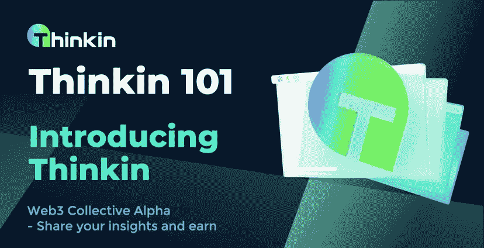
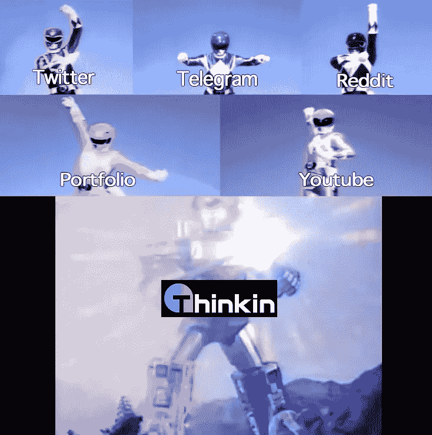

# Thinkin 简介:终极的 SocialFi 平台，为积极的社区参与提供丰厚的奖励

> 原文：<https://medium.com/coinmonks/introducing-thinkin-the-ultimate-socialfi-platform-with-robust-rewards-for-active-community-5de5f24a6b12?source=collection_archive---------33----------------------->

> 自从加密货币和区块链技术的发展以来，我们已经听到了不同的行话和术语。有 GameFi，DeFi，NFTs，DAO 等。区块链和加密货币的一个独特之处是，它们奖励了我们通常为了好玩而做的事情。区块链正在用金融和奖励参与者来扰乱我们正常的日常活动。

根据同样的原则，我们现在有了所谓的社会保险。SocialFi 的理念是社交媒体和金融的结合。SocialFi 平台是按照 web3 的思维模式构建的，将数据的所有权还给用户，而不是将数据留在脸书和 Twitter 等集中式平台手中。凭借去中心化自治组织(Dao)、NFT、加密货币和许多其他 Web3 发明的力量，SocialFi 被证明是社交媒体的未来。

所以，如果你是 SocialFi 领域的新手，或者你有一个强大的项目。Thinkin 是一个了不起的平台，它有着令人难以置信的实用程序，可以给你一个稳健的开端。Thinkin 为您提供强大的社区建设能力和可靠的 IDO 发布。

## 什么是思考？

Thinkin 是一个 SocialFi 平台，通过允许用户参与初始 DEX 产品(IDO)来奖励那些在基于 Web3 的论坛上与社区互动的用户。

think 没有将财务承诺作为分配 IDO 的标准，而是为社区成员提供了一个通过社区参与获得 IDO 分配的独一无二的机会。

## **什么特征让思考成为更好的选择？**

在当今的在线社交媒体和投资社区中，影响者和追随他们的散户投资者之间存在信息鸿沟。Thinkin 通过其 Web3 基础设施弥合了这些差距。以下是 Thinkin 的一些独特优势和特性；

*   Thinkin 创建了一个具有一致激励的同质社区，每个人都有平等的权利参与早期机会。
*   Thinkin 提供了工具和框架，允许社区以分散的方式蓬勃发展。笔记本 NFT 成立了作为这一努力的基石。
*   为了创造吸引人和有益的体验，Thinkin 正在实施各种游戏化元素。他们的笔记本 NFT 是一个互动令牌，可以升级和记录您的社区参与。
*   您可以分享您的见解，以获得奖励，收集奖励，并增强您的 NFT 和提高您的地位。Thinkin 是一个允许其用户通过社区参与来参与 IDOs 的平台。
*   如果你的影响力足够大，你可能会受益于 Thinkin Alpha Lounge，成为一名关键的意见领袖。此外，您在 IDOs 中的分配潜力将会增加。

## **思维阿尔法休息室的好处**

阿尔法休息室是您的项目在 IDO 前后的营销需求的一站式商店。

Alpha Lounge 使项目能够

*   雇佣社区经理和关键意见领袖。
*   为翻译、beta 测试和其他任务提供奖金
*   控制空投和其他促销活动
*   通过问答和 AMA 让你的社区参与进来。

随着社区治理发挥作用，Alpha Lounge 的范围可能会随着时间的推移而扩大。要成为关键的意见领袖，用户必须是社区的活跃成员，拥有高质量帖子的记录。NFT 和他们的个人资料是他们以前参与社区的记录，将建立每个人的声誉。

## **发射台**

除了标记标记之外，用户还可以通过标记他们的 NFT 来参与 IDOs，这是 launchpad 领域的一种常见方法。将启动和激励项目评审倡议，在 Thinkin 平台和其他社交媒体平台上传播意识。因为参与 IDOs 不仅仅局限于代币持有者，你的筹款努力的总体成功将比在其他平台上更有回报。

## **结论**

每个项目都值得一个强大的社区。Thinkin 提供了一种与社区互动并获得用户和投资者的独特方式。通过直接参与或空投和 AMAs。Thinkin 用户将被鼓励客观地回顾和讨论你的项目，通过 kol，你将有能力处理任何反馈。通过这些努力，你将能够建立一个强大的初始支持者群体。

点击[此处](https://linktr.ee/thinkin_official)查看他们社交平台上的思考。

> 交易新手？尝试[加密交易机器人](/coinmonks/crypto-trading-bot-c2ffce8acb2a)或[复制交易](/coinmonks/top-10-crypto-copy-trading-platforms-for-beginners-d0c37c7d698c)