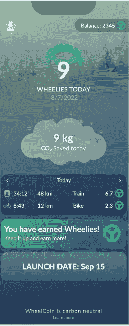

# 推出 WheelCoin:首个移动应用 Move2Earn

> 原文：<https://medium.com/coinmonks/introducing-wheelcoin-the-1st-move2earn-app-for-mobility-713a571cdc3d?source=collection_archive---------4----------------------->

虽然 Play2Earn 和 Move2Earn 运动取得了一些早期的成功，也有一些失败，但加密社区继续看好利用象征性经济激励使用户在玩或移动时赚取收入的可能性。

STEP ' n(2022 年 Q2 盈利 1.2 亿)和 sweat coin(7500 万次下载)为 Move2Earn 铺平了道路。虽然这两人(以及其他追随者)都专注于代币激励步行，但直到今天，还没有人试图应用 Move2Earn 来鼓励可持续的移动选择。

然而，交通运输是大多数家庭预算的重要组成部分，在全球家庭支出中排名第二或第三，也是碳排放的主要来源，不幸的是，交通运输是唯一一个努力将排放量降低到 1990 年水平以上的部门。

令人欣慰的是，相当一部分年轻一代(我们中的一些老年人也是如此)正在改变我们的偏好，从拥有汽车和汽车依赖转向更可持续的选择，如公交、火车、自行车和滑板车、步行和“需要”汽车时的(电动汽车)共乘。

移动互联网网络一直致力于将全球移动生态系统整合为一个无信任、无许可的生态系统，车队运营商可以通过竞争和合作为不断增长的全球人口提供可持续的多式联运解决方案。到目前为止，IoM 网络一直专注于将该网络提供给大型需求合作伙伴，如铁路运营商(如美国的 Brightline Trains、英国的伦敦东北铁路)、航空公司(如 Vueling Airlines)和其他即将宣布的公司。

WheelCoin Landing Screen for tracking Green Mobility

**推出转轮硬币**

今天，我们宣布推出 WheelCoin，旨在让全球各地的人们更容易、更经济地选择可持续的交通方式。为什么是 WheelCoin？世界上大多数机动车辆(例如踏板车、滑板、公共汽车、自行车、许多火车、汽车)都有轮子。此外，轮子经常被认为是人类历史上最重要的发明之一(当然互联网和区块链也在其中)。

WheelCoin 应用程序将于 9 月 15 日作为私人测试版面向首批 5000 名 OG 用户推出。在测试期间，我们将努力校准激励措施，以便在几个月后推出 WheelCoin 公用事业令牌时，允许可持续的令牌排放水平。然而，OG 用户将有几个好处，包括:获得一个不可转让的 NFT，使他们能够立即开始赚取(点数优先，将在 WheelCoin token 公开发行时转换为 token)。OG 成员的未来 airdop 收益也是可以预期的。如果你有兴趣加入 OG 计划[加入我们的不和谐](https://discord.gg/IoM)。

在 WheelCoin 的早期版本中，该应用程序将检测用户在公共交通、铁路和自行车上的运动。它还可以检测用户是否在汽车或飞机上，但这两者都不会获得奖励，因为 WheelCoin 的目标是激励更快地转向可持续的移动性。最初，测试版用户将获得积分，这些积分随后将转换为 WheelCoin 代币。

在未来的版本中，移动互联网(IoM)网络将被集成到 WheelCoin 中，允许用户实际预订和支付绿色移动服务，并获得这些服务的进一步激励(或折扣)。一旦整合了 IoM 网络，代币激励模式将包括其他移动模式，包括应用程序中预订的小型摩托车和应用程序中预订的绿色车辆(汽车共享、汽车租赁和出租车)等。

*敬请关注进一步的更新，包括我们的代币经济、未来发布的新合作伙伴关系等。*

**关于作者**

*Boyd Cohen 是 Iomob 的首席执行官和联合创始人，Iomob 是一个分散的移动互联网(IoM)网络。自 2001 年在科罗拉多大学获得战略和创业博士学位以来，他在过去的二十年里致力于加速实现低碳可持续经济。这包括出版了 3 本书，多篇同行评审的文章，经常为 Fast Company 投稿，并在智能城市和可持续发展领域创办了一些企业。*

> 加入 Coinmonks [电报频道](https://t.me/coincodecap)和 [Youtube 频道](https://www.youtube.com/c/coinmonks/videos)了解加密交易和投资

# 另外，阅读

*   [瓦济里克斯 NFT 评论](https://coincodecap.com/wazirx-nft-review)|[Bitsgap vs Pionex](https://coincodecap.com/bitsgap-vs-pionex)|[Tangem 评论](https://coincodecap.com/tangem-wallet-review)
*   [如何使用 Solidity 在以太坊上创建 DApp？](https://coincodecap.com/create-a-dapp-on-ethereum-using-solidity)
*   [加密交易机器人](/coinmonks/crypto-trading-bot-c2ffce8acb2a) | [OKEx vs 币安](https://coincodecap.com/okex-vs-binance)
*   [币安 vs FTX](https://coincodecap.com/binance-vs-ftx) | [最佳(SOL)索拉纳钱包](https://coincodecap.com/solana-wallets)
*   如何在 Uniswap 上交换加密？ | [A-Ads 审查](https://coincodecap.com/a-ads-review)