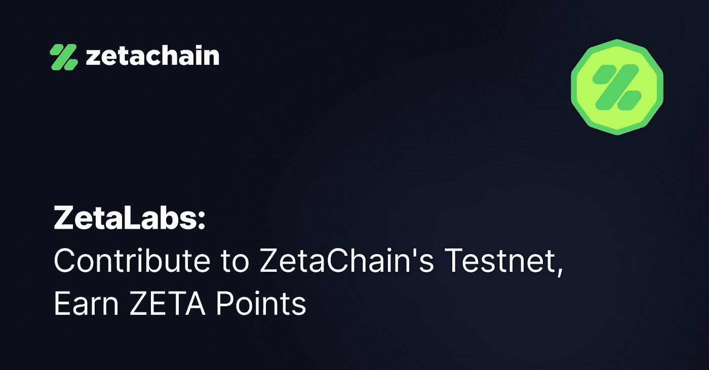
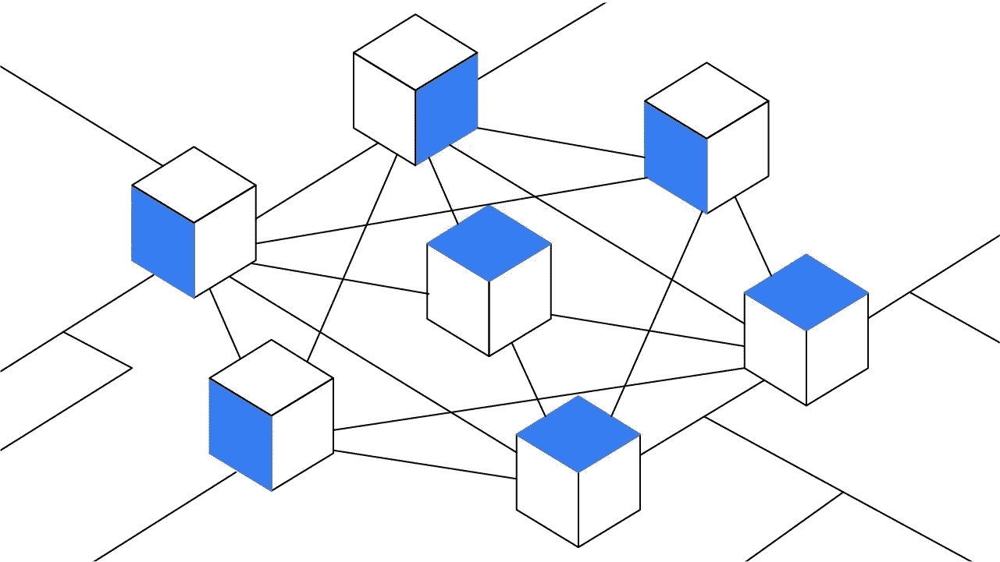
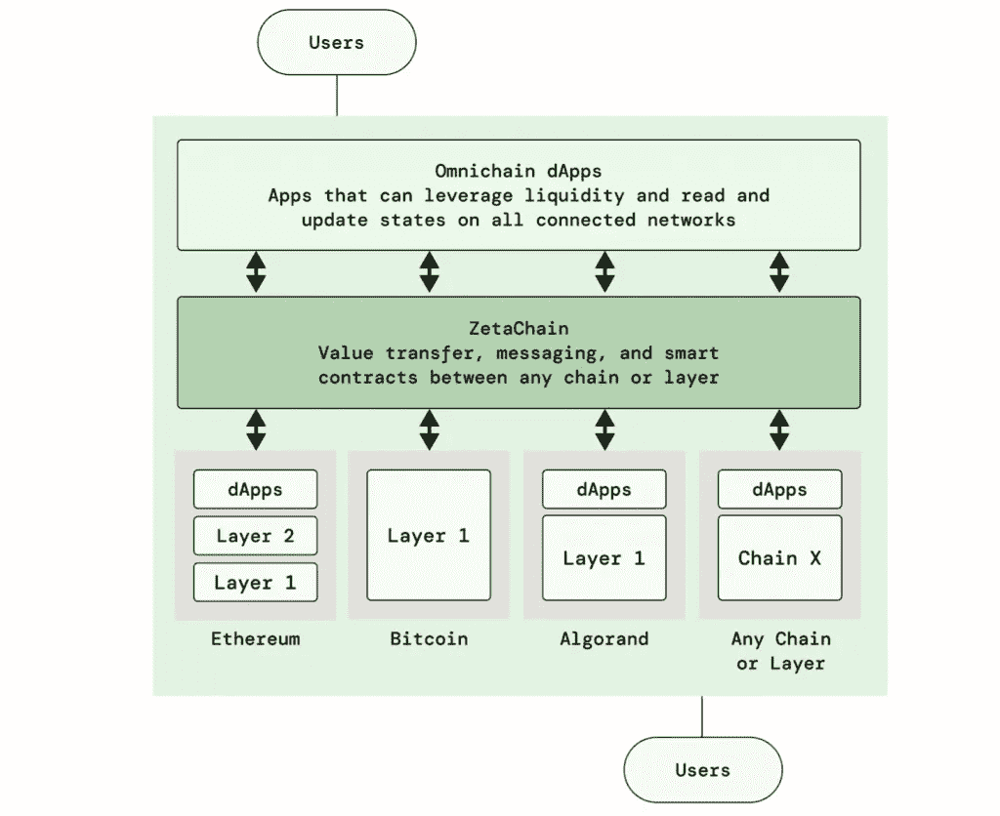
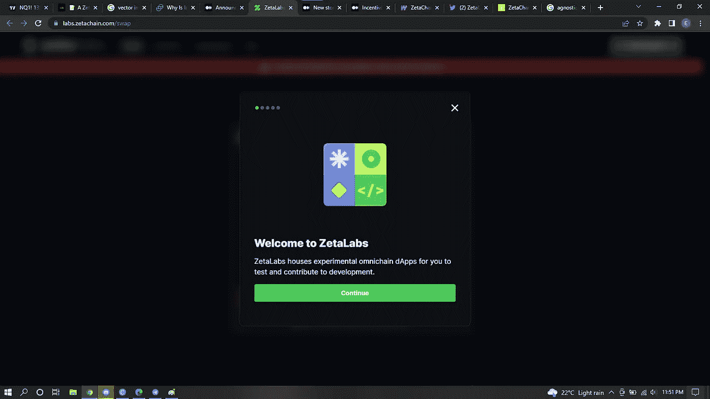
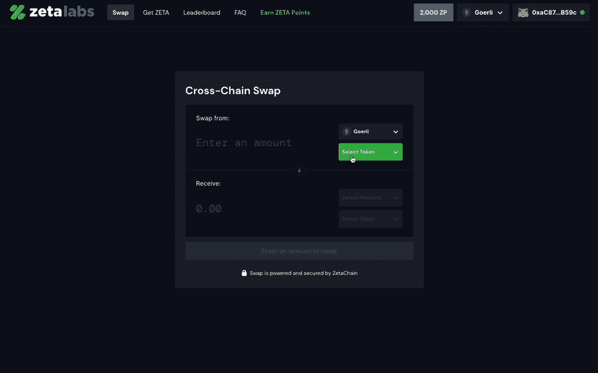
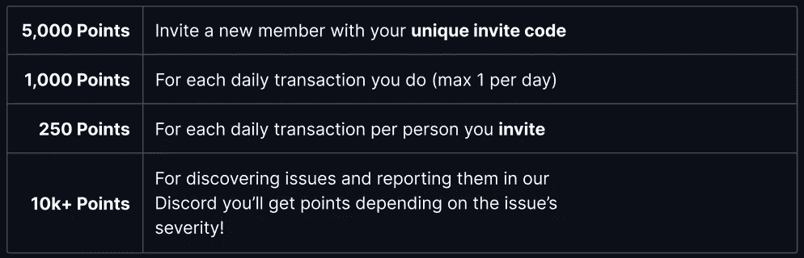

# 介绍 ZetaLabs 更具互操作性的加密网络的工作空间。

> 原文：<https://medium.com/coinmonks/introducing-zetalabs-the-workspace-for-a-more-interoperable-crypto-network-9a13da7c2938?source=collection_archive---------4----------------------->

# 跨链互操作性:公式最终是正确的吗？

Zetachains introducing Zetalabs

# **简介**

区块链空间正以令人难以置信的速度增长，2021 年价值为 59.2 亿美元，预计从 2022 年到 2030 年复合年增长率(CAGR)为 85.9%。其中大部分流动性和数据被锁定在几个不同的独立和隔离的系统中，称为区块链生态系统。

需要一个更加统一和可互操作的区块链技术空间。

这就引出了问题 [**【为什么互通】**](https://www.gemini.com/cryptopedia/why-is-interoperability-important-for-blockchain)

model concept for interoperability

*“区块链互操作性”的概念是指不同区块链网络之间交换和利用数据，以及在网络各自的区块链之间移动独特类型的数字资产的能力。*

从更直观的角度来看，区块链互操作性基本上允许几种区块链技术联合起来共享优势，并在需要时弥补不足。

这种优势和劣势的例子在比特币的例子中更容易看到。工作证明区块链在 2009 年经济危机后成立，市值高达 5000 亿美元，作为国家货币的替代品，因此渴望成为交易媒介和价值储存手段，但在创建不可变的程序化合同和应用程序方面能力严重不足。

这导致了另一种被称为以太币的加密货币的诞生(**一种可编程的互联网计算机，能够为不可改变和不可信的数字资产转移产生智能合同**)。

诸如此类的多种情景在区块链涌现并不令人意外，这造成了流动性分散的问题，就像国际货币交易早期的情况一样。

# 迄今为止的解决方案

到目前为止，连接两个唯一分离的区块链的解决方案是包装它们各自的令牌，并利用类似桥的虫洞在这两个不同的区块链之间传递这些令牌的值。

但是这并没有被证明是最好的解决方案。因为根据两个区块链的相对市值和涉及的包装令牌的数量，这些桥为寻求利用[安全缺陷的不良行为者创造了理想的攻击媒介。](https://thenewstack.io/security-risks-facing-web3-developers/)

Photo by [Collin Armstrong](https://unsplash.com/es/@brazofuerte?utm_source=medium&utm_medium=referral) on [Unsplash](https://unsplash.com?utm_source=medium&utm_medium=referral)

# ZetaChain 和更好的解决方案

在审查最近发布的[白皮书](https://www.zetachain.com/whitepaper.pdf)、 [ZetaChain](https://www.zetachain.com/) 时，2021 年 7 月启动的一个项目提出了一种不同的方法来应对区块链互操作性的挑战，其中包括创建一个公共的 L1(第一层)区块链，专门用于不可思议地将区块链连接在一起。

完全避免了代币的桥接和可利用的虫洞的使用。

为了做到这一点，齐塔人考虑到了区块链设计之间的巨大差异，并采用了一种更不可知论的路线。

# 【Zeta 链是如何工作的，什么是 Zetalabs

在区块链之间建立互操作性而不需要通过桥和虫洞路由的一种常见方法是在每个链上创建和部署几个智能契约，并开发一个 dapp，该 dapp 根据所选择的链与所有这些 dapp 进行交互。

虽然这可能看起来是一个相当有效的解决方案，但当您考虑到正在开发和使用的区块链的数量每天都在增加时，它很快就会变得不切实际，有些不切实际。

此外，当您考虑到智能合同是由可能或可能不具备所有区块链知识的人编写时，这种解决方案还存在巨大的安全风险，更不用说引入手动错误的可能性了。

Zeta Chain 采取的路线是通过允许开发人员在名为 Omnichain 的新 L1 链上创建和部署一个智能合同来减少上述过程，omni Chain 在前端只与一个名为 Omnidapp(odapp)的 dapp 交互，在后端与几个受支持的区块链交互，如下图所示。

这里，齐塔链充当了金属层(这个词是齐塔创始人在[采访](https://invezz.com/news/2022/03/09/zetachain-whitepaper-analysis-interview/)时使用的)

# 什么是 ZetaLabs，它是如何工作的

ZetaLabs 是 Zeta chain 的实验室中心，它基本上是一个确保配方正确的试验场。

Zeta labs, amking sure the formula is just right

它基本上是一个开放的领域，任何用户都可以测试部署在 Zetachain 上的 omnidapp，了解它们是如何工作的，并向开发人员报告任何错误或有趣的发现。

它在 pc 和移动电话上都是可用的，因此扩展了用户输入的范围。

zeta labs interface on a pc

由于泽塔实验室是一个刚刚启动的项目，它目前由一个 [**ZetaSwap 应用**](https://labs.zetachain.com/swap) 和一个[**ZetaScan 应用**](https://explorer.zetachain.com/) **组成。**

**zeta swap 应用**

ZetaLabs Swap 应用程序使用 ZetaChain 的原生价值转移，即区块链之间的代币和价值转移，没有桥接、包装或锁定资产。它通过使用在本地链上发现的池中的流动性来实现这一点，例如在 uniswap 和几个 testnet 上发现的池，这将用户的风险降至最低，目前用户只能在 testnet 上的两个链之间交换，例如 Bsc test net 和 Goerli ethereum testnet。

为了便于使用，只有少数令牌可用于在测试网上交换，但是根据需要可以包括更多令牌。

zetalabs swap function

然而，在本文撰写之时，zetaswap 由于进一步的维护，目前处于离线状态，但很快就会恢复在线。

# 使用泽塔实验室

点击这个 [**站点**](https://labs.zetachain.com/swap) ，点击“**用 Twitter** 验证”并连接你的 Twitter(你的 Twitter 必须在 1 个月以上)——你将获得 **5000 ZP** ，你可以使用我的 [**推荐链接**](https://labs.zetachain.com/leaderboard?code=rp6WEcv6sW24_O1FeGNb9) (这是获得 ZP 的另一种方式)

您还可以通过在 ZetaLabs 上进行多项活动获得额外的 ZP 积分，例如，

这是一种直接激励在网站上进行测试的方式，这些分数会转化为所有参与者未来的财务下降吗？

只有时间能证明一切，但这仍然值得去做。

# 开始吧

您需要通过他们的不和谐页面或网站请求测试令牌，方法是连接一个兼容的钱包，如 metamask 或 coinbase，并点击左上角的 Get Zeta 按钮。

交换就像在一次交易中选择你想要交换的代币和你想要交换的链一样简单，所有的汽油、转账和费用都由 ZetaChain 处理。

通过利用 ZetaChain 的开源样本合同代码启动创新，收购的 ZetaTokens 还可用于在 Zeta lab 网络上测试和部署智能合同

# **社交**

[不和谐](https://t.co/sl2DzqcNY7)

[推特](https://twitter.com/zetablockchain)

泽塔拉布

# 来源:

 [## ZetaChain 提供无桥区块链互联

### 分散应用程序(dApp)开发的一个基本挑战是，单个区块链是…

thenewstack.io](https://thenewstack.io/zetachain-offers-bridgeless-blockchain-interconnectivity/)  [## 宣布 ZetaLabs

### Check out this blog post in español, 中文, 日本語, हिंदी, 한국인, tiếng-việt, deutsch, français, русский, and українська

blog.zetachain.com](https://blog.zetachain.com/announcing-zetalabs-1ab832adf86) 

> 加入 Coinmonks [电报频道](https://t.me/coincodecap)和 [Youtube 频道](https://www.youtube.com/c/coinmonks/videos)了解加密交易和投资

# 另外，阅读

*   [什么是融资融券交易](https://coincodecap.com/margin-trading) | [成本平均法](https://coincodecap.com/dca)
*   [支持卡审核](https://coincodecap.com/uphold-card-review) | [信任钱包 vs 元掩码](https://coincodecap.com/trust-wallet-vs-metamask)
*   [Exness 回顾](https://coincodecap.com/exness-review)|[moon xbt Vs bit get Vs Bingbon](https://coincodecap.com/bingbon-vs-bitget-vs-moonxbt)
*   [如何开始通过加密贷款赚取被动收入](https://coincodecap.com/passive-income-crypto-lending)
*   [BigONE 交易所评论](/coinmonks/bigone-exchange-review-64705d85a1d4) | [电网交易 Bot](https://coincodecap.com/grid-trading)