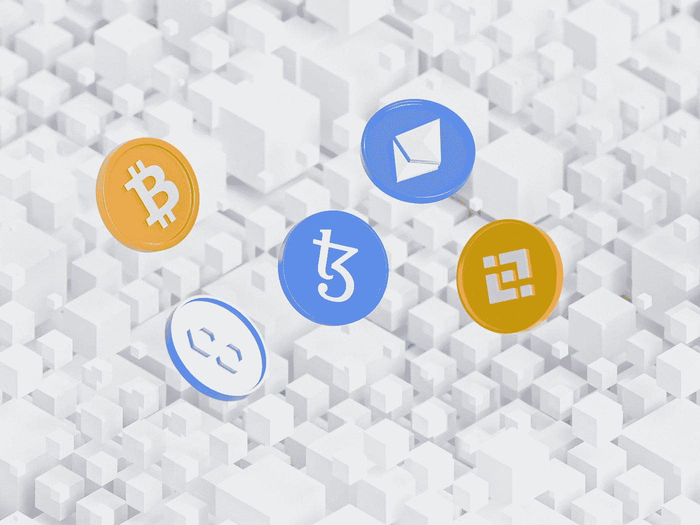
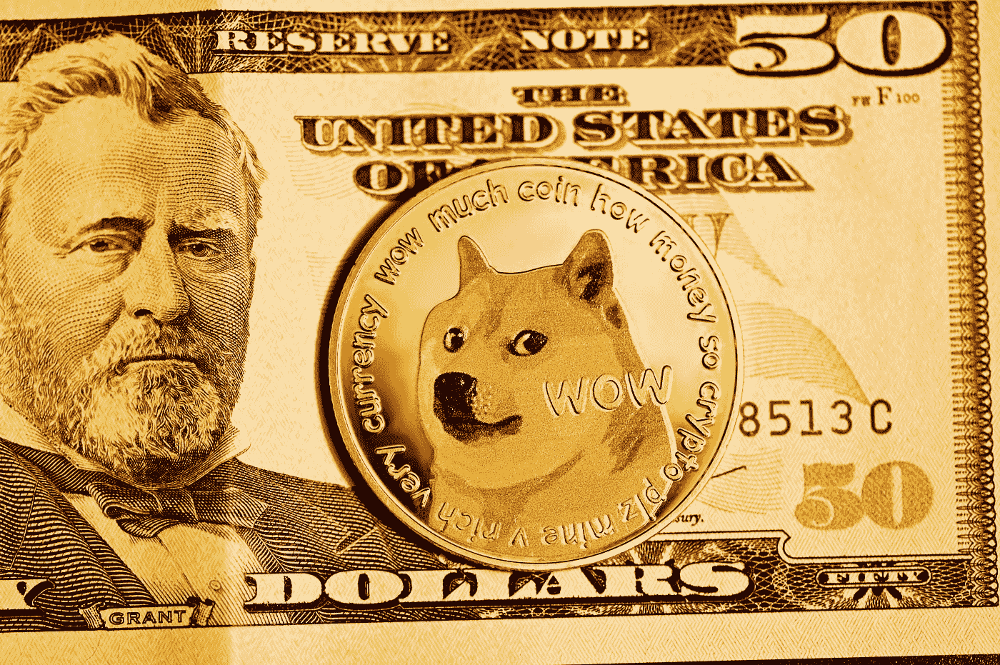
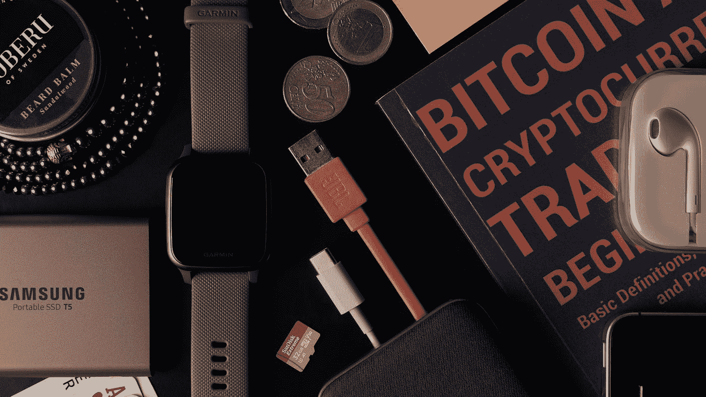

# 区块链技术和加密货币简介

> 原文：<https://medium.com/coinmonks/introduction-to-blockchain-technology-and-cryptocurrencies-4bf6614791f6?source=collection_archive---------34----------------------->

Photo by [Rodion Kutsaev](https://unsplash.com/@frostroomhead?utm_source=medium&utm_medium=referral) on [Unsplash](https://unsplash.com?utm_source=medium&utm_medium=referral)

如果你有一个加密货币钱包，你可能对我们今天要谈论的内容有所了解，区块链和加密货币也称为数字货币。顺便说一下，[加密货币在乌干达仍然是非法的](https://www.mugabiimran.com/post/cryptocurrency-still-illegal-in-uganda)。

这是一本加密货币指南，面向希望了解加密货币交易所和比特币区块链背后的技术的初学者。

# 什么是区块链？

区块链是互联网上来自世界不同地区的计算机网络，没有中央权力或治理。

区块链也被定义为允许权力分散的协议。你可以从你的家人那里汇款或收款，中间不需要任何金融机构或第三方。这只是区块链技术的一个用例。

为了理解区块链，我们可能要回顾一下互联网的历史和货币的历史。因为区块链完全在线上运作，使用[互联网](https://www.scienceandmediamuseum.org.uk/objects-and-stories/short-history-internet)。

在我们的 [Web3.0 帖子](https://www.mugabiimran.com/post/what-is-the-metaverse-and-web3)中，我们看了对[万维网](https://webdesign.tutsplus.com/articles/a-brief-history-of-the-world-wide-web--webdesign-8710)和元宇宙的简要介绍，以及元宇宙如何利用区块链的力量使游戏发生了革命性的变化，允许游戏玩家拥有武器和化身等资产。

在计算机科学语言中，区块链是一个带有时间戳的仅附加日志系统，用于记录去中心化网络上的各种交易。

[https://youtu.be/ov5Vx7n0bco](https://youtu.be/ov5Vx7n0bco)

## 互联网和网络简史

**以太网** —这允许两台计算机之间使用以太网电缆进行通信。随着阿帕网的创建，第一个可行的互联网原型出现在 20 世纪 60 年代末。

**TCP/IP** —这允许网络内容的通信。TCP/IP 代表传输控制协议/互联网协议。该术语用于描述一组控制数据如何在网络中传输的协议。由计算机科学家鲍勃·卡恩和温顿·瑟夫于 1974 年发明。这也导致了局域网的快速发展。

蒂姆·伯纳斯·李在 1989 年提出了“信息网络”的概念。通过使用超文本标记语言(HTML)，超链接可以指向互联网上的任何 HTML 页面。它导致了互联网浏览器的诞生。

1993 年，马克·安德森在 1994 年推出了名为 Mosaic 和 NetScape 的新浏览器，在 3 年时间里，网站数量从 100 个增长到 10 万个。这也导致了后来其他 web 脚本语言的诞生，比如 JavaScript、CSS、PHP 等等。

**密码术** —这有助于解密或加密(隐藏)数据或信息，以便让正确的人看到。

**SSL/TLS**—这是一种网络安全形式。随着互联网的发展，出现了对更安全的在线数据加密和解密的需求。导致了 90 年代后期 PayPal 的诞生，以及后来用于在线支付的 VISA 借记卡和信用卡。

你可能听说过 [SSL/TLS](https://www.hostinger.com/tutorials/what-is-ssl-tls-https) 证书。您的 *SSL 证书*包括一个公钥和一个私钥，用于验证您的服务器，并让您的服务器加密和解密数据。

HTTP & URL —它允许你通过互联网向其他人发送信息。HTTP 是计算机用于在互联网上交流 HTML 文档的语言，而 URL(唯一资源定位器)提供了一个可以轻松找到页面的唯一地址。例子包括，1998 年的脸书(现在是 Meta)、Twitter、亚马逊。

> 交易新手？尝试[加密交易机器人](/coinmonks/crypto-trading-bot-c2ffce8acb2a)或[复制交易](/coinmonks/top-10-crypto-copy-trading-platforms-for-beginners-d0c37c7d698c)

## 货币与交换超级简史

在埃塞俄比亚和尼日利亚等西非国家，贝壳和盐矿被用作交换手段。但这些类型的商品很重，不容易获得，导致了纸币的诞生。

## 比特币加密货币&区块链的诞生

2010 年，中本聪推出了点对点货币交换票据。这里就是有人说区块链技术诞生的地方。

然而，其他观点认为比特币不是第一个区块链，区块链技术在中本聪分享比特币白皮书之前就已经引入了。

随着比特币的诞生，出现了一种不同类型的金融，称为去中心化金融，在这种金融中，资金转移、借贷等金融挑战得到了简化，在这些过程中，第三方的参与很少甚至没有。

Photo by [Kanchanara](https://unsplash.com/@kanchanara?utm_source=medium&utm_medium=referral) on [Unsplash](https://unsplash.com?utm_source=medium&utm_medium=referral)

## 钱是什么？

货币是一种价值储存手段，或者是对实物或数字物品价值的社会共识。

法定货币是一种中央货币，由政府发行，有时由黄金等商品或资产支持。

如果你同意哪里有钱，哪里就有价值交换。这里有一些流行的在线交易所，你可能想了解比特币的价格，并跟踪其他加密资产；

**币安** —币安是最大的加密货币交易所之一。任何一个投资加密或交易加密使用币安应用程序，只需添加资金到您的加密帐户，开始在币安交易加密。你可能听说过币安学院，币安硬币，币安 NFT，嗯，所有这些都是币安的产品。

https://youtu.be/QxgI1LzlbiI

**比特币基地**——比特币基地是一个购买、出售、转移和存储加密货币的安全在线平台。如果你正在寻找乌干达的比特币价格，只需访问他们的网站。其他显示比特币价格的网站有 Coingecko、CoinMarketCap 等。

顺便说一句，如果你想知道如何将钱存入比特币基地加密钱包， [**观看下面的视频**](https://youtu.be/d3hXqZ4mEoU) 学习如何创建一个比特币基地钱包，即使你在乌干达使用比特币基地应用程序。下面是您的 [**链接，比特币基地免费报名**](https://bit.ly/CoinbaseNewAccount) **。**

[https://youtu.be/d3hXqZ4mEoU](https://youtu.be/d3hXqZ4mEoU)

[**CoinMarketCap**](https://bit.ly/CoinmarketCapLogin)**—CoinMarketCap 是加密货币领域世界上被引用次数最多的加密货币资产价格跟踪网站。他们有高质量的信息来帮助你在投资上得出自己明智的结论。**

## **金钱的作用**

****市场—** 货币是市场中的标准交易手段，无论是秘密市场、NFT 市场还是杂货市场。《剑桥英语词典》将市场定义为买卖股票、债券、商品、产品、服务和货币交易的活动**

**法律:管理货币的法律已经存在，但是交易媒介使得管理和控制这些法律的修改变得困难。例如，毒品交易利用法定货币作为最简单的交易手段，然而，随着信用卡/借记卡的引入，使用信用卡/借记卡购买药物变得越来越困难，因为它们更容易管理和跟踪总账中的交易。**

****架构**——货币的架构需要货币的设计。你可以通过中央银行或政府发行的实物或数字代币来赚钱。**

****

**Photo by [Mike Cho](https://unsplash.com/@mike_cho?utm_source=medium&utm_medium=referral) on [Unsplash](https://unsplash.com?utm_source=medium&utm_medium=referral)**

## **比特币作为一种货币形式**

**比特币是一种数字形式的货币或电子现金支付系统，由中本聪在其比特币白皮书中定义。随着采用，比特币的价值会随着时间推移而变化。**

**正如你可能已经知道的，只要有交换手段，就有各种各样的交易需要分类账来跟踪和记录这些交易。**

## ****什么是账本**？**

**分类账是记录经济活动或财务交易的一种方式。区块链分类账包括交易和余额分类账。分类账分为总分类账和子分类账。例如，比特币更像是一种交易分类账，而以太坊更像是一种余额分类账。**

**随着比特币的诞生，出现了比特币区块链，这是比特币用户的网络或生态系统。这个比特币区块链还充当了比特币交易的不可变账本。**

## **什么是比特币账本？**

**比特币分类账(也称为加密货币公共分类账)，是一个记录比特币区块链网络上执行的所有真实交易的系统。它还匿名维护参与者的身份。**

***你需要注意的是，每个区块链网络都有一个原生货币，例如，比特币，比特币加密货币有(BTC)，以太坊区块链有(ETH)，索拉纳区块链有(SOL)，创生态系统有(TRX)，特佐斯区块链有(XTZ)，等等。这种货币被用作特定生态系统中交易和交易 NFT 的基础。***

***比如沙盒市场交易 NFT 的沙盒代币* [*沙盒元宇宙*](https://bit.ly/EnterSandboxMetaverse) *，Axie Infinity crytpo 区块链玩赚游戏的 AXS，分散地元宇宙的法力等等。***

## **比特币作为支付系统**

**就像工资单或支付凭证一样，您需要详细信息，如付款人、收款人、时间戳、金额、ID 或联系电话。**

**在比特币语言中，加密钱包，它存储你的地址和你的密码。**

**就像你会发现一个代表区块链合同、游戏、元宇宙或 DAOs(去中心化自治组织)的代币或数字货币。如果你想进入 Web3 的世界，了解 Dao，它们是如何工作的将会很有帮助。**

## **道是什么？Dao 是如何工作的？**

**分散自治组织(DAO)是一个由社区领导的实体，没有中央权威。它由智能合约驱动，完全自主且透明。智能合约只是在区块链上运行的一段代码，用一种叫做 Solidity 的编程语言编写，有点类似于 JavaScript。**

## **什么是智能合约和 DApps？**

**智能合同或 DApps(分散式应用程序)是在区块链上运行的应用软件，就像 Meta(脸书)、YouTube、Canva、Wix 以及其他使用互联网在线运行的应用程序一样。**

**智能合同是一组数字形式的承诺或操作。智能合约也可以定义为一组协议，用于自动执行人类原本要做的事情。智能合约是用一种叫做 Solidity 的编程语言或脚本语言编写的。**

**例如，你可以编写一个进行加密货币交换的 DApp，因此，一个[分散的交换](https://cointelegraph.com/defi-101/what-are-decentralized-exchanges-and-how-do-dexs-work) (DEX)，像 [Uniswap](https://uniswap.org/) 和 [PancakeSwap](https://pancakeswap.finance/) 。**

## **Dao 的示例**

**Dao 的例子可能包括 Vitalik Buterin 的以太坊项目、比特币项目、沙盒、Axie Infinity 等等。**

**如果你还记得的话，早些时候我们谈到了在 Axie Infinity (AXS)中使用的代币，或者在无聊猿 Yatch 俱乐部和变异猿 Yatch 俱乐部的 metaverses 中使用的 APECOIN，你拥有的代币越多，你在[道](https://www.weforum.org/agenda/2022/06/are-dao-the-business-structures-of-the-future/)中影响决策的力量就越大。**

## **加密货币中的密码学是什么？**

**密码学是对数据或信息节点进行加密或解密的过程。密码学要求讨论诸如共识、区块链语、私钥和公钥以及散列函数等主题。**

****共识** —你需要知道的共识基础是 PoW(工作证明)和 PoS(利害关系证明)。工作证明是新比特币如何通过密集使用能源而存在，而赌注证明是现在的以太坊 2.0，如果你下注，你就会得到回报。稍后将详细介绍其余条款。**

**赌注就是把你的密码交给别人使用并获得回报。**

***提示:查看* [*元宇宙 Web3.0 帖子*](https://www.mugabiimran.com/post/what-is-the-metaverse-and-web3) *了解更多区块链用例。***

## **区块链金融 vs 传统金融挑战**

****可扩展性** —使用 VISA 和 MasterCard 系统，您每秒钟可以完成多达 20，000 笔交易。而在以太坊上只有 20 个交易点，至少其他一些加密货币，如比特币，每秒钟甚至不到 10 笔交易。**

**然而，比特币和区块链技术要解决的问题包括重复消费。有趣的是，一些金融机构，如 Absa 和 Stanbic Bank，正在投资与[区块链](https://blockchainafrica.co/)相关的项目和活动。例如，2022 年加密节和 2023 年区块链非洲大会。**

***Solana (SOL)、Cosmos (EOS)、Ripple (XRP)、Stellar(恒星)，是每秒***交易次数最多的几种加密货币。他们致力于在持续的基础上扩展它。****

*****法定货币不稳定** —数字货币当然不稳定，但以太坊等加密货币的价值已被证明在很短的时间内翻了一倍或几倍，创造了比任何其他经济体都多的百万富翁和亿万富翁。***

*****集中式中介** — PayPal、支付宝和 MPesa 是集中式货币兑换中介的一些例子。区块链催生了 DeFi(去中心化金融)、DAOs 和 DApps(去中心化应用),它们可以做中央金融机构可以做的任何事情。***

*****金融包容性** —说到包容性，区块链加密钱包和区块链 DeFi 应用程序在谷歌 PlayStore 等应用商店和各种网站上都有。你只需要互联网和区块链加密钱包或应用程序，如币安或比特币基地，就可以开始交易加密。***

***然而，就传统金融系统而言，要求和程序有时成为许多人，特别是偏远地区的人的准入障碍。***

## ***区块链类型(许可与非许可区块链)***

*****许可区块链**——你可能已经知道脸书的(元)地平线元宇宙。这是区块链许可的一个例子。由某个组织控制的一种区块链。通常，当你想到区块链时，你会想到它是开源的，而不是 Horizon 的。***

***许可区块链的另一个例子是 IBM 的 Hyper Ledger Fabric 区块链，它被微软和亚马逊这样的大型组织使用。***

*****无权限区块链**——这是以太坊、比特币、索拉纳、多边形以及其他开源的区块链项目，它们不被任何一个特定的人控制，而是对互联网上的所有人开放。通常在 DAOs 下运行。***

## ***区块链金融用例***

***当你考虑区块链金融系统的应用时，你会想到像 DeFi 这样允许跨境汇款交易加密的事情。***

***比特币基地和币安的加密交易所让任何地方的任何人都可以用移动货币购买加密货币。就像在乌干达和非洲各地一样，ChipperCash 宣传自己是购买 stokes 和 crypto 的应用程序。***

*****风险投资** —许多初创公司已经能够通过风险投资公司和首次公开募股(ICO)众筹获得资本和资金。例如，以太坊诞生于一个 ICO，Vitallik Butterlin 从 Joe Lubin(来自加拿大的投资者)等风险投资家那里收集了超过 1800 万美元，并于 2014 年投资了以太坊基金会。***

*****贸易金融&供应链—** 想象加密货币在非洲、美国和欧洲其他国家被接受为法定货币。您还会使用任何金融机构来促进您的交易吗？请在评论中留下你的答案。***

*****数字身份证和数据报告** —你可以使用 NFT(不可替代的代币)拥有你的游戏资产，如头像、武器等。这一概念可用于房地产，以创建土地所有者的不可改变的记录。同样的技术可以应用于政府创建数字身份证。这可以减少伪造。***

*****GameFi** — GameFi 指的是玩即赚的区块链游戏。在“赢取游戏”中，玩家可以通过完成任务、与其他玩家战斗以及通过不同的游戏关卡来赢取加密货币和 NFT 奖励。与传统的视频游戏不同，大多数区块链游戏允许玩家买卖游戏资产，比如武器、头像、服装，或者出租。***

***让我们以谈论比特币挖矿来结束这篇文章。***

******

***Photo by [Nana Dua](https://unsplash.com/es/@nanadua11?utm_source=medium&utm_medium=referral) on [Unsplash](https://unsplash.com?utm_source=medium&utm_medium=referral)***

# ***什么是比特币挖矿？***

***比特币挖矿就是新的比特币产生的过程。这是通过一种被称为工作证明的共识机制来实现的。工作证明是指使用计算机解决密码难题，并验证区块链上的记录(块)或新交易。***

***有各种共识机制，工作证明是其中之一。利害关系证明是在其他区块链中使用的另一种共识机制，如以太坊 2.0、索拉纳等。***

***还有燃烧证明、活动证明和容量或存储证明等。***

## ***如何在家里开采比特币***

***你可以通过拥有一台相当强的电脑或显卡和相当便宜的电来开始挖矿。一些加密货币如莱特币(LTC)和以太坊(ETH)加密货币可以使用简单的显卡如英伟达或 AMD 镭龙进行挖掘。***

***现在，你可以购买一台比特币挖矿机，由 Bitfury 或比特大陆称为 ASIC Miner，并建立自己的比特币采矿平台，通过币安或 NiceHash 通过采矿池开始赚取加密货币。***

***你可能想了解的技术术语包括哈希函数生成的 Hashrate，对于比特币，它是 SHA256 哈希函数。***

***请记住，在区块链上每创建 210，000 个区块，比特币挖掘过程的难度就会增加。这也被称为减半。***

***每解决一个方块，就会产生一个新的比特币，这个新开采的比特币被称为比特币基地。不要与[比特币基地应用](https://bit.ly/CoinbaseNewAccount)混淆。***

****提示:阅读更多比特币挖矿，减半，* [*此处*](https://www.investopedia.com/tech/how-does-bitcoin-mining-work/)*&*[*此处*](https://www.simplilearn.com/bitcoin-mining-explained-article) *。****

# ***结论***

***Blcockchain 首先提供了一个非常重要的替代方案(P2P 点对点资金转移)来替代传统的集中式资金转移金融系统。***

***[非洲的加密货币](https://www.trtworld.com/magazine/crypto-continent-the-rise-of-african-blockchain-startups-57680)正在高速增长，DAOs、DApps 和 DeFi(去中心化金融)等区块链技术已经引入，至少在[中非共和国](https://www.un.org/africarenewal/magazine/april-2018-july-2018/africa-could-be-next-frontier-cryptocurrency)等一些国家，比特币是合法货币。***

***在肯尼亚、尼日利亚、津巴布韦等其他国家，加密货币和区块链技术的采用率仍然很高。***

***而在瑞典，他们的在线支付几乎 100%是数字化的。***

***在美国，Bitpay 允许你用比特币购买星巴克咖啡。这是因为 Bitpay 是一家受监管的公司，并为所有比特币交易和交易缴税。***

***如果你想用移动货币在乌干达购买加密货币，[币安](https://bit.ly/BinanceFreeWallet)、[比特币基地](https://bit.ly/CoinbaseNewAccount)、ChipperCash 应用、 [Paxful](https://bit.ly/PaxfulFreeAccount) 、YelloCard 以及其他应用可以帮你做到这一点。***

***区块链技术使这一切成为可能。***

***还有谁迫不及待地想要在乌干达合法买卖密码呢？别忘了留下评论，与其他密码爱好者分享这些知识。***