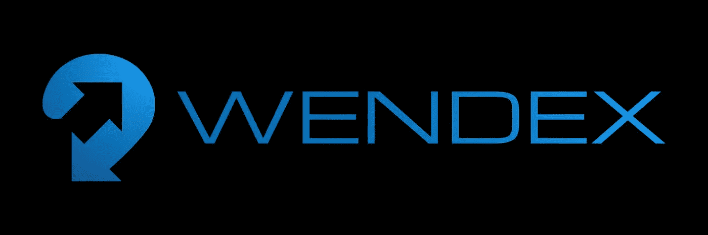

# 分散式交易所和 WenDex 简介

> 原文：<https://medium.com/coinmonks/introduction-to-decentralized-exchanges-and-wendex-d7a35703a6fd?source=collection_archive---------8----------------------->

什么是 DEX？

分散式交易所(DEX)是一个不受集中机构管理的点对点市场。DEX 将买家和卖家与加密货币联系起来。它被认为是一种分散式应用，有三种不同类型的分散式交换。一种类型使用自动做市商(AMM)，这是一种依靠数学方程来确定资产价格的协议。另一种使用 orderbook 的，包括链上和链下，最后一种使用 DEX aggregators，这是一套简单的金融协议，允许交易者使用相同的接口访问大量的交易池。他们在多个不同的平台上寻找特定令牌的最佳提供商。

与比特币基地这样的中央交易所(CEX)相比，DEX 没有保管钱包。当你在集中交易所购买加密资产时，你所购买的加密资产被保存在保管钱包中。交易所持有你钱包的私人钥匙。听说过“不是你的钥匙，不是你的密码”这个词吗？这就是这意味着，CEX 有你保管钱包的私人钥匙。在 DEX 上，您将非保管钱包连接到 marketplace 应用程序以与之交互。这不是 CEXs 的功能，相反，在 DEX 上，你可以将一种加密货币换成另一种。WenDex 是一个分散的交易所。

分散的交易所使用一种算法和流动性池来创造加密货币的价格。投资者锁定他们的资金，以换取一定比例的回报，通常以利息的形式，以帮助进行交易。CEX 上的交易非常不同，它允许你使用信用卡或银行的菲亚特来购买各种加密货币资产。集中交易所的交易记录在内部的私人数据库中，而分散交易所的交易记录在区块链上。分散交易所的著名流行例子包括但不限于以太坊网络上的 Sushiswap 和币安智能链上的 Pancakeswap。

硬币对代币

硬币是代表区块链网络的固有资产。例子包括比特币、以太坊、疯狂互联网币、BNB 等。令牌则不同，它不代表区块链，而是使用构建令牌的网络技术构建的。它们是使用服务于各种不同用例及功能的智能契约来制定的。有不同类型的可用令牌，安全令牌、实用令牌甚至治理令牌。当一个新的代币发行时，要在一个著名的集中交易所进行签名是非常昂贵的。在一个分散的交易所推出一个新的代币更便宜，也更划算。首先，初始价格由你提供给流动性池的代币决定。当您向流动性池提供代币时，您可以将代币与稳定硬币或代表网络的硬币配对。最初，你的代币没有任何价值，除非你为资金池提供流动性。这创造了你的代币价格。分散的交易所提供了许多有用的服务，并且不受一个集中机构的管理。你保持匿名，并保持对你的身份的控制。

如何使用 DEX？

与使用传统的集中交易所不同，这里没有注册过程，没有 KYC 程序或地理限制。只需将你的非托管钱包连接到他们的市场或分散应用程序，但要确保你有网络原生硬币作为资产，用于支付交易和相关费用。

# 什么是文德克斯爵士？

“Always Remembered Never forgotten” CIC Labs LTD.

WenDex 是一个分散的交易所，提供各种服务，使其成为一个包罗万象的交易所。他们为投资者和开发者提供你需要的一切。他们致力于提供分散的“交换即服务”,这样每个人都可以实现自己的梦想。不要让这个名字欺骗了你，它来源于加密社区。“When”是一个常见的词，在加密领域已经成为同义词，通常拼写为“Wen”。这个词在每一个加密项目中都变得相当重要，并且在整个加密领域都广为人知。WDT 是代表 WenDex 交易所的股票代号，也是用于与 WenDex 交易所交互的本地令牌。要收购 WDT，你必须使用中投币作为与 WDT 交易的货币。WCIC 也可以在 WenDex 上找到，这是包裹的中投币。包装的加密令牌与原始加密硬币或资产的价值挂钩，这一过程允许它们在并非源自它们的链上使用。就像以太坊网络上的 BTC 一样，以太坊网络上使用的令牌应该是 WBTC。包裹代币提高资本效率和流动性。

当一个新项目开始开发时，产生的成本可能是巨大的。在集中交易所上市不是免费的，而且成本也很高。利用 WenDex 交易所，项目开发商可以建立初始流动性，让潜在投资者有机会购买他们的项目代币。有两个池形成，代币项目和中投硬币，这将使人们能够在他们之间交换。选择提供流动性的人将从使用他们提供流动性的流动性池的交易中获得一定比例的收益。

WenDex 提供了一个健壮、友好、易于使用的界面。提供的服务包括…

*   温贸易
*   文发射
*   文斯塔克
*   温乐恩
*   文 Build
*   文奖励
*   文穆恩
*   文塞克斯
*   闻道

查看文德克斯交易所。中投链官方 DEX。

以下是 CIC Chain 白皮书、网站和 linktree 的官方链接。

[中投白皮书](http://cicchain.gitbook.io/)

[中投网站](https://cicchain.net/)

[中投链接树](https://linktr.ee/cicchain)

*任何书面材料都不构成财务建议，也不应被误解为财务建议。在购买或投资之前，请务必咨询财务顾问。本文中的信息仅供参考，不得误解。*

*   如果你喜欢这篇文章，请考虑关注我，留下一个好的评论和一些掌声。谢谢你的时间。

> 交易新手？尝试[加密交易机器人](/coinmonks/crypto-trading-bot-c2ffce8acb2a)或[复制交易](/coinmonks/top-10-crypto-copy-trading-platforms-for-beginners-d0c37c7d698c)