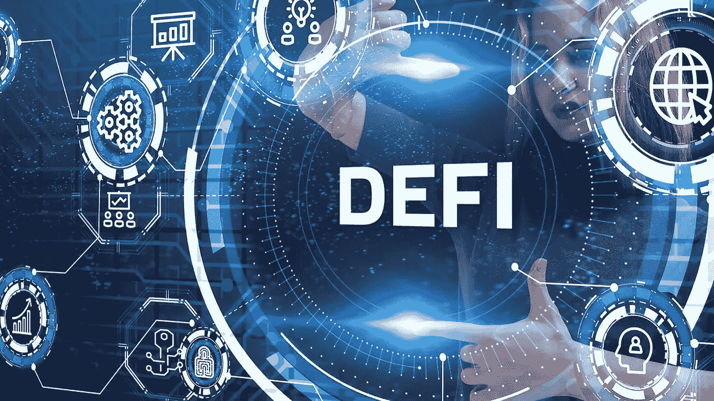

# DEFI 简介

> 原文：<https://medium.com/coinmonks/introduction-to-defi-8a63b6405a52?source=collection_archive---------24----------------------->

分散金融(DEFI)已经成为一个时髦词，在金融交易方式方面带来了巨大的变化。这篇文章是理解分散金融(DEFI)的权威指南。

# 什么是 DEFI？

DEFI 是一个庞大的金融生态系统，致力于消除中间人，允许用户之间的金融交易。

简单地说，它代表自我保管金融。不像传统金融，公司、银行、基金对你的钱负责。在 DEFI 中，除了你没有人能接触到它。

在金融交易中，DEFI 主要除掉中间人。因此，当你购物时，不是让你的银行或信用卡发行商成为你和商家之间的中介，而是使用数字货币，并拥有它的所有权来直接使用。DEFI 主要基于以太坊。

## DEFI 简史

有人认为，DEFI 始于 2009 年推出的比特币，这是第一个建立在区块链网络上的 p2p 数字资产。比特币让人们有可能想象传统金融世界的变革。2020 年的夏天是 DEFI 历史上的另一个关键点。随着疫情席卷全球，传统金融体系在它的压迫下崩溃，这是现代 DEFI 市场发展的起点。DEFI 应用程序，如贷款、借款、做市商、高产农业、保险和其他许多通常只由传统金融提供的工具，都是在封锁期间开发的，为数百万失去工作的人提供了喘息的机会。

好吧，让我们深入它的应用；

1.  放款与借款

用户可以通过提供另一个作为抵押品来借用一个加密资产，换句话说，DEFI 协议有助于使借贷过程透明和容易。

2.派生物

衍生产品的范围可以从资产支持的代币到分散的甲骨文或预测市场的 p2p 协议。

3.分散交易所

分散交换是加密交换，它以安全的方式促进直接对等交易，并限制对中介的需求。

## DEFI 的优势。

1.  DEFI 为进入金融市场提供了便利。

DEFI 为投资者和交易者提供了一种更好、更简单、更高效的金融转账方式。

2.DEFI 推高加密价格

自 DEFI 问世以来，该部门主要项目的市值显著增加。一些炒作币的价格在不到一年的时间里翻了一番。

3.DEFI 提高了透明度

DEFI 协议提供了比传统金融机构更高的透明度。DEFI 协议是在区块链上创建的，这使得交易不可变，并确保透明。

## DEFI 的问题和风险

同时，DEFI 生态系统也有一些不可忽视的缺点。

1.  需要第三方审计。

DEFI 基于智能合同，对操纵和利用非常敏感。因此，所有 DEFI 协议都需要对智能合同进行审计。

2.集中式数据馈送

区块链无法访问链外信息，因此需要第三方为区块链提供真实世界的数据，这使得数据集中化，容易出现与集中化相关的问题。

3.黑客和其他漏洞攻击

由于滥用第三方协议、业务错误、编码错误、快速贷款和价格操纵，DEFI 项目容易受到黑客和其他类型的漏洞攻击。

DEFI 的未来会怎样？

显然，有些人非常关心 DEFI 将来会是什么样子。

与传统金融机构不同，DEFI 还允许您继续保管您的金融资产。这是一种非常现代和分散的做事方式。

DEFI 技术是未来的发展方向，因为它为传统问题带来了解决方案。

最后，你会注意到，分散金融是金融体系变革中的下一件大事。学员有机会发现一系列信息，展示其在现有金融环境中的重要性。DEFI 还为金融系统的数字化转型和轻松改善金融工具的获取提供了可靠的前景。

好了，感谢你读到这里，如果你喜欢这篇文章，请随时给我鼓掌，并关注更多！

下次再见了。

> 交易新手？试试[密码交易机器人](/coinmonks/crypto-trading-bot-c2ffce8acb2a)或者[复制交易](/coinmonks/top-10-crypto-copy-trading-platforms-for-beginners-d0c37c7d698c)