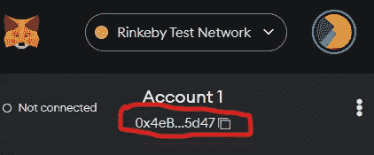

# 以太坊测试网简介

> 原文：<https://medium.com/coinmonks/introduction-to-ethereum-testnet-b68d3b4b027a?source=collection_archive---------31----------------------->

每个人都熟悉以太坊区块链，因为它在比特币之后的区块链行业中很受欢迎。大多数分散式应用程序都是使用智能合约构建和部署到这个链上的。

您是否知道有一种环境，在部署智能合约之前会对其进行测试？这个环境被称为 testnet，它是以太坊主网的模拟。以太坊区块链有两种环境，即 Ropsten 和 Rinkeby。我的重点是 Rinkeby，因为 Ropsten 现在已经过时了。

Rinkeby 是一个基于以太坊区块链的测试网，从以太坊代码派生而来。Rinkeby 是一个权威证明(PoA)共识机制，从而为以太坊的发展创造了一个良好的环境。

## 优势

*   更集中，不容易被垃圾邮件。
*   授权证明(PoA)增强了该环境的整体安全性。

如果您没有 Metamask 浏览器扩展，您可以在[网络商店](https://chrome.google.com/webstore/detail/metamask/nkbihfbeogaeaoehlefnkodbefgpgknn?hl=en)获得。在那里，您点击添加按钮进行添加。

## 将 Rinkeby 添加到 wallet:

*   点击浏览器右上角的拼图图片，打开你的 Metamask 钱包

*   点击 Metamask wallet 旁边的下拉菜单—在我的例子中，您有 Alfajores

*   向下滚动到有“添加网络”的末尾

*   它会把你带到 Chrome 浏览器扩展

*   开始填写网络信息，然后单击“保存”进行添加

## 获取测试 ETH

为了让环境像模拟一样工作，您需要通过水龙头使用测试令牌。这个令牌只是用于测试，并不像主 ETH 那样具有真正的价值。

**部分网站获得测试龙头:**

*   [炼金术](https://rinkebyfaucet.com/)
*   [Rinkeby 水龙头](https://faucet.rinkeby.io/)

你会被要求以太坊的地址。打开元掩码，点击要复制的账户

*   粘贴到网站提供的输入字段，点击发送按钮获取。在炼金术的例子中，发送按钮看起来像这样

*   几秒钟后刷新您的钱包，查看您的余额。

这篇文章将向人们特别是新开发人员介绍 testnets 以及如何获得测试令牌。它适用于其他区块链，不同的是他们的链 id 和 RPC 的网址。

感谢您的阅读。

> 交易新手？尝试[加密交易机器人](/coinmonks/crypto-trading-bot-c2ffce8acb2a)或[复制交易](/coinmonks/top-10-crypto-copy-trading-platforms-for-beginners-d0c37c7d698c)