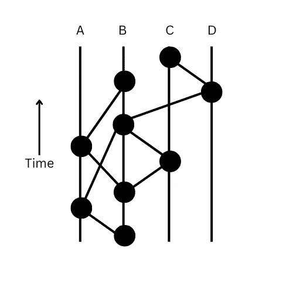

# HEDERA HashGraph 简介

> 原文：<https://medium.com/coinmonks/introduction-to-hedera-hashgraph-67bdb752562f?source=collection_archive---------22----------------------->

Hedera Hashgraph

如果你正在读这篇文章，那意味着你已经在 Web3 空间了。你一定知道或者至少一定听过人们谈论分布式账本技术(区块链)、加密货币、NFT、以太坊、多边形、比特币和许多类似的术语。现在让我给它加上这个新词 HEDERA HASHGRAPH。

> 从顶级交易者那里复制交易机器人。免费试用。

那么，这个海德拉·🧐是什么？？
它是由两个单词组成的，所以让我们把它们分开，看看我们会得到什么。

## 海德拉:

这是一个使用了**哈希图**技术的公共分布式账本。它是由 Hedera 公司开发的，该公司由 Leemon Barid 和他的商业伙伴 Mance Harmon 创建。

它由分布在全球各地的全球企业管理。Google、IBM、Tata Communication、Ubisoft 等都组成了 Hedera 管理委员会，该委员会有一个有限的任期，轮流管理成员，每个成员对与平台相关的关键决策都有平等的投票权。

## 哈希图:

这是一种分布式账本技术，由 Leemon Barid 发明。在某些时候，hashgraph 被描述为区块链的继承者。它提供了更快的速度、更高的安全性、更低的成本和公平性(事务时间戳)。目前 hashgraph 拥有**专利，且仅由 HEDERA 独家拥有**。

> 所以综上所述，Hedera Hashgraph 是基于 Hashgraph 算法的公共分布式账本。

现在你知道了 Hedera Hashgraph，让我们看看引擎盖下，了解一切是如何工作的⚙️🛠️.

Hashgraph 主要基于两种技术:
1]关于流言蜚语的流言蜚语
2]虚拟投票

Hashgraph created on Canva

## 关于八卦的八卦:

拜托，我们都曾在某个时候谈论过某个人😅。不骄傲，但我也做过，很有趣😂。

现在，Hashgraph 使用同样的技术。
假设他们是三个节点。现在，所有节点都开始了导致事件(流言)的事务。
现在事件由四样东西组成:
1]时间戳
2]事务
3]你的事务历史的散列
4]上一个节点共享的事务历史的散列

为了使它更容易，让我们说你是四个朋友 A，B，C，D，e。
现在你们都开始了一个随意的对话。先说 A 先和 C 开始八卦。他们互相交换了迄今为止所有的信息。现在，A 再次随机开始与 E 聊天。现在，A 将与 E 分享它知道的所有信息，此外，它还将分享 c 分享的八卦信息。如果我们试图从任何顶部节点追溯，我们每次都会在它们下面找到相同的图。

## 虚拟投票:

这可能听起来很愚蠢和混乱，但这是一个没有投票的投票系统。一种投票系统，你有 vting 系统的数学证明，但是没有投票。

任何一个普通人都会这样哟，这到底是什么？没有投票的投票系统，有点荒谬。是的，我同意你。但是让我们看看它是如何工作的，也许我们能明白一点。

任何分布式分类账都希望尽可能快地分散其交易。为此，海德拉使用了关于流言蜚语的技巧。一个节点与其它随机节点共享它所知道所有事务，其它随机节点与其它随机节点共享它，以此类推，像野火一样蔓延。很快网络中的每个人都知道了每一笔交易。没有领导者，没有像区块链那样的轮流，没有 DDOS 攻击的可能性，因为所有交易都是签名的，没有伪造，但问题是没有共识。
现在和事务一起，如果我们把共享的事务的 hash 加到前面的节点，会发生什么？？网络中的每个节点不仅知道所有的事务，而且知道整个图直到根。每个节点将知道前一个节点的所有事务，依此类推。这是搬弄是非。

现在，如果我们运行投票算法，我们可以合并来自任何节点的投票，而无需该节点发送投票。我们可以预测其他节点将投票。这样做将没有必要发送投票给任何人。这整个过程给了我们一个强大而公平的投票。这将使我们的速度只受到你的互联网带宽的限制。

这不是很神奇吗🤯？

这是海德拉的哈希图。

在下一篇博客中，我将尝试写一些关于 Hedera 的智能合同。

推荐视频:
1】[https://youtu.be/rleAZVVA3kM](https://youtu.be/rleAZVVA3kM)

2][https://youtu.be/IVlmwsleu6c](https://youtu.be/IVlmwsleu6c)

> 加入 Coinmonks [电报频道](https://t.me/coincodecap)和 [Youtube 频道](https://www.youtube.com/c/coinmonks/videos)了解加密交易和投资

# 另外，阅读

*   [新加坡十大最佳加密交易所](https://coincodecap.com/crypto-exchange-in-singapore) | [购买 AXS](https://coincodecap.com/buy-axs-token)
*   [投资印度的最佳加密软件](https://coincodecap.com/best-crypto-to-invest-in-india-in-2021) | [WazirX P2P](https://coincodecap.com/wazirx-p2p)
*   [西班牙 5 大最佳文案交易平台](https://coincodecap.com/copy-trading-spain)
*   [Pionex 双投](https://coincodecap.com/pionex-dual-investment) | [AdvCash 审核](https://coincodecap.com/advcash-review) | [坚持审核](https://coincodecap.com/uphold-review)
*   [面向开发者的 8 个最佳加密货币 APIs】](https://coincodecap.com/best-cryptocurrency-apis)