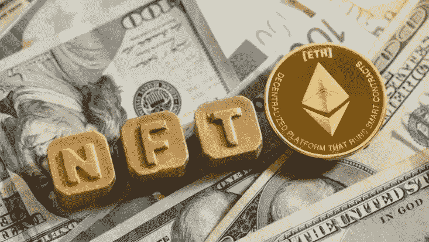
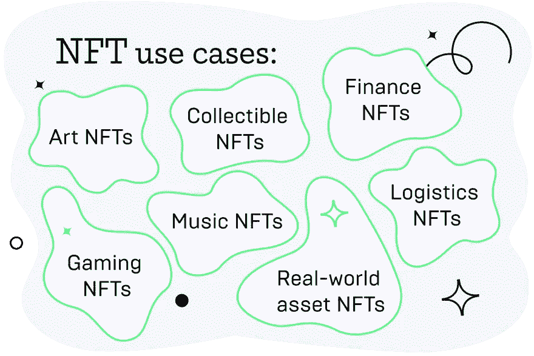
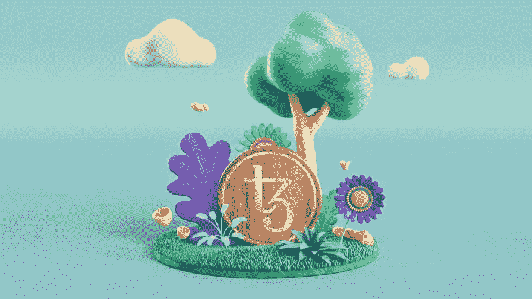

# NFT 简介

> 原文：<https://medium.com/coinmonks/introduction-to-nft-6f1ca62241a8?source=collection_archive---------38----------------------->

“非功能性交易是有风险的，因为它们的未来是不确定的，我们还没有大量的历史来判断它们的表现。由于非功能性测试是如此之新，现在投资少量资金进行尝试可能是值得的。Arry YU

NFT 可以用来表示物理对象、数字内容，甚至是无形的概念，比如知识产权。超越数字内容，超越 2D 或 3D 图像，从艺术和音乐到玉米卷和卫生纸，这些数字资产正在像 17 世纪充满异国情调的荷兰郁金香一样出售——有些价值数百万美元。

NFT 获得超过 6900 万美元或一条推文获得 290 万美元的实例不是幻想，而是令人难以置信的现实。(但现在他准备以非常低的价格出售，这就是不确定性)

尽管自 2014 年以来，NFT 就一直存在，但现在它越来越臭名昭著，因为它正成为一种越来越受欢迎的买卖数字艺术品的方式。

> 交易新手？试试[加密交易机器人](/coinmonks/crypto-trading-bot-c2ffce8acb2a)或者[复制交易](/coinmonks/top-10-crypto-copy-trading-platforms-for-beginners-d0c37c7d698c)

# 什么是 NFT，它与加密货币有何不同？

NFT 代表不可替代的令牌。“不可替代”意味着它是完全独一无二的。“代币”意味着它可以在区块链上转让。本质上，NFT 是带有唯一数字身份的资产，可以在像 Tezos 这样的公共区块链上在用户之间进行交易。

它们是数字资产或一种拥有商品的数字证书，或者是一种代表各种无形和有形项目的资产，如绘画、虚拟房地产、明信片、视频等。NFT 不能被复制或等同于相似的资产，因为每个不可替换的令牌资产本身都是唯一的。

我们再举一个例子，看看它们和普通加密货币有什么不同。

100 美元和另一张 100 美元钞票的价值相同。当有人借给你一张 100 美元的钞票时，你不一定要用一模一样的钞票来还他们，因为另一张同值的钞票价值相同。非森林旅游有一些共同的特征，如稀有性、不可分割性和独特性。

现在，你终于能够区分货币和 NFT 了。

现在，让我们来了解一下在哪里可以购买或交易 NFT。

# NFT 市场

NFT 市场是可以存储、展示、交易以及在某些情况下铸造(创造)非金融资产的平台。这些市场对于 NFTs 就像亚马逊或易贝对于商品一样。NFT 市场是建立在区块链上的，这使得它们不同于其他在线市场。大多数 NFT 市场都是分散的应用程序，允许它们由社区安全地运行。

你可能会好奇人们是如何购买关于数字猫或猿的 NFT、推文甚至是唐纳德·特朗普的虚拟艺术品的。这就是 NFT 市场的作用所在。

所以，你可能会想，如何才能进入这些市场。

为了访问和使用这些类型的市场，您需要具备以下条件:

*   加密钱包:你需要选择一个与区块链网络兼容的钱包，支持你想要购买的非加密钱包(如下)。例如，如果你计划购买或销售基于 Tezos 区块链平台的 NFT，你需要使用兼容的 Tezos 钱包，如 Temple Wallet、Galleon 或 Kukai。
*   钱包里的硬币数量:在购买、上市或铸造 NFT 之前，你需要预先在你的钱包里存些钱。同样，您需要找出您打算使用的市场支持哪些加密货币。
*   用户账户:你需要在你想购买 NFTs 的特定市场上建立一个账户。

按照前面提到的步骤，你已经准备好进入不确定性的世界，我们指的是 NFTs。以下是最受欢迎的 Tezos NFT 市场列表。

*   [Objkt](https://objkt.com/)
*   [稀有](https://rarible.com/)
*   [卡拉明特](https://kalamint.io/)
*   [FxHash](https://www.fxhash.xyz/)

现在你对市场已经有了相当不错的了解，但是为什么人们首先应该买 NFT 呢？

# 为什么 NFT 有价值？

让我们参观 Tezos 上最受欢迎的 NFT 市场，并从中挑选一个 NFT。在这种情况下，NFT 是 Tezzardz 3362。

现在我们可以下载并保存人们支付 1234.00 XTZ 的图片。你可能会想，既然你可以免费得到它，那么买它又有什么意义呢？NFT 和网上版本有什么区别吗？

答案是肯定的——NFT 与网上的普通图片完全不同。它们有独特的身份和可追踪的历史，这使得它们稀少并带有出处。

举个例子，想想最著名的艺术品之一，蒙娜丽莎。在任何时候，都有可能委托一位艺术家来重现蒙娜丽莎。你甚至可以拍一张蒙娜丽莎的照片，或者订购一幅画挂在墙上。

作为原作，真正的《蒙娜丽莎》将永远比任何复制品或印刷品更有价值，更受追捧——这是因为它的出处和原创性。NFT 为数字图像提供了一种类似的独特性，这种独特性曾经只保留给物理艺术。

此外，一些 NFT 市场有一个功能，你可以确保每次你的 NFT 被出售或转手时，你都可以得到一定比例的报酬。这确保了如果你的作品变得超级受欢迎，价值暴涨，你会看到一些好处。

# NFTs 的应用

*   大多数**游戏**在其生态系统中都有虚拟货币，这有助于用户更轻松地进步。NFTs 的不同用途将允许玩家在适当的验证和安全的情况下轻松地交易游戏中的收藏品。
*   **房地产 NFT**可以用来转让地契，提供所有权证明，甚至可以使用带时间戳的 NFT 跟踪房地产价值的变化。
*   **知识产权和专利 NFT** 令牌还允许用户证明他们对任何内容的所有权，这是商标和版权等传统知识产权工具所无法实现的。可以区分 ip 的所有权，特别是时间戳，即 IP 的整个历史。NFT 链将是不可改变的，这意味着 NFT 所有者可以证明他们在任何时间点都是一件作品的原始创作者。
*   投票 NFT 可以帮助解决去投票站投票时携带带照片的身份证和居住证明的问题，因为它们可以为没有物理文件证明他们是谁和他们在该国居住的地方的人提供数字身份。

现在你对什么是 NFT，它们是如何交易的，甚至它们越来越火背后的原因都有了相当不错的理解。尽管我们已经基本了解了 NFT 的一切，但留给我们最后一个问题:为什么是 NFT 的泰佐斯？

# NFT 和 FA2 的 Tezos

最初不可替代的令牌标准是建立在以太坊上的 ERC721，每个令牌都是唯一的，可以独立定价。这就是为什么艺术家的数字艺术创作等独特的数字资产可以存储在这样的令牌上。每个令牌都是唯一的，不能被销毁或复制。根据其独特性和稀有性，每个代币都可以被视为收藏品。这是创建的第一个不可替代的令牌标准。但是，Tezos 社区已经在 FA2 令牌标准中产生了这一点。与以太坊的 ERC-1155 标准相似，FA2 在一个接口中支持多种令牌类型(例如，可替换、不可替换、不可转让等),该标准已经得到了显著的发展和关注。

**但是为什么要转换呢？**

对非传统艺术最常见的批评之一，也是许多艺术家趋之若鹜的原因，是传统的非传统艺术不环保。Tezos 运行在利益证明(PoS)共识机制上，而不是

以太坊和其他区块链使用的工作验证(PoW)机制。这就是 Tezos 的生态和经济卖点的来源。

PoW 要求计算机相互竞争来解决复杂的难题，从而为区块链添加区块和交易。因此，使用电力区块链(如以太坊)需要大量的计算机能力——意味着大量的能量——才能工作。

另一方面，PoS 允许用户下注一定数量的加密货币，以获得被随机选为分组验证者的机会。这种类型的机制奖励忠诚，同时减少验证区块链上的块和交易所需的计算工作。正因为如此，Tezos 的运营效率高，收费也比其他区块链低得多。事实上，它使用的能量比以太坊少 200 万倍。

你可以在我们之前的文章中了解更多关于 Tezos 及其共识机制的信息。阅读更多关于 [FA2](https://wiki.tezosagora.org/build/create-a-tezos-token/fa2) 的信息。

# NFT 的未来

虽然以太坊是第一个具有 NFT 功能的区块链平台，但它并不是专门为非功能性桌面构建的。像 Flow 和 Tezos 这样的平台是以 NFT 第一的态度建立的。毫无疑问，在不久的将来，将会有更多的 NFT 标准可供选择。

NFT 技术对民主化和奖励社区参与的承诺与日俱增。但它的金融部分可能会伤害太多人，它不会成为主流。

差不多就是这样！我们想引用 NFT lytic(一个多边形支持的 NFT 市场)的创始人兼首席执行官的话来结束这篇文章:

“NFT 正在缓慢但肯定地成为我们日常生活的一部分。NFT 不仅是一个巨大的商机，也是人们在赚钱的同时享受生活的新方式。这就是为什么非功能性测试会继续存在的原因。